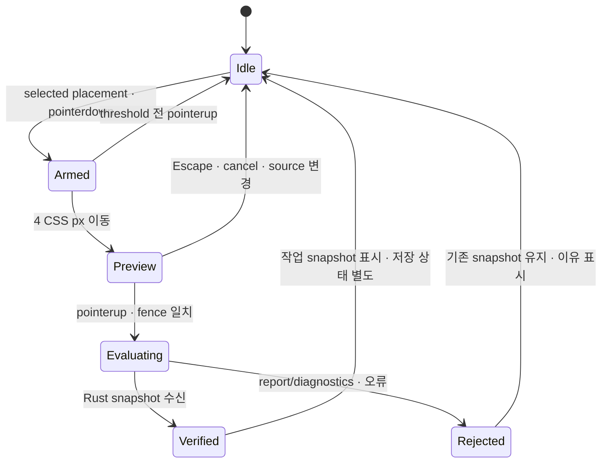

# ZARI 측정·공간·실행 작업대 상세 설계

상태: 설계 후보, 구현·화면 승인 아님. 계산/DTO는 [SPATIAL_VIEW_CONTRACT](../docs/SPATIAL_VIEW_CONTRACT.md), 작업 배정은 [AIOPS_SPATIAL_EXECUTION_PLAN](../docs/AIOPS_SPATIAL_EXECUTION_PLAN.md). 기존 DESIGN/WORKSPACE_BLUEPRINT/SCREENS의 정리 작업대·unknown·접근성 계약을 유지한다.

## 1. 공통 구성과 화면 밀도

기존 routes 유지: `#/project/<id>`는 측정, `#/project/<id>/plan`은 계획/실행. 3D는 plan의 보조 view이며 새 상품 페이지/전체 방 route를 만들지 않는다. plan toolbar: `평면 / 정면 / 공간 보기`, `축소 / 확대 / 맞춤`, `치수 / 내용물 / 검사`와 현재 범위·stale 안내. 아직 구현되지 않은 공간 보기 버튼은 앞선 태스크에서 노출하지 않는다.

wide(≥75rem): 왼쪽 문맥·대안, 중앙 도면, 오른쪽 inspector. 중앙은 가장 큰 영역이고 최소 24rem가 확보되지 않으면 보조 pane을 접는다. medium(48–75rem): 중앙+하나의 pane; inspector와 목록을 명시적으로 전환. compact(<48rem, DESIGN.md·FRONTEND.md·WORKSPACE_BLUEPRINT의 rem 계약과 같음): 단계 입력/도면 전체 폭/선택 inspector sheet/목록. compact sheet는 modal이며 focus trap/닫기 후 복귀; 뒤 도면을 조작하려면 닫아야 한다. view toolbar는 줄바꿈하며 일반 콘텐츠 가로 overflow 금지. keyboard/safe-area에 가려지면 sticky controls를 문서 flow로 돌린다.

객체 수·비용·저장·검사를 장식 KPI 카드로 늘리지 않는다. 도면·실물 단위·근거·다음 행동을 우선한다. 현재 main의 기술 metadata를 사용자 주 작업 면에서 확장하지 않는다. 긴 SKU명/한글/200% 확대에서 잘라내지 않는다. 탭·숫자 목록으로 같은 조작을 할 수 있어야 한다.

## 2. 측정 → 치수선

SP-002는 현재 편집 가능한 11 measurement fields와 현재 snapshot의 선택 대상 치수부터 구현한다. 새 장애물·하중·staging 입력 form 전체를 만드는 태스크가 아니다. 이미 존재하는 사실은 검사 layer/inspector에 표시한다. source fieldPath는 Rust와 현재 `fieldPathFor`가 공유하는 경로 grammar를 사용하고 `item-a` 문자열을 새 geometry mapping에 박아 넣지 않는다.

| Focus | 도식·강조 | 설명 |
|---|---|---|
| space.interior.width | 정면 x 치수선 | 왼쪽 안쪽 면부터 오른쪽 안쪽 면 |
| space.interior.depth | 평면 y 치수선 | 입구에서 뒤쪽 안쪽 면 |
| space.interior.height | 정면 z 치수선 | 사용 바닥부터 위쪽 경계 |
| space.opening.width | 앞면 aperture x | 안쪽 폭과 다를 수 있는 입구 폭 |
| space.opening.height | 앞면 aperture z | 안쪽 높이와 다를 수 있는 입구 높이 |
| items.<id>.dimensions.envelope.width/depth/height | 해당 item 측정 도식의 x/y/z | 수량·실제 placement 없는 상태에도 측정 안내로 표시 |
| 선택 수납용품 outer/inner dimensions | 그 외형 또는 cavity의 대응 축 | 외경/내경/원래 product frame을 구분 |

focus는 입력+단위 선택 컨트롤의 논리 그룹에 속한다. 입력에서 단위 select로 옮길 때 강조가 사라지지 않게 focusWithin으로 처리한다. pointer hover가 keyboard focus를 지우지 않는다. 관련 view를 자동 reveal할 수 있지만 route/입력값/선택 객체는 바꾸지 않는다. 치수선을 눌러 입력 focus 이동은 explicit button-equivalent이며 숨겨진 필드를 강제로 만들지 않는다. inspector read-only catalog 치수는 출처로 이동하고 사용자 SKU 치수 input으로 바꾸지 않는다.

known 축만 있으면 그 축의 값은 표시할 수 있다. drawable plane의 두 축이 모두 known인 때만 축척 도면을 만든다. width known/depth unknown인 평면은 `측정 위치 안내 · 축척 없음`; 빈 값의 길이를 0/기본 600으로 그리지 않는다. 모든 required 축이 known이어도 uncertainty unknown이면 그 사실을 옆에 보인다. 사진은 측정 사실이 아니다.

IME/소수점/미완성 raw 입력은 원문으로 보존한다. Rust-normalization 전 새 raw 숫자로 실제 비율을 업데이트하지 않는다. matching epoch 결과까지 이전 scaled-current 도식을 stale로 표시하거나 안내 도식으로 전환한다. invalid 입력의 마지막 valid 결과를 지금 값처럼 보이지 않게 한다. mm/cm 변환은 기존 Rust format request를 유지한다. focus/blur 자체는 project revision을 올리지 않는다. live region은 field 설명 변화/확정 오류에만 짧게 알리며 매 키·mousemove 발표 금지.

## 3. 선택·내경·검사 layer

배경 → 구획 경계·front opening → obstacles/access exclusion → nominal placement → contents → inspection envelope → provisional ghost → selection/focus outline → dimension labels. 선택 대상 outline은 최상위이되 오류 edge를 지우지 않는다. 실물 크기와 hit target은 별개다. 모든 접근 부피를 동시에 채워 도면을 덮지 않는다.

| Layer/선택 | 기본 | 표시 규칙 |
|---|---|---|
| 구획/obstacles/front | 항상 | unknown obstacle position은 목록/근거만; 바닥·외부 cabinet 두께를 추정하지 않음 |
| contents | on | confirmed contained instance만 world geometry; provisional은 목록/`수납 확인 전` |
| dimensions | on | 선택/입력 focus 치수 우선; text는 readable screen size |
| checks | off | 켜면 선택된 check/target의 제공된 geometry만; check text는 항상 접근 가능 |
| inner cavity | 선택 수납함 | offset unknown이면 별도 cavity-local pane; world overlay 숨김과 이유 |
| support/load | 선택 근거 | support footprint와 실제 load fact를 구분; 하중을 초록 mesh로 증명하지 않음 |

inspector 순서: 객체명/정확한 variant·owned·direct 역할 → 내용물 → 외경/내경/허용 방향 → outer_geometry, inner_capacity, installation_path, operational_access, support_geometry/load, orientation → commerce 관련 사실 → 근거·수정 행동. 모든 기존 check를 접근 가능하게 유지한다. label·status·reason·source evidence·측정 오차를 함께 보여 준다. check Unknown과 geometry unavailable을 구분한다.

selection은 `SpatialTarget` 하나, focus는 check/BOM/step target set 하나다. BOM 여러 placement는 전부 같은 focus channel로 강조한다. 선택된 contained item은 자신의 정보와 부모 수납함 관계를 표시; 이동 버튼은 부모를 명시적으로 선택한 때만 활성. 옆 항목/동일 label을 이름으로 연동하지 않는다. snapshot switch는 selection/focus를 clear하며 같은 ID를 자동 승계하지 않는다. top/front/spatial 전환은 binding이 같으면 selection/focus를 유지한다.

## 4. 평면 드래그의 확정 계약

초기 드래그는 **space에 직접 놓인 placement**의 x/y 평행 이동만이다. z는 기존 값 고정. 정면/3D/contained child는 읽기 전용 선택; 숫자 inspector의 기존 허용 편집은 유지한다. resize handle/임의 회전/벽 자동 밀어내기/자동 SKU 축소/유효 위치로 조용히 재배치 금지. 회전은 기존 R 또는 inspector로 upright0/90 중 Rust가 허용한 값만 요청한다. 드래그 중 회전은 먼저 gesture를 취소하고 별도 편집한다.

입장 조건: 현재 source key=displayed snapshot, session ready/context installed/worker ready, `isCurrentSnapshot`, save conflict 없음, 다른 edit.pending/search running 없음, 해당 placement와 nominal box resolve 가능. 조건부 물리 plan은 검사값을 유지한 채 편집 가능; confirmed라는 이름으로 위장하지 않는다.

- pointerdown은 gesture id/pointer id/client CTM/base snapshot id/placement position/epoch/activation/worker generation/current projectRevision을 capture한다. primary pointer만; pointer capture로 도면 밖 이동을 추적한다. threshold=4 CSS px는 선택 클릭과 이동의 구분이며 mm gap가 아니다.
- pointermove는 freeze한 CTM inverse로 Δx/Δy를 계산. 시작 정수 위치에 **1mm 단위로 양자화한 delta**를 더한다. 양·음 tie는 0에서 멀어지는 쪽(`sign(d)*floor(abs(d)+0.5)`). 정밀도 안내 `드래그는 1mm 단위 · 정확한 값은 좌표 입력`을 제공한다. raw measurement의 조용한 rounding과는 별개인 직접 조작 정책이다.
- per-pointermove Rust/IndexedDB 호출 0. RAF로 최신 preview 하나만 paint. TypeScript는 ghost와 좌표만 계산; pass/fail·overlap·추천 대체 위치를 판정하지 않는다. min 범위/finite 오류는 UI precheck로 메시지, domain은 Rust가 최종 검증. root의 bounds 밖도 ghost로 보여 줄 수 있으나 valid처럼 표시하지 않는다.
- pointerup 직전에 lease와 현재 displayed head/epoch/context/generation을 재검사. no-op 좌표는 요청·history·저장 0. changed gesture는 기존 movePlacement/evaluateLayoutEdit 요청 **정확히 하나**. 평가 중 물리 편집과 두 번째 drag를 잠근다. 수치/keyboard 편집은 같은 잠금 규칙을 적용한다.
- 검증 전 ghost 점선+`검사 전`, 평가 중 `검증 중`. 검증 통과 후 결과는 **작업 중 계획**이며 기존 accepted binding은 바꾸지 않는다. 새 snapshot의 도면·BOM·guide·projection을 한 binding으로 전환; 새 projection이 준비되기 전 기존 도면을 새 BOM 옆에 붙이지 않는다.
- Rust 거절/timeout/trap/CAS conflict/저장 실패는 서로 다른 상태다. 거절은 원래 snapshot/BOM/undo 유지, failing check 근거 표시. Rust 성공+save 실패는 현재 검증된 작업안과 `이 기기에 저장하지 못함`을 유지하고 export/retry 제공; accepted/saved badge를 붙이지 않는다.
- 성공 drag는 undo transition 하나. 거절/no-op/cancel은 0. undo/redo는 기존 restoreLayout과 Rust 재검증. gesture preview를 history나 draft에 저장하지 않는다.
- Escape, pointercancel, 두 번째 touch, window blur, hidden document, resize/CTM 변화, project/snapshot/input/catalog change, conflict, worker replacement는 preview/armed를 취소. 이미 요청된 evaluation의 late 결과는 기존 seq/activation fencing + displayed-binding fence로 배제한다. cancel과 정상 releasePointerCapture 후 lostpointercapture를 구분한다. 움직이지 않고 클릭하면 선택만 수행한다.

숫자·키보드 동등성: 이동 단위는 FRONTEND.md 계약(기본 1mm, 명시적 수정키 10mm)을 따르고 화면에 단위를 표시한다. 현재 구현(화살표=10mm, Shift+화살표=1mm, PlanScreen)은 이 계약과 반대라서 SP-003에서 계약에 맞춘다. R=허용 회전, Ctrl/Meta+Z와 redo 유지. textbox/textarea/select/contenteditable 안에서는 workspace 단축키 가로채지 않는다. 같은 move를 모든 입력 경로에서 같은 command로 보낸다. keyboard 목록 선택 후 수치 이동으로 마우스 없는 전 과정을 완료할 수 있다.

## 5. viewport와 touch

top/front 각각 pan/zoom state, 확대 범위 0.5–8× fit scale. `맞춤`은 알려진 compartment bounds+읽기 위한 여백; overlay를 켰다고 자동 zoom-out하지 않는다. staging은 명시적 `앞쪽 작업 영역 보기`로 frame 확장. 대안 비교는 같은 interior scale factor, 별도 fit으로 같은 크기를 다르게 보이지 않게 한다. source 교체는 fit/reset, 동일 binding의 view 전환은 기존 viewport 유지.

desktop: empty-space primary drag는 명시적 `화면 이동` 모드일 때만 pan; 선택 모드에서 placement drag는 move. middle/Space+drag는 viewport pan이며 input focus 중 Space를 가로채지 않는다. Ctrl+wheel은 focus된 viewport에서만 zoom; 일반 wheel은 페이지 scroll. visible +/-/fit 버튼과 keyboard zoom 대체를 제공한다. zoom anchor는 같은 CTM inverse를 사용한다.

compact/coarse pointer: 기본 tap=selection, page vertical scroll 유지. 선택 후 명시적 `평면에서 이동` 버튼을 누르면 해당 canvas의 move mode에 진입하고 inspector modal은 닫는다. 취소/좌표입력 버튼을 노출하며 mode 중 canvas만 touch-action:none. 두 번째 touch는 move 취소; v1에서 placement move와 pinch를 결합하지 않는다. canvas 밖은 정상 scroll/브라우저 zoom. 별도 pan mode와 +/-/fit가 있어 multi-touch 없이 이동 가능. body/html touch-action:none, user-scalable=no, 전역 preventDefault 금지.

## 6. 읽기 전용 3D · 절개

SP-005에서 처음 제공. 버튼을 누를 때만 동적 import; 사용자 3D 요청 전 Three chunk 다운로드/renderer 생성/카메라 listener 0. 데이터는 동일 SpatialProjection. 실제 3D editor를 만드는 태스크가 아니다.

기본 orthographic oblique view, preset `비스듬히 / 위에서 / 앞에서`. front 방향 표시와 축/단위 caption. orbit은 구획 중심에 제한; 카메라 아래/내부로 들어가지 않게 angle/distance 범위를 정한다. camera/pan/zoom이 inspection check나 snapshot을 바꾸지 않는다. top/front preset은 동일 fitting bounds로 물리 scale을 비교할 수 있고 arbitrary perspective 축척을 BOM/치수 증거로 쓰지 않는다.

`앞면 경계 숨김` on, `윗면 경계 숨김` on이 기본. 벽은 **내부 경계를 나타내는 평면**, 실제 cabinet wall thickness/material이 아니다. aperture offset이 unknown이면 front frame을 추정하지 않고 입구 사실을 inspector에 표시한다. back/side/floor는 필요한 낮은 대비의 solid 또는 선; 유리 같은 반투명 shell을 기본 미감으로 쓰지 않는다. `수납함 내부 보기`는 선택 수납함의 외형 표면만 시각적으로 숨기며 데이터·수량·검사에는 영향 없음. 알려진 cavity origin과 내용물만 world로 표시한다.

형상은 보수적 cuboid/명시적 aperture/footprint; 참조 프로젝트의 bed/sofa/detail furniture/material 모델을 복제하지 않는다. handles가 외경 밖으로 알려졌으면 Rust envelope layer로 표시; 모르면 임의 handle 모델 0. 외경 box에 정교한 내부 벽/뚜껑을 그려 실측 구조로 오인시키지 않는다. 모든 item/owned/new는 적절한 구분 label과 동일 물리 scale.

선택은 mesh hit→typed target→공통 selection. 겹치는 body/contents는 기본 outer surface 선택, explicit 내부 보기 상태에서 contents picking; invisible cut face/overlay는 pick에서 제외. pick 순서가 ambiguous하면 선택 가능한 목록을 제시한다. 보기 전용 mesh를 drag하더라도 위치 변경 명령을 내보내지 않는다. canvas aria-hidden으로 장식 취급하지 않고 설명/텍스트 목록/keyboard 동일 정보 경로를 제공하되 mesh 수만큼 tab stop을 만들지 않는다.

구현: 하나의 React adapter가 imperative Three scene/camera/resources를 소유. 선택/설정 상태는 React workspace에서만 변경. 기본 WebGL renderer, DPR=min(devicePixelRatio,1.5), antialias 허용, shadows/postprocessing/HDR/external textures/3D assets 없음, preserveDrawingBuffer=false. 공유 box geometry/material과 역할별 색을 재사용. mesh batching/InstancedMesh는 local 최적화 선택 가능하나 instance→typed-target mapping을 시험한다. 초기 WebGPU/WebXR/R3F/Drei 도입 금지.

demand render: source/selection/focus/camera/resize/style 변경에만 RAF 한 번 예약; damping 비활성, idle loop 없음, hidden/offscreen에는 render 중단. orbit 조작 중만 필요 frame, pointer 종료 이후 안정 상태에 멈춤. DOM labels는 React/SVG overlay의 escaped textContent이고 HTML 문자열 주입 금지. theme token을 검증된 색으로 읽어 Three color에 적용; imported material 문자열을 코드로 쓰지 않는다.

정상 종료/프로젝트 변경/route unmount에 event listeners/ResizeObserver/RAF/controls/materials/geometry/renderer를 dispose. 공유 resource는 ref ownership 하나로 중복 dispose 금지. contextlost→캔버스 실패 안내+2D 버튼, 한 번의 **사용자 명시적** 재시도에서 새로운 renderer. 자동 무한 재시도·GPU에 의존한 plan completion 없음. WebGL unavailable/import chunk 실패에도 계획·BOM·숫자 편집·단계 완료는 2D에서 사용 가능.

## 7. 실행 단계와 완료 상태

실행 화면은 기존 PlanDetail의 ActionStep DAG를 사용한다. 현재 단계=사용자가 선택한 step; 기본은 명시적 `다음 실행 단계` 버튼이 기존 순서에서 미완료·선행 완료인 첫 단계로 이동한다. progress null이면 다음 단계 판정도 unavailable. 자동 재생·시간 기반 완료·드래그 성공→실제 설치 완료 없음.

| Action kind | 강조 | 완료 의미 |
|---|---|---|
| acquire / confirmArrival | 관련 placements와 BOM 행 | 사용자가 실제 확보/도착을 기록 |
| install | 해당 placement + 제공된 설치 envelope | 사용자가 실제 위치 설치를 기록 |
| transferContents | exact instance와 parent cavity/placement | 실제 옮김을 기록, 애니메이션 완료 아님 |
| resolveCondition | 관련 근거/미확인 target | 진행 기록은 물리 fact를 pass로 수정하지 않음 |
| verifyUnassigned | 미배정 item 목록 | 상자 위치를 가짜로 생성하지 않음 |
| 기타 supported action | Rust link 또는 텍스트 | 제공되지 않은 spatial target은 이유 표시 |

source binding이 displayed=accepted=currentInput이고 raw draft stale 아님, conflict 없음, actionProgress!=null일 때만 완료 변경 가능. 작업 중 edit.head나 미채택 대안/과거 snapshot은 preview/read-only. accepted가 다른 계획이면 `채택된 계획에서 실행하기`로 명시적 전환; old progress를 새 계획에 자동 이식하지 않는다. 같은 placement ID가 남아도 다른 snapshot의 완료를 가져오지 않는다.

prerequisites는 실제 step IDs에서 읽는다. done 변경은 기존 repository CAS; dependents가 done이면 부모의 done 해제 거절. requiredConfirmations가 nonempty지만 확인 workflow가 지원되지 않으면 `확인 절차 필요`로 완료를 막고 임의 pass를 만들지 않는다. 현재 producer의 빈 목록은 유지한다. resolveCondition 체크만으로 원본 검사를 수정하거나 뒤 snapshot을 재확정하지 않는다.

step toggle은 accepted binding과 project/session generation을 capture하고 await 이후 재검사한다. 이전 snapshot 성공 응답을 새 progress map에 합치지 않는다. repository도 transaction 안에서 accepted/currentInputRevision/inputDigest를 검사한다. 불러오기 실패는 `진행 기록을 읽지 못함`, 저장 실패는 이전 checkbox state+retry, 타 탭 변경은 conflict. null을 `{}`/all todo로 치환 금지. 저장 성공 전 check를 낙관적으로 완료 표시하지 않는다.

선택 단계와 선택 객체는 분리: 현재 step targets는 얇은 info 윤곽, 선택 대상은 selection 윤곽. selected inspector를 다른 대상으로 바꾸고 싶으면 명시적 선택. 다음/이전 단계는 focus만 변경하고 DB를 쓰지 않는다. 완료 기록은 snapshot hash/BOM/geometry와 별도 row이며 reload로 복원한다. currentStep selection 자체는 volatile이라 reload 후 기본 상태로 돌아가도 완료 row는 보존한다.

## 8. 시각 상태·motion·접근성

기존 semantic tokens 사용. SP-002가 아래 alias가 필요한 경우 tokens.css+contrast case를 함께 추가한다. 색조를 새 디자인 identity로 바꾸지 않는다.

| 의미 | 토큰/형태 | 함께 보일 문구 |
|---|---|---|
| 선택 | selection-ring solid outline | 선택됨 / 객체명 |
| step focus | info 색 얇은 별도 outline | 현재 단계 대상 |
| pass | success icon+text | 해당 검사 통과 |
| unknown | text-muted dashed/hatch | 미확인 + 필요한 사실 |
| stale | warning outline/banner | 입력 변경 · 이전 계획 |
| fail | danger line+text | Rust 실패 이유 |
| preview | info dashed ghost | 검사 전 |
| disabled | text-muted/control outline, 명시적 사유 | 현재 상태에서 편집 불가 |

`--zari-unknown`/`--zari-stale`/`--zari-preview`를 기존 semantic 값에 alias할 수 있다. selection과 success가 비슷한 기존 팔레트는 outline vs icon/status text로 분리한다. 중요한 도면 선은 미관용 grid/divider를 재사용하지 않는다. 차원·제품 모서리는 물리적 직선; UI radius를 제품 box에 적용하지 않는다. 주요 입력/버튼 기존 control-radius, sheet overlay-radius; 카드 중첩/알약 toolbar/불필요 shadow 없음. 한국어 본문 1rem, units와 numbers tabular, label 0.875rem, warnings 최소 본문 크기.

허용 motion은 selection highlight/inspector 전환 120–180ms. 드래그 ghost는 현재 pointer와 바로 대응; 검증 결과나 geometry에 탄성/관성 없음. 카메라 preset·cutaway는 즉시 전환이 기본. reduced-motion에서는 spatial motion 0; completion·focus restoration·save 상태가 animationend에 의존하지 않는다. 강제 색 모드에서는 패턴·텍스트·목록으로 의미 유지, 3D 색을 이해할 수 없으면 2D/text 전환을 안내한다.

touch target 48px 상당, 기본 control 최소44px. 작은 실물의 hit region 확대는 클릭 검출에서만 적용; 실제 mesh/shape 확대 금지. 겹치는 hit area는 목록 선택 fallback. tooltip만으로 조건을 전달하지 않는다. 선택/실패/저장/worker recovery를 짧은 live region에 발표, hover/pointer frame 발표 0.

**z-accessibility-workspace만 (2026-10-09).** 이 문장은 이 노드의 구현 노트다. 키보드로 배치를 고르면 같은 상세의 좌표 입력으로 포커스가 간다. 터치 증감과 화살표와 좌표 입력은 같은 `movePlacement`다. 1mm가 기본이고 10mm는 명시적이다. 빈 좌표는 0mm가 아니다. 좁은 화면에서도 프로젝트 이름과 이 기기 저장 안내가 남고, 대안 비교 표는 구역 안에서 가로로 스크롤된다. 선택·목록 강조는 시각과 polite live region에 함께 있다. 저장 실패·충돌·워커 실패·채택 오류·계산 취소는 복구 컨트롤로 포커스를 옮기고 입력 글자는 지우지 않는다. 채택 뒤 실행 가이드의 사용 가능한 컨트롤로 포커스가 간다. 데스크톱 320px·확대·forced-colors·reduced motion은 실기기 검증이 아니다. 기록은 [Dz-accessibility-workspace](DECISIONS.md)와 [docs/adr/SP-z-accessibility-workspace.md](../docs/adr/SP-z-accessibility-workspace.md)이다.

## 9. draft capture 요구

SP-007은 실제 구현 HEAD/fixture/environment와 다음 capture를 등록한다: 측정 focus known/unknown/invalid, 선택 수납함 outer/inner, 접근 unknown, drag 검사 전/거절/검증 후 저장 실패, 3D cutaway와 exact child selection, WebGL fallback, BOM 다중 대상, 현재 step/prerequisite blocked/progress unavailable/stale/타 탭 conflict. wide1440와 compact390, 200% 확대와 reduced-motion/forced-colors 근거 포함. 비동기 state는 test hook으로 고정하되 Rust 평가를 mock하여 통과 화면을 꾸미지 않는다.

manifest의 draft/approved와 승인 근거를 분리한다. DOM/SVG 상태는 시각 regression용 결정적 캡처; WebGL은 renderer/browser/GPU 별 recorded tolerances로 비교하고 exact pixel equality를 물리 검증으로 쓰지 않는다. 사용자가 exact capture set을 승인하기 전 기존 approved baseline을 바꾸거나 승인0을 완료로 고치지 않는다.
