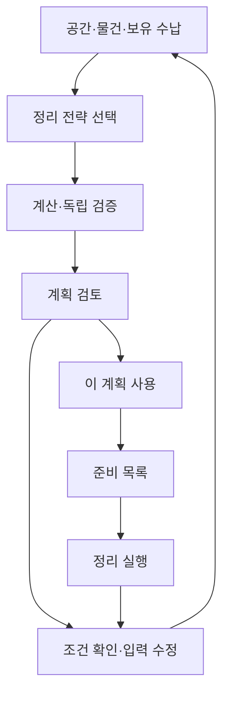

# ZARI 작업대 상세 설계도

상태: 구현용 문서 제안. 실행되는 UI, 화면 캡처, 승인된 baseline이 아니다. 이 문서는 기존 설계를 화면의 정보 순서·상태·행동·검증 항목으로 구체화한다. 사용자 수락이나 이 문서의 존재를 물리 검증·저장 성공·시각 승인으로 해석하지 않는다.

## 1. 문서 권한과 읽는 순서

제품 범위는 [PRODUCT_SPEC](../docs/PRODUCT_SPEC.md), 좌표·수량·검사·snapshot의 의미는 [DOMAIN_MODEL](../docs/DOMAIN_MODEL.md), 요청과 응답의 생명주기는 [WASM_PROTOCOL](../docs/WASM_PROTOCOL.md), UI 상태 소유권은 [FRONTEND](../docs/FRONTEND.md), 저장은 [PERSISTENCE](../docs/PERSISTENCE.md)가 정한다. 이 파일은 이들의 DTO나 이벤트 태그를 다시 정의하지 않는다.

시각 방향은 [DESIGN](../DESIGN.md), [DESIGN_SYSTEM](../docs/DESIGN_SYSTEM.md), [SCREENS](SCREENS.md), [COMPONENTS](COMPONENTS.md)를 따른다. 값과 상태 표현이 충돌하면 canonical 문서를 조용히 덮어쓰지 않고 정확한 충돌을 기록한다. 아래 패널 너비는 시작 layout constraint이며 새로운 CSS token 승인이나 기존 화면 승인이 아니다.

구현자는 이 문서에서 자신의 Task ID에 연결된 화면과 `UX-*` 검증 항목을 찾아 구현·브라우저 검증에 사용한다. 전체 기능을 미리 scaffold하거나 후속 기능을 작동하는 것처럼 표시하지 않는다.

## 2. 제품이 보여 주는 정보의 순서

사용자가 매 단계에서 답할 질문을 고정한다.

| 단계 | 사용자 질문 | 화면이 답할 내용 | 아직 답하지 않는 것 |
|---|---|---|---|
| 공간 | 어디에 정리할까? | 내부 치수, 입구, 장애물, 미측정 조건 | 어떤 상품을 사야 하는지 |
| 물건·보유 수납 | 무엇을 얼마나 넣을까? | 보관 형태, 수량, 그룹, 기존 용품 | 치수가 없는 물건의 허구 배치 |
| 정리 전략 | 어떤 기준으로 나눌까? | 선택 기준, 근거 사실, 구역·우선순위 | 이유 없는 상품 추천 |
| 계획 | 실제로 어떻게 놓을까? | 같은 scale의 배치, 내용물, 검사 근거 | 모델 밖의 안전 보증 |
| 준비 목록 | 무엇을 확인·확보할까? | 재사용, 구매 단위, 잉여, 미확인 조건 | 자동 주문·결제 |
| 정리 실행 | 어떤 순서로 옮길까? | 선행 조건과 snapshot에 묶인 단계 | 도착·설치의 자동 추정 |

위 순서는 선형 onboarding 강제가 아니다. 기존 프로젝트는 저장된 단계로 돌아갈 수 있고 과거 계획을 읽을 수 있다. 입력이 바뀌면 이전 계획의 현재성만 즉시 해제하며, 사용자가 보던 물건·검사 문맥은 가능한 한 유지한다.

## 3. 공통 작업대와 화면 밀도

### 3.1 공통 구조

1. ProjectHeader: 프로젝트 목록 링크, 프로젝트명, 현재 단계, 독립된 저장 상태. 구현된 시점부터 undo/redo를 제공한다.
2. 단계 navigation: 공간 / 물건 / 정리 기준 / 계획 / 준비 목록 / 실행. 미구현 항목은 링크로 만들지 않는다. 정보가 부족한 구현된 route는 필요한 입력과 복귀 경로를 설명한다.
3. 문맥 상태 영역: stale·계산 오류·저장 실패처럼 현재 행동을 바꾸는 알림. 같은 사실을 toast와 banner로 중복 반복하지 않는다.
4. 본문: 해당 단계의 form, workspace 또는 실제 목록. 공간 이름이나 숫자를 장식 KPI로 반복하지 않는다.
5. 해당 단계의 주요 행동: 사용자의 다음 결정 하나. 보조 행동은 같은 행 또는 가까운 위치에 두되 동일한 강조 버튼을 여러 개 만들지 않는다.

페이지 전체를 card로 감싸지 않는다. 각 pane은 하나의 배경과 heading으로 구분하고, 검사 목록과 BOM은 행 구조를 사용한다. 물리 도면 안의 제품 경계는 UI card 경계와 다르다.

### 3.2 너비별 배치

| 가용 너비 | 계획 화면의 구조 | 입력·목록 화면 | inspector |
|---|---|---|---|
| wide ≥75rem | 좌측 작업 문맥 16rem + 도면 가변 + 우측 20rem; 열 간 1rem | 공간 도식과 form, 또는 목록과 요약 | 비modal 우측 pane |
| medium 48–75rem | 도면 + 보조 pane 하나; 작업 문맥/선택 정보 전환 | form과 도식의 읽기 순서를 유지해 재배치 | 같은 보조 pane에서 명시적 전환 |
| compact <48rem | 도면, 보기/목록 전환, 선택 항목 열기 | 한 단계·한 열, 가로 page scroll 없음 | 명시적으로 여는 modal sheet |

wide 바깥 여백은 1.5rem, compact는 1rem을 시작값으로 한다. 중앙 도면의 유효 너비가 24rem 아래로 내려가면 보조 pane을 먼저 접는다. 브라우저 확대와 긴 한글로 필요 공간이 늘어나도 세 열을 억지로 유지하지 않는다. 1440px에서는 양쪽 pane보다 도면이 가장 넓어야 한다.

Header는 최소 4rem부터 내용에 맞게 늘어난다. 본문을 단일 viewport 높이에 고정해 키보드나 큰 글자를 자르지 않는다. wide에서 pane 자체 scroll을 사용한다면 각 scroll region에 이름이 있고 Tab 이동 시 focus가 보이는 곳으로 이동해야 한다. compact는 일반 문서 scroll을 기본으로 한다.

본문·입력 1rem, label 0.875rem, metadata 0.8125rem의 기존 위계를 사용한다. 경고와 중요한 가격을 metadata 크기로 줄이지 않는다. field 안 8px, 관련 field 사이 16px, 별도 section 사이 24px에 대응하는 토큰으로 정렬한다. 외부 여백을 늘려 도면이나 입력 정보가 첫 화면 밖으로 밀리는 설계는 거절한다.

### 3.3 모바일의 조작 원칙

- 도면은 전체 폭을 사용한다. 확대·축소·맞춤 버튼과 `배치 목록` 전환을 제공한다.
- 도면의 작은 물체를 탭하기 어려우면 같은 placement를 목록에서 선택할 수 있다. 가짜 hit target 크기를 물리적 크기로 표시하지 않는다.
- sheet에는 항목명, 현재 위치, numeric edit, 검사, 명시적 닫기를 제공한다. 열린 동안 배경 focus를 막고, 닫은 뒤 원래 trigger 또는 남아 있는 목록 항목으로 복귀한다.
- sheet를 닫지 않고 뒤의 다른 물체를 선택하려는 모호한 반modal 동작은 만들지 않는다. sheet 안에서 다음 대상 전환을 추가한다면 selection과 제목을 함께 갱신하고 별도로 검증한다.
- 가상 키보드가 열리면 현재 field·오류·확인 버튼에 도달할 수 있어야 한다. 고정 하단 bar가 오류를 덮으면 일반 flow로 전환한다.
- 구매 행을 작은 desktop table로 축소하지 않는다. 옵션명 다음에 수량·가격·확인 상태가 이어지는 labeled row로 바꾼다.

## 4. S00 프로젝트 시작과 재개

Route는 FRONTEND의 `#/projects`를 따른다. 제목 아래 `공간 정리 시작하기`, `샘플로 둘러보기`를 둔다. 샘플은 합성 데이터임을 시작점과 결과에 표시한다. 로그인·AI 대화·홍보 hero가 시작을 막지 않는다.

기존 프로젝트는 이름, 실제 저장된 공간 설명, 마지막 저장 시각, 마지막 계획의 현재성으로 구분한다. 치수나 계획이 없으면 없다고 표시한다. 진행률이나 절약액을 계산해 채우지 않는다. 프로젝트의 현 draft와 accepted snapshot이 다를 수 있음을 프로젝트 열기 후 명확히 보여 준다.

| 상태/행동 | 결과 | 금지 |
|---|---|---|
| 새 프로젝트 선택 | 비어 있는 공간 입력 | demo 수치를 사용자 측정값으로 초기화 |
| 샘플 선택 | synthetic 라벨의 별도 프로젝트 | 실제 판매처·재고처럼 표현 |
| 기존 프로젝트 열기 | 저장 검증→fresh activation→draft 복원 | 저장된 Worker ID 재사용 |
| 손상 기록 | 읽을 수 있는 정보와 복구/export 경로 | 손상 데이터를 삭제하고 새 프로젝트로 위장 |
| 저장 실패 후 프로젝트 전환 | 현재 draft 보존, retry/export/명시적 discard | 저장 실패를 무시한 전환 |

Task005에서 저장·재개를 시작하고, 손상 복구·export/import의 완전한 사용자 흐름은 Task009에 제공한다. 그 전에는 미구현 복구 버튼을 만들지 않고 사용할 수 있는 입력 보존·재시도만 설명한다.

## 5. S01 공간 측정

### 5.1 보이는 순서

form은 프로젝트 이름 → `수납장 안쪽 치수` → 폭·깊이·높이 → 미확인 상세 요약 → `입구·앞쪽 작업 공간` → `장애물·바닥·하중` → `측정 오차와 여유` 순서다. 각 section은 목록이나 fieldset이며 card 중첩이 아니다.

기본 치수부터 입력하되 상세 미확인을 숨기지 않는다. `입구 높이·하중 등 확인 필요`처럼 부족한 항목을 표시한다. Rust가 현재 입력으로 계산 가능한 범위를 알려 주면 그 범위와 제한을 보여 준다. 모든 상세 값이 없다는 이유만으로 무조건 form 오류를 만들지도, 상세를 닫았다는 이유로 통과 처리하지도 않는다.

도형은 수치가 모두 존재할 때 실제 비율을 사용한다. 필요한 축 값이 unknown이면 해당 view는 `측정 위치 안내 · 축척 없음`인 도식으로 표시한다. 알려지지 않은 깊이를 임의 깊이로 정해 실제 평면도처럼 보이지 않게 한다. 위치 미상이면 origin 0으로 배치하지 않는다.

### 5.2 field-to-dimension 연결

| Focus field | 함께 보이는 도식 | 텍스트 보완 |
|---|---|---|
| 내부 폭 | x 방향 치수선 | `왼쪽 안쪽 면부터 오른쪽 안쪽 면까지` |
| 내부 깊이 | 평면도의 front→rear 치수선 | `입구 쪽 안쪽 면부터 뒤쪽 안쪽 면까지` |
| 내부 높이 | 정면도의 z 치수선 | `사용할 바닥면부터 위쪽 경계까지` |
| 입구 폭/높이 | 정면 aperture와 대응 축 | `내부 치수와 입구 치수는 다를 수 있습니다` |
| 장애물 위치/크기 | 선택 obstacle과 해당 축 | 같은 obstacle ID와 field label |

Focus에 따라 관련 view를 드러낼 수 있으나 다른 form field의 값·selection·route를 바꾸지 않는다. 도면 색만으로 연결을 설명하지 않는다. 측정 안내 그림의 유효하지 않은 값은 물리적 배치 증거가 아니다.

### 5.3 상태·행동·결과

| 상태 | 사용자 행동 | 보이는 결과 / 권위 |
|---|---|---|
| 비어 있음 | 입력 또는 `아직 재지 않았어요` | raw text 또는 명시적 unknown, 0 아님 |
| IME/소수점 입력 중 | 계속 입력 | 원문 보존, 매 키 입력마다 오류 발표하지 않음 |
| 확인/blur | 값 확인 | Rust 결과로 유효/unknown/오류 표시 |
| 유효한 cm 값 | mm로 변경 | Rust 형식 변환 중→같은 epoch의 결과 적용 |
| 불완전한 값 | 단위 변경 | 원문·기존 단위 유지, 먼저 값 확인 안내 |
| invalid 제출 | 다음 단계 요청 | 오류 요약과 첫 invalid field focus |
| 이전 계획 있는 상태 | 값 수정 | 즉시 `치수가 바뀌었습니다. 이전 계획을 보고 있어요` |
| normalization 지연 | 새 값 입력 | 이전 응답 무시, 새 field를 과거 값으로 되돌리지 않음 |
| 저장 실패 | 입력 계속 | 입력은 유지, `이 기기에 저장됨` 표시 금지 |

측정 출처 `사용자 측정` 선택만으로 confirmed로 승격하지 않는다. 확인 증거를 요구하는 domain 계약을 그대로 따른다. 단위 표시 전환은 의미가 같다고 Rust가 확인하면 inputRevision을 바꾸지 않지만, 최신 raw edit의 응답 검증은 계속 필요하다.

### 5.4 앞쪽 작업 공간은 깊이 한 개가 아니다

`앞쪽 작업 공간`은 DOMAIN_MODEL의 staging을 사용자가 측정하는 이름이다. 공간 밖으로 용품을 완전히 꺼내고, 내용물을 위로 꺼내거나 넣을 수 있는 영역이다. 이 section은 다음 정보를 서로 독립적으로 보여 준다.

| 입력/근거 | 도식과 설명 | 없을 때 |
|---|---|---|
| 좌우 위치와 사용 가능한 폭 | 정면·평면에서 실제 앞쪽 영역 표시 | 중앙 정렬이나 내부 폭과 같다고 가정하지 않음 |
| 앞쪽으로 사용 가능한 깊이 | 입구 y=0에서 앞쪽으로 이어지는 free volume | 내부 깊이를 복사하지 않음 |
| 위로 비어 있는 높이 | 정면에서 staging 바닥부터 위쪽 경계까지 | 내용물을 위로 꺼낼 수 있다고 판정하지 않음 |
| 같은 높이의 지지면 | 구획 바닥과 이어지는 전체 staging 바닥의 지지 여부 | 손으로 받치는 상황을 확인된 support로 대체하지 않음 |
| 지지면 하중 | 용기와 내용물을 합한 하중의 근거 | 구획 바닥 하중을 staging에 복사하지 않음 |
| 취급 여유 | 좌우·위쪽 여유, 추가 pull 깊이, rim 위 lift 여유 | 제조사 요구나 손 여유를 임의의 상수로 채우지 않음 |

staging 깊이는 정본 measured bounds에서 유도한다. UI에 같은 값을 서로 다른 권위 필드로 중복 저장하지 않는다. 모델이 요구하는 level support가 없거나 높이가 다른 경우에는 다음 제한을 가까이 표시한다: `현재 버전은 같은 높이의 앞쪽 지지면을 따라 넣고 꺼내는 동작을 검사합니다. 손으로 들어 옮기는 동작은 검사 범위에 포함되지 않습니다.` unknown과 알려진 미지원 조건의 판정은 Rust에서 받는다.

내부 정적 여유, cavity 내부 여유, 움직일 때 취급 여유는 label과 입력 근거를 구분한다. 같은 물리적 틈을 UI에서 다시 합산하지 않는다. direct retrieval에서 적용되지 않는 lift 검사는 N/A 이유를 보여 주며, 다른 허용 recipe가 쓸 원래 입력값을 삭제하지 않는다.

## 6. S04 물건과 보유 수납용품

두 개의 heading을 사용한다: `정리할 물건`, `이미 가진 수납용품`. 두 목록을 같은 종류의 상품 카드로 표현하지 않는다.

물건 row의 기본 정보는 이름, 수량/미확인, 보관 형태, 해당 형태의 W/D/H, 그룹이다. 빈도·활동·active/reserve·무게·방향 요구는 해당 전략/검사에 필요한 상세로 이어진다. 상세가 닫혀도 미측정 수량과 치수는 행에 남는다. 같은 물건을 여러 활동에 연결해도 물리 수량을 복제하지 않는다.

`꺼내는 방식`에는 정본 `allowedRetrievalModes`의 지원 선택지를 표시한다. `물건을 앞쪽으로 바로 꺼내기`와 `수납용품을 꺼낸 뒤 물건 꺼내기`를 각각 선택할 수 있으며 둘 다 허용할 수 있다. 이는 가능한 사용 방법을 정하는 입력이다. 최소 구매 전략이나 recipe가 사용자 선택을 조용히 변경하지 않는다. 아직 선택하지 않은 상태를 UI가 임의로 둘 다 허용한 것으로 저장하지 않는다.

그룹에는 `한 곳에 모으기`와 `같은 구역 안에서 나눠 담기`의 명시적 선택을 제공한다. 각각 정본 `GroupSplitPolicy`의 OneTarget과 AllowMultipleTargets를 따른다. 한 곳에 모으기는 용기 하나에 모으거나 해당 구역에 모두 직접 배치하는 의미이며, 그룹당 물건 한 개를 뜻하지 않는다. 개별 Item의 `함께 보관해야 함` 제약은 별도로 표시한다. 그룹 분할을 허용해도 이 제약은 해제되지 않는다. 설정되지 않은 imported group을 분할 허용으로 보정하지 않는다.

보유 수납 row는 용품명, 보유/사용 가능 수량, 외경과 내경의 별도 상태, 선택적 variant 참조를 보여 준다. retailer 재고가 없는 것과 사용자가 가진 것이 없는 것은 다른 사실이다. 구매 offer가 없어도 owned container를 사용할 수 있다.

| 행동 | 결과 |
|---|---|
| 물건 추가 | 이름·수량·보관 상태가 있는 실제 편집 row, 임의 1개 default 금지 |
| 수량 0 입력 | 알려진 빈 수량으로 보존, unknown과 구별 |
| 수량 미확인 | 전체 수량을 임의로 전개하지 않고 미확인 목록 유지 |
| 그룹 변경 | selected grouping의 고유 membership 검증; 충돌을 표시 |
| 꺼내는 방식 변경 | 해당 recipe의 허용 여부를 Rust가 다시 판단, 기존 계획 stale |
| 그룹 분할 선택 | 정확한 인스턴스 분할과 함께 보관 제약을 다시 검증, 물리 수량 복제 금지 |
| 저장 형태 변경 | 바뀐 치수/방향을 확인할 수 있도록 입력 갱신, 기존 계획 stale |
| owned item 제거 | 영향받는 placement·계획을 stale 처리, 과거 snapshot은 불변 |

Task006은 한두 개의 rigid group과 최소한의 owned open bin 입력을 제공한다. 복잡한 catalog 관리가 있어야만 첫 기능을 사용할 수 있는 구조는 금지한다.

## 7. S05 정리 전략과 취향

전략은 radio 선택 목록이다. 각 항목은 제목, 목표, Rust가 참조한 입력 사실, 실제 구역/우선순위 변화, 적용 불가 이유를 보여 준다. 상품 사진·판매가를 전략 선택보다 먼저 배치하지 않는다.

기본 표시 예시: `추가 구매를 최소화` → `입력한 보유 수납용품을 우선 검토합니다` → `통과하지 못하는 수납용품은 사용하지 않습니다`. 문구는 실제 `StrategyDecision` reason과 일치할 때만 사용한다. 정보가 없으면 `사용 빈도를 입력하면 구분할 수 있습니다`처럼 필요한 fact로 연결한다. UI가 별도 추천 논리를 만들지 않는다.

선택한 전략 아래에 `이 기준이 바꾸는 것`을 두고 그룹·구역·priority를 설명한다. `색상·재질 선호`는 뒤의 별도 section이다. `반드시`인 hard constraint와 `가능하면`인 preference를 같은 toggle 모양으로 섞지 않는다. 충족할 수 없는 hard constraint를 조용히 soft로 낮추지 않는다.

첫 slice에서는 실제로 구현된 minimum-purchase만 노출한다. 다른 family가 구현·검증되기 전에는 설명 카드나 선택 가능한 가짜 옵션으로 채우지 않는다. 후속 beta에서 빈도/활동/active-reserve/one-action-access가 실제 규칙과 이유를 가진 경우에만 추가한다.

z-strategy-library는 그 라디오 아래에 비교를 둔다. 다섯 Recipe의 규칙·primitive·접근 가정은 Rust 응답이고, 화면은 추천 순서를 만들지 않는다. 저장하지 않은 라디오는 핀을 옮기지 않는다.

주요 행동은 `배치안 계산`이다. 마지막 확인은 입력·미확인·선택 전략의 짧은 요약이며 강제 승인 modal을 반복하지 않는다. 계산 가능 여부와 실패 이유는 Rust의 validation/capability 결과에서 온다.

## 8. S02 계획 검토와 물리 workspace

### 8.1 각 영역의 정확한 책임

| 영역 | 상시 내용 | 선택/확장 내용 |
|---|---|---|
| 좌측 문맥 | 공간/물건/전략의 간결한 요약, 원본 편집 링크 | 그룹별 대상 목록 |
| 도면 toolbar | 평면/정면, zoom/fit, 배치 목록, 범위 label | 구현된 비교와 이동 controls |
| 중앙 도면 | 공간 경계, front 표시, placement, obstacle | 해당 객체의 치수·내용물·검사 evidence |
| 도면 아래 | 미배정 물건과 이유, 결과 scope | search 종료 이유와 사용 budget |
| 우측 inspector | 선택 대상 이름, 정확한 옵션, 역할 | 외경/내경/내용물/검사/출처/허용 편집 |
| 결과 행동 | `이 계획 사용`, 실제 대안 선택 | 조건부 선택 설명과 historical 경로 |

객체를 선택하지 않았으면 inspector는 계획 전체 검사와 `대상을 선택하면 내용물과 근거를 볼 수 있습니다`를 보여 준다. 빈 패널을 장식 카드로 채우지 않는다. 선택 객체의 이름이 길어도 정확한 옵션을 확인할 수 있어야 한다.

### 8.2 도면 layer와 좌표

배경 grid(선택적) → 공간·opening → obstacles → 권위 있는 placement → 선택 outline → 현재 검사 evidence → provisional ghost → dimension label 순서로 그린다. 꼭 필요한 경계와 선택 outline이 겹치면 텍스트/별도 선 형태로 두 의미를 보존한다. 모든 접근 영역을 동시에 채워 도면을 가리지 않고 선택한 check의 evidence만 드러낸다.

평면은 x 오른쪽, y 뒤쪽을 화면 위로 표시하고 아래쪽에 `앞쪽 / 입구`를 둔다. 정면은 x 오른쪽, z 위쪽이다. 이는 SVG 표시 변환이며 Rust coordinate를 변경하지 않는다. 경계·내경·aperture·handling clearance는 서로 다른 label을 가진다. 실제 치수와 gap을 미관상 늘리거나 줄이지 않는다.

container 내부가 알려졌더라도 cavity offset이 미확인이면, 내용물 배치는 inspector 안의 `내부 수납 도식 · 실제 외형 내 위치 미확인`으로 보여 준다. 외형 중앙에 임의 정렬해 전역 좌표가 확인된 것처럼 표시하지 않는다. assignment가 provisional이면 `수납 가능 확인 전`을 유지한다.

접근 검사에서 앞을 막는 물체가 있으면 해당 blocker ID와 제거 의존 순서를 도면·목록으로 연결한다. `먼저 옮겨야 할 수납용품 2개` 같은 수치는 Rust가 제공할 때만 사용하며, 이를 전체 사람 행동 횟수라고 부르지 않는다. v1은 제거한 물체의 임시 보관 위치와 재설치 동작을 검증하지 않는다. 따라서 blocker가 1개 이상이면 `앞 물체를 옮길 임시 위치는 검사하지 않았습니다`와 접근 unknown을 유지한다. hard one-action 조건이면 실패다. 사용자 확인 check나 비순환 의존 순서만으로 접근 pass를 만들지 않는다.

### 8.3 검색 상태

| 상태 | UI와 행동 | 보존하는 것 |
|---|---|---|
| 계산 전 | 필요한 입력, `배치안 계산` | draft |
| 계산 중 | 검토 대상/처리량 등 실제 counters, `취소` | 기존 accepted snapshot은 이전 계획으로 유지 |
| 취소 요청 | `계산 취소 중`, late 결과 게시 차단 | 현재 입력·마지막 계획 |
| 협력 취소 완료 | `계산을 취소했습니다`, 새 계산 가능 | 완료를 주장하지 않음 |
| 강제 종료 | `계산을 중단했습니다`, Worker 재초기화/재시도 | budget exhausted로 표시하지 않음 |
| 일부 유효 대안 + budget 종료 | 실제 대안과 `정해진 탐색 한도까지 계산` | 대안을 전체 최적해라고 부르지 않음 |
| 후보 없음 | catalog/filter/scope/unknown 별 원인과 수정 경로 | 모든 물건과 부족한 정보 |
| Worker 실패 | `계산 다시 시작`, failure 원인 범위 | 입력·저장된 계획 |

진행률의 전체 작업량을 모르면 퍼센트·남은 초를 만들지 않는다. debug/manual stepping은 개발·검증용이며 일반 사용자 단계 버튼으로 노출할 이유가 없다. 완료·취소·저장 상태는 animation 종료 이벤트와 무관하다.

### 8.4 같은 축척의 대안 비교

대안 수는 0–3개의 실제 결과를 따른다. wide에서 두 안을 나란히 놓으면 공통 viewport extent와 두 pane에 모두 맞는 하나의 scale을 선택한다. 세 안은 모든 pane에 같은 scale을 적용하거나 두 안 비교와 명시적 대상 교체를 사용한다. compact는 하나씩 전환하되 scale·pan·view를 유지한다.

비교 행은 `신규 구매 필요`, `사용하는 보유 용품`, `미배정 물건`, `확인할 조건`, Rust가 제공하는 접근 차이다. 금액은 확인된 소계와 미확인을 함께 표시한다. UI가 physical count를 다시 합산하거나 종합 효율 점수를 만들지 않는다.

`안 보기`는 검사할 candidate 변경이고 `이 계획 사용`은 사용자 수락이다. 어떤 대안을 보고 있는 동안에도 accepted plan 표시는 구분한다. 단순 selection으로 action progress나 accepted binding을 이동시키지 않는다.

## 9. 편집·키보드·숫자 입력의 동등성

Task007 이전에는 drag editor와 그에 준하는 완성 기능을 표시하지 않는다. Task007에서 모든 경로는 같은 Rust `validateEdit` 계약을 사용한다.

| 목표 | Pointer | Keyboard/숫자 대안 | 완료 기준 |
|---|---|---|---|
| 선택 | 도면 탭 또는 목록 버튼 | 목록/도면 control focus 후 선택 | 동일 placement ID의 inspector |
| 이동 | drag ghost, 놓기 | x/y/z numeric field 확인 또는 방향 버튼 | matching Rust 결과의 새 snapshot |
| 미세 이동 | 방향 버튼 | 도면에 명시적 focus일 때 arrow 1mm, 표시된 modifier 10mm | key group 하나의 transaction |
| 회전 | 허용 회전 버튼 | 같은 버튼 또는 허용 방향 선택 | 허용 orientation만 요청·재검증 |
| 교체 | 해당 용품의 후보 선택 | 후보 목록 keyboard 선택 | 내용물·BOM까지 재검증 |
| 취소 | `원래 위치로` | Escape | ghost만 제거, 이전 accepted plan 유지 |
| undo/redo | 명시적 버튼 | 구현된 단축키, text field 기본 편집과 구분 | 최신 context에서 다시 검증 |

숫자 입력은 drag보다 덜 검증하거나 더 강한 권한을 갖지 않는다. 실패한 move에서는 기존 placement와 BOM을 유지하고 ghost에 실패 이유를 붙인다. `공간 밖으로 5 mm 나갑니다`는 Rust evidence가 있을 때만 표시한다. replacement가 물건을 미배정으로 바꾸면 그 목록도 동일 snapshot으로 갱신한다.

입력 undo와 배치 undo는 의미가 다르다. 전자는 정규화 digest가 변할 때 inputRevision을 증가시키며, 후자는 같은 입력의 새 validated layout이 될 수 있다. UI가 revision을 감소시키거나 과거 응답을 다시 유효하게 만들지 않는다.

## 10. S03 준비 목록과 실행

### 10.1 준비 목록

상단에는 현재 검사 중/사용 중인 계획, historical 여부, 관측 시각, 아직 확인할 조건을 둔다. 본문은 `이미 가진 것`, `새로 확보할 것`, `확인할 것`의 의미 있는 행으로 구성한다. 출처 관측 시각이 없는 값에 현재 시각을 넣지 않는다.

wide table의 핵심 열은 옵션/규격, 필요한 개수, 재사용, 주문 단위·묶음 수, 확보·잉여, 확인된 소계, 확인 상태/행동이다. 열이 부족하면 한 행 안에 label을 붙여 재배치한다. 필요한 개수와 주문 묶음 수를 모두 `수량`으로 표기하지 않는다.

예시 `필요 5개 / 2개 묶음 / 3묶음 주문 / 6개 확보 / 1개 남음`은 Rust snapshot이 반환한 경우만 표시한다. 가격·배송·재고는 별도 행이다. 일부 가격 미확인 시 `총 0원`이나 확정 총액을 표시하지 않는다. 추가 구매가 없으면 실행 순서를 계속 제공한다.

`배치에서 보기`는 해당 BOMLine의 placementIds를 강조하고 계획 route로 연결한다. `판매처에서 보기`는 해당 offer의 검증된 reference URL을 연다. 이 링크를 enabled로 표시하는 것이 fit·재고·주문 완료의 의미가 아님을 유지한다. 자동 cart·결제 버튼은 없다.

### 10.2 실행 가이드

실행 guide는 snapshot의 ActionStep 순서와 선행 관계를 사용한다. UI가 독자적으로 `비우기→구매→정리` 고정 문장을 생성하지 않는다. step row는 제목, 관련 물건/placement, 완료 상태, 선행 조건, 필요한 확인의 최소 구조다. 물리 작업과 구매·도착을 구분한다.

openBin·tray·verticalFile에 대해 정본 solver가 생성하는 순서는 `필요한 제품 확보·도착 확인 → 구획 비우기와 측정된 staging 준비 → staging에서 물건을 용품에 담기 → 검증된 순서로 내용물이 든 용품 삽입`이다. 내용물을 이미 설치된 용품 안으로 위에서 넣으라고 바꾸지 않는다. direct item은 개별 삽입 순서를 따른다. guide에는 `고정 방향으로 천천히 이동하는 직육면체 모델 기준이며, 흔들림·쏟아짐·잡는 동작은 검사하지 않습니다`라는 범위 설명을 필요한 단계 가까이 둔다. 알려진 취급 조건이 모델을 벗어나면 dependent 단계가 차단된 이유를 표시한다.

| 상황 | 사용자 행동과 결과 |
|---|---|
| 선행 단계 미완료 | 완료 control을 사용할 수 없는 이유와 선행 단계 링크 |
| 상품 도착 전 | 도착을 사용자가 기록하기 전 dependent 설치 완료 불가 |
| 물리 조건 미확인 | 필요한 조건을 입력/검증 경로로 안내; 계획 수락으로 해제하지 않음 |
| 단계 완료 | 해당 snapshot binding의 progress 저장 요청 |
| 저장 실패 | 현재 의도 보존, 저장되지 않았음을 표시하고 retry |
| 다른 계획 채택 | 다른 binding으로 분리, 과거 check 자동 이전 금지 |
| historical 실행 열기 | 과거 계획과 progress임을 표시, 현재 도면과 혼합 금지 |

Task006은 작은 synthetic 계획에서 나온 guide를 같은 snapshot으로 보여 주는 데 집중한다. 실제 catalog 기반 구매·실행과 도착/진행 상태의 완전한 흐름은 Task008, export/import와 복구는 Task009에서 검증한다.

## 11. 상태를 하나의 초록 badge로 합치지 않는 규칙

아래는 저장 DTO가 아니라 화면의 의미표다. 하나의 `verified` boolean을 만드는 근거로 쓰지 않는다.

| 차원 | 의미 | 표시 예 | 다른 차원에 주지 않는 권한 |
|---|---|---|---|
| evaluated | 독립 검사를 수행함 | `검사 결과` | 모든 항목 pass 아님 |
| conditional | 적용 조건 중 unknown이 남음 | `내경 높이 확인 필요` | 실행 prerequisite 해제 아님 |
| physically confirmed | 지원 모델의 필수 물리 검사가 확인됨 | `입력·검사 범위 안에서 확인됨` | 재고/배송/실물 무제한 안전 보장 아님 |
| selected | 지금 비교·검토하는 안 | `보고 있는 안` | 수락·저장 아님 |
| accepted | 사용자가 사용할 계획으로 지정 | `사용 중인 계획` | unknown→pass 아님 |
| saved | 해당 최신 transaction 완료 | `이 기기에 저장됨` | backup·현재성 보장 아님 |
| current | 현재 input/context와 일치 | 현재 문맥에서 표시 | 다른 검사 실패 제거 아님 |
| stale/historical | 현재 입력·계산 문맥과 다름 | `이전 계획 · 재계산 필요` | 과거 데이터 삭제 사유 아님 |

대표 조합: `사용 중인 계획 · 내경 높이 확인 필요 · 이 기기에 저장됨`은 유효한 상태다. `이전 계획 · 입력 변경 · 새 입력 저장 중`도 유효하다. 여기에 무조건 초록 check 하나를 붙이지 않는다.

미확인 검사와 실패는 inspector를 닫아도 계획 요약에서 발견할 수 있어야 한다. known hard-invalid candidate는 진단으로 표시하며 추천·실행 가능한 계획으로 채택시키지 않는다. stale 계획 위에 최신 공간 outline만 덮어 과거 placement와 섞지 않는다.

## 12. slice별 범위와 브라우저 acceptance

| 단계 | 실제 제공할 화면 | 제공하면 안 되는 주장 |
|---|---|---|
| Task001 bridge | 폭 입력·단위·폭 검사 도식·pack arithmetic·Worker retry | 완전한 공간/배치 검증, 정리 전략, 저장 |
| Task005 measurement | W/D/H·상세 입력·draft save/reload·Worker lifecycle | full compiler·검색 harness가 실 WASM 취소 증거라는 주장 |
| Task006 첫 완성 slice | 물건/owned 최소 입력, minimum purchase, 실제 대안, inspector, BOM/guide, accept/save/reload | 실제 상거래, 범용 editor, 사진 측정 |
| Task007 editor | 같은-scale 비교·허용 편집·undo/redo | SKU resize·무검증 optimistic BOM |
| Task008 catalog/execution | 실제 import/evidence·보유품·판매처·실행 progress | 자동 scrape·재고 추정·결제 |
| Task009 recovery | import/export·손상/충돌 복구·local photo·offline revisit | cloud backup·사진 치수 추론 |
| Task010 beta evidence | 지원 browser·반응형·접근성·성능 검증 | 미승인 캡처의 baseline 승격 |

아래 ID는 [DEVIN_EXECUTION_PLAN](../docs/DEVIN_EXECUTION_PLAN.md)의 acceptance에 추가로 연결하는 UX 증거 인덱스다. 새로운 독립 task나 실행 승인 기록이 아니다. 각 적용 작업의 작성자는 실제 browser route, fixture, HEAD SHA, viewport, 행동, 결과와 미검증 부분을 보고한다.

| ID | Task | 실제 수행할 검증 | 통과 관찰 |
|---|---|---|---|
| UX-001 | 001 | keyboard로 60cm↔600mm, blank/zero/60.01cm | Rust 결과·unknown·field 오류가 각각 구별됨 |
| UX-002 | 001 | 3×190/195mm와 5개/2개 pack fixture | 590/605mm와 3/6/1 표시, 폭 검사 한정 문구 |
| UX-003 | 001 | normalization 지연 후 새 raw-invalid edit | 늦은 응답이 최신 입력·오류·표시를 덮지 않음 |
| UX-004 | 001 | Worker 종료 후 retry, 390/1440px | 입력 보존, 실제 WASM 다음 호출 성공, console 오류 점검 |
| UX-005 | 005 | 폭/깊이/높이 focus와 view 연결 | 대응 치수선·label, route와 다른 field 보존 |
| UX-006 | 005 | invalid draft 저장 후 reload | 원문 복원, 0 변환 없음, 옛 plan은 current 위장 없음 |
| UX-007 | 005 | 늦은 저장 응답 뒤 새 편집, 두 탭 충돌 | 새 draft를 saved로 표기하지 않음, 충돌 설명 |
| UX-008 | 005,006 | 프로젝트 A→B→A와 Worker 재생성 | 이전 activation/generation의 결과 게시 안 됨 |
| UX-009 | 006 | 기본/재사용-only/추가 구매 없음 | 같은 제품 품질의 정상 계획, shopping 압박 없음 |
| UX-010 | 006 | 외경 fit·내경 fail/unknown fixtures | hard fail은 진단, unknown은 조건과 물건을 보존 |
| UX-011 | 006 | 물건 한 개를 선택하고 배치/contents/BOM 추적 | 동일 ID·snapshot binding, 미배정도 보존 |
| UX-012 | 006 | 입력 수정 직후 이전 계획 보기 | 즉시 stale, 새 공간과 옛 placement 혼합 없음 |
| UX-013 | 006 | 실제 stepped WASM 검색 취소·hard cancel | 취소/중단/예산 소진 구분, 늦은 result 차단 |
| UX-014 | 006 | conditional 계획 수락·저장·reload | 조건과 snapshot ID 보존, 수락이 pass를 만들지 않음 |
| UX-015 | 007 | 대안 1/2/3개를 desktop/mobile 비교 | 같은 공간·view·scale, 가짜 대안 없음 |
| UX-016 | 007 | 같은 move를 drag/numeric/버튼으로 수행 | 같은 Rust 검증 결과, ghost 동안 BOM 불변 |
| UX-017 | 007 | 충돌·범위 초과 move와 Escape | 이전 authoritative geometry 유지, 오류/복귀 명확 |
| UX-018 | 007 | text field arrow와 viewport arrow | 입력 caret과 물체 이동 shortcut 충돌 없음 |
| UX-019 | 007 | 입력 undo와 layout undo, 새 편집 후 redo | revision 규칙과 history branch가 canonical 계약과 일치 |
| UX-020 | 007 | compact sheet 열기/닫기·선택 제거 | focus trap/복귀/유효 fallback, numeric 편집 가능 |
| UX-021 | 008 | 동일 BOM에서 필요/재사용/pack/잉여 확인 | 도면을 다시 세지 않고 Rust 출력 표시 |
| UX-022 | 008 | price/shipping/inventory 각 unknown | 독립 상태, 누락 가격 무료 처리 없음 |
| UX-023 | 008 | 선행 미완료·도착 전·다른 계획 실행 | 완료 제한 이유, progress 자동 이전 없음 |
| UX-024 | 009 | 손상 import·CAS 충돌·저장 실패 | 입력 보존, 명시적 복구, 조용한 삭제/덮어쓰기 없음 |
| UX-025 | 009 | export/import·offline 재방문 | demo/조건/버전 보존, 맞는 JS/WASM build, local임을 표현 |
| UX-026 | 009 | 사진 첨부·삭제·metadata 점검 | 로컬 첨부만, 치수 자동 추론·외부 업로드 없음 |
| UX-027 | 010 | 320/390/768/1280/1440px,200%zoom, 긴 한글 | 일반 콘텐츠 reflow, 주요 field·오류·행동 도달 가능 |
| UX-028 | 010 | 실 모바일 키보드·safe area | field·오류·확인 버튼 가림 없음 |
| UX-029 | 010 | screen reader·forced colors·reduced motion | 주요 flow 수행, 상태 텍스트·focus 유지 |
| UX-030 | 010 | draft capture와 baseline manifest 대조 | 승인 없는 승격·실행하지 않은 검증 주장 없음 |
| UX-031 | 005,006 | staging 폭·깊이·높이·support/load 각각 known/unknown과 높이 차이 | 서로 복사하지 않음, 지원 경로 제한과 실제 Rust 판정 표시 |
| UX-032 | 006,007 | retrieval 두 방식 허용/제한, group split과 mustStayTogether 조합 | 사용자 선택을 recipe가 바꾸지 않음, 정확한 수량 보존 |
| UX-033 | 006,008 | 설치 가능한 뒤쪽 용품 앞에 removable blocker 존재 | 임시 위치 미검증으로 접근 unknown, hard one-action이면 fail |
| UX-034 | 006,008 | container plan의 실행 순서와 staging headroom 부족 | staging에서 담은 뒤 삽입, 미지원 내부 transfer 지시 없음 |

## 13. 충돌 점검과 구현 감수 기준

기존 SCREEN 명세의 세 화면 S01/S02/S03는 이 문서에서 유지했다. 물건·전략은 S04/S05로 식별하되 실제 journey 순서는 route 계약을 따른다. 번호가 제품 진행 순서나 새로운 route를 뜻하지 않는다.

COMPONENTS, FRONTEND, DESIGN_SYSTEM은 raw 문자열을 보존하는 TextField와 Rust normalize 계약을 따른다. NumberField의 숫자 변환을 정규화 권위로 사용하지 않는다. 새 도구·디자인 identity·geometry capability를 이 문서로 승인하지 않는다.

다음은 단순 시각 polish가 아니라 진행을 막는 UX 결함이다: unknown을 success로 표시, drag ghost의 BOM 반영, stale 결과의 현재 표시, 저장 실패 은폐, keyboard/단일 pointer 대안 부재, 정확한 옵션/quantity 숨김, 다른 snapshot 데이터 혼합, synthetic을 실상품처럼 표시, 승인 없는 baseline 교체. 작성자의 green CI나 예쁜 캡처로 면제되지 않는다.

도면 완성도와 문서 완성도는 다르다. 이 설계도의 검증 ID는 아직 미실행이며, 각 구현 task가 실제 앱을 띄워 증거를 생성해야 한다. 사용자에게 보여 줄 검토 자료는 대표 성공 화면뿐 아니라 unknown·실패·stale·mobile 상태를 포함한다.
