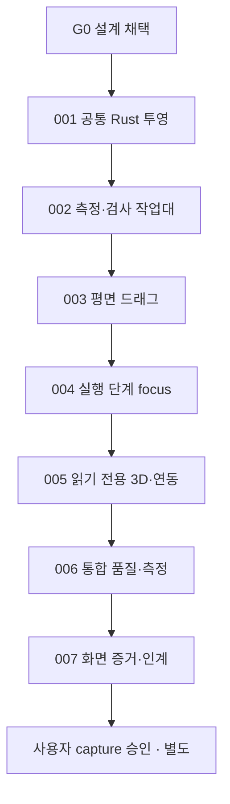

# AIOPS — ZARI 공간 작업대 확장 실행 계획

상태: **설계 후보 / 이슈 미생성 / 미발송 / 미구현**. 본 패키지의 채택과 유효한 program plan pin 뒤에만 실행한다. program key 후보 `ZARI-SPATIAL`, node `001`–`007`, canonical Task ID=`ZARI-SPATIAL-001` 등, branch=`astra/zari-spatial-001` 등. SP-001 같은 표기는 문서 안의 축약이다.

## 1. 운영 권한과 시작 전제

현재 ZARI AGENTS의 program mode와 중앙 M1/M5를 따른다. 설계 초안을 작성한 이 세션은 Claude Fable의 설계 감사자나 중앙 coordinator/merge executor가 아니다. 현재 main source가 runtime_enabled=true를 담아도, host-bound activated SHA/qualified lanes/client pin/bridge의 일치를 이 문서에서 확인했다고 주장하지 않는다. candidate pin의 상태 문구가 오래됐다는 이유로 dispatcher를 우회하거나 추가 설치하지 않는다.

시작 전: (1) exact-HEAD Fable G0 채택, (2) 실제 적용 가능한 중앙 policy/runtime/host/client 관계 확인, (3) 등록 프로젝트·레인 자격·체크 정의 확인, (4) 승인 근거가 기록된 계획을 default branch에 병합, (5) 비활성 draft program을 승인된 `.aiops/program.json`으로 별도 등록하고 그 commit을 pin. 이 계획 PR은 문서만 게시하며 (2)–(5)를 실행하지 않는다.

시작 후 중앙은 pinned plan에서 canonical issue 하나와 TASK ENVELOPE v4를 생성한다. 원문 task key/request/MAC/issue URL을 작성자·소장이 임의로 만들지 않는다. node마다 BUILDER_STANDARD/PR, 레인 선택은 `DEVIN → GROK_BUILD → GLM → CURSOR`의 현재 qualified idle lane 순서; owner는 끝까지 유지한다. reviewer는 owner 제외, A2 이상은 서로 다른 두 independent lanes와 현재 규약상 필요한 Fable gate. idle/unknown/unqualified는 unavailable; 몰래 fallback/retry/polling 금지.

빌더는 investigate→local plan→implement→tests/run/browser→debug/fix→full diff→evidence/status→commit→ready PR→session signer delivery→종료. 수정 피드백은 같은 owner의 follow-up으로 전달한다. writer/reviewer는 merge·main push·history rewrite·tags/branch 삭제/이동 금지. 프로그램 delivery branch는 intake가 제공한 이름 그대로. 중앙 merge executor만 User M1 범위에서 computed READY_FOR_MERGE·exact expected HEAD·bridge를 확인해 ordinary merge; 문서의 PASS 문구로 gate를 대체하지 않는다. 일반 design PR은 이 프로그램 task가 아니며 자동 merge 대상이라고 주장하지 않는다.

## 2. 공통 task contract

아래 각 task 본문과 이 절을 pinned plan의 정확한 파일/anchor에서 함께 읽는다. 원문 prompt/manifest 불변, Rust 단일 계산 권위, immutable snapshot/BOM/guide, unknown fencing, local-first, no-purchase를 모든 task에 적용한다.

**모든 task의 시작 문장:** “수정 전에 실제 repository HEAD, 해당 task의 pinned 설계 계약, 아래 관련 source와 인접 tests를 조사하십시오. 전체 저장소의 무제한 재감사를 반복하지 마십시오.” repo 변경이 구현을 진전시켰으면 현 패턴을 활용하고 완료 능력을 중복 구현하지 않는다. foundational contract가 바뀌었으면 관련 범위를 중단한다.

Allowed judgment: private helpers/React 분해/indexing/memoization/test fixtures/bug debugging은 scope 안에서 선택한다. field tags/mm axes/unknown/PlanSnapshot/Worker source lease/persistence/selection/drag outcome/입출력 상태는 새로 발명하지 않는다. Required files are ownership surfaces, not every helper's line-by-line recipe. 기존 modules를 조사해 맞추되 동작이 필요한 곳만 만든다.

공통 verification V-UI: `npm run typecheck`, `npm run lint`, `npm test`, `npm run build`, `npm run test:browser -- --project=chromium`, `node scripts/check-design-tokens.mjs --self-test`, 실제 브라우저 기능별 success+important failure+console 검증. contracts 변화면 V-CORE도 수행. V-CORE: `cargo fmt --all -- --check`, `cargo clippy --workspace --all-targets --locked -- -D warnings`, `cargo test --workspace --locked`, `cargo run -p zari-core --locked --example fixture_runner -- fixtures`, `npm run wasm:build`, `npm run contracts:check`, `npm run test:parity`. 최초 dependency 설치는 기존 locks/toolchain, 새 dependency는 SP-005 허용 범위만. 정확한 현재 명령은 [SPATIAL_VERIFICATION §5](SPATIAL_VERIFICATION.md#5-실행-명령-계약).

공통 evidence: task/pinned docs, observed base SHA, final full HEAD SHA, full changed paths, acceptance→test mapping, exact commands/exit/results/counts, browser route/device/flow/console/artifact, native/browser parity 해당 여부, known limits/unverified, touched areas/contract-change advisory, architecture deviations, out-of-scope items, user decision 필요 시 근거. `Tests pass` 한 줄 금지. evidence는 `docs/evidence/ZARI-SPATIAL-<node>.md`와 PR, IMPLEMENTATION_STATUS의 실제 완료 상태에 기록. 증거 문서는 review PASS를 author가 쓰는 곳이 아니다.

공통 forbidden: source prompts/manifest·governance/runtime flags/CI gate 약화·remote services/secrets/public deploy/AI/GPU/DuckDB/Polars/Python business logic·floorplan-3d 복사·unknown default·approved baseline 교체·임의 merge. generated artifacts는 Rust 변경과 함께 generate/check/diff, 손수 고치지 않는다. 실패 tests 삭제/skip/threshold 완화로 통과시키지 않는다.

공통 stop: 필수 계약 충돌/없음, 보호 영역 수정 필요, destructive migration, new paid/license/secret/cloud boundary, validator 의미 변경, source pin drift가 계약을 바꿈, 실제 브라우저/required CI 실행 불가, unqualified lanes/UNKNOWN ownership, scope 밖 engine/dependency 필요. routine naming·debugging·test 수정은 승인 없이 해결한다. architecture evidence+최소 변경안을 Fable 경로로 전달, User-only consequential decision은 User에게 전달한다.

## 3. DAG와 ownership

| Node | Class | Execution/parallelism | Audit floor / Astra gate | Architectural gate |
|---|---|---|---|---|
| 001 | A, contract + native/browser integration | single qualified builder, SEQUENTIAL | A3 / ARCHITECTURE | G1 |
| 002 | B, measurement/inspection slice | single qualified builder, SEQUENTIAL | A2 / MILESTONE | G1b |
| 003 | B, end-to-end drag | single qualified builder, SEQUENTIAL | A2 / MILESTONE | G2 |
| 004 | B, guide/progress slice | single qualified builder, SEQUENTIAL | A2 / MILESTONE | G3 |
| 005 | B, 3D+selection slice | single qualified builder, SEQUENTIAL | A2 / MILESTONE | G4 |
| 006 | B, integrated quality | single qualified builder, SEQUENTIAL | A2 / MILESTONE | G5 |
| 007 | B, real screen evidence | single qualified builder, SEQUENTIAL | A1 / MILESTONE | G6 |

이 프로그램은 shared session/PlanScreen/styles/contracts/capture 파일을 건드리므로 **모든 node가 직렬**이다. dependency_done은 중앙 host-pinned delivery PR의 정확한 HEAD 병합을 의미하며 author 완료 주장/이슈 닫기만으로 다음으로 가지 않는다. 다른 제품의 독립 작업은 중앙 전체 규약이 허용하면 병렬 가능. 독립 read-only reviewer sessions는 필수 review와 슬롯 규칙에 따라 병렬 가능하되 작성에 참여한 레인은 제외한다.

별도 Ask Devin investigation은 초기에는 불필요하다. SP-006에서 실제 perf 병목이 여러 모듈에 걸치고 비교 가치가 생기면 scope-limited 조사/동일 fixture 경쟁 실험을 별도 승인 task로 제안할 수 있다. 결과 비교 없이 생산 renderer를 세 레인에 중복 구현시키지 않는다.

## 4. SP-001 — 공통 Rust 공간 투영과 기존 도면 좌표 정합

**Objective/outcome:** source integrity를 검증한 하나의 Rust projection이 현재 SVG top/front의 parent/offset/yaw/unknown 문제를 해결하고, 후속 layer/3D가 같은 mm geometry와 typed links를 사용하게 한다. 여러 언어를 다루지만 하나의 read-model 계약을 native부터 browser까지 증명하는 ownership unit이다.

**Context:** SPATIAL_INTERACTION_PLAN §§2–5; SPATIAL_VIEW_CONTRACT 전체; DOMAIN_MODEL §§1–7; WASM_PROTOCOL; geometry/validator/finalize/protocol/canonical; existing plan/view.ts, PlanScreen, session/client/controller, contracts exporter/harness/fixtures. Upstream scalar/snapshot/protocol/CAS는 이미 구현돼 있음. 좌표/model를 다시 정하지 않는다.

**Frozen:** projection DTO/source/version/caps, mm axes/parent transform, existing snapshot bytes/hash, no second validator, system-reply lease. **Allowed judgment:** helper extraction/indexing/testing adapters, minimal current-screen integration. **Files:** `crates/core/src/spatial_view.rs` (실제 구현 때 생성), geometry/finalize ID helper/protocol/tests/examples(schema export/runner), generated contracts, worker client/build constants, session projection consumer, features/plan/view.ts, top/front source adapter, fixtures/spatial+manifest/harness/parity, `docs/WASM_PROTOCOL.md` (command/capability table and BUILD_ID), `docs/TEST_STRATEGY.md` (fixture contract), scoped docs/evidence/status.

**Required:** nominal/conservative/two-axis/cavity-local projection; supporting overlays without status recalculation; BOM/check/action links and exact instance ID utility; bounded source validation; projectSpatialView/event; BUILD_ID/domain-4 and exact capabilities atomic update; new fixture operation and generated DTO; source lease/dedupe/cache; current diagrams/thumbnail consume authoritative rectangles and correct display axes. Preserve current view interaction behavior and labels; no new toolbar/drag/3D in this task.

**Acceptance:** R1 hand-checked numeric cases and unknown-offset cases visible correctly; view rectangles invert only at render; no yaw/offset logic left as a competing physical projection; all emitted refs resolve/explicitly unavailable; existing fixtures keep expected outputs/snapshot digests/IDs/BOM/actions byte-identical (only their engineContext.buildId is re-pinned to the new BUILD_ID); no source/search/context mutation; actual native/browser projected outputs equal; stale system response cannot paint wrong source. Renderer failure retains text/BOM.

**Verification:** V-CORE+V-UI; projection fixture runner/native-browser parity; current plan/edit/probe flows in real browser; rotated+offset/unknown fixtures pictured. **Forbidden extra:** physical-check/rule changes, geometry scope expansion, persisted schema migration, unrelated refactor. **Stop:** helper extraction changes any authoritative result/ID; a bounded opaque ID cannot preserve historical mapping; existing schema cannot encode stated source. **Deps:** G0 plus adopted program pin. **Parallel:** none with 002–007. **Review:** A3 independent path + Fable ARCHITECTURE G1; greens do not substitute coordinate math review. **Merge:** User authorization, central executor only in program mode.

## 5. SP-002 — 측정·선택·검사 작업대

**Objective/outcome:** keyboard focus와 physical dimension 연결, selected container의 contents/outer/inner/check evidence, BOM focus가 한 workspace에서 동작한다. raw form→Rust normalized read model→SVG/inspector behavior를 한 builder가 통합한다.

**Context:** SPATIAL_WORKSPACE §§1–3,5,8; SPATIAL_VIEW_CONTRACT §§1–3,7; DESIGN/WORKSPACE_BLUEPRINT; ProjectScreen/DimensionField/draft, PlanScreen, plan view tests, session. **Frozen:** SP-001 wire/links/lease/axes, typed selection+focus, no physical recomputation. **Judgment:** React module extraction/layout/semantic token aliases. **Files:** features/workspace real modules/MeasurementDiagram/PlanDiagram/InspectorLayers, ProjectScreen/PlanScreen integration, DimensionField focusWithin, app/project CSS/tokens/contrast cases, tests/browser+unit, evidence/status.

**Required:** common WorkspaceState/selection adapter, input/known two-axis/unknown schematic field-to-dimension, focusWithin across unit select, correct CTM/captions, content/cavity-local views, opt-in selected-check overlays, multiple-placement BOM focus, accessible text lists and viewport +/-/fit. Refactor existing monolithic PlanScreen only along implemented workspace responsibility. Keep all quantity/cost/commerce warnings from the same snapshot.

**Acceptance:** all currently editable measurement fields have correct guide; unknown/invalid never gives a fake scaled region; focus/view/selection/layer changes write no revision or Worker requests; current input vs historical plan visually separated; child and parent selection distinction; dimensions and outer/inner/provenance accessible; 320/390/768/1440+200% fit; keyboard-only and forced-colors status meaning intact.

**Verification:** V-UI, real known/unknown/invalid→unit→save/reload→plan→selection→check→BOM flow; projection call count assertions; type-contract check if integration changes generated surface. **Forbidden extra:** new measurement form suite/solver strategy/catalog/3D/drag/approved screenshots. **Stop:** required geometry/link absent from frozen DTO or UI needs to infer physical unknown. **Deps:** 001 merged at reviewed head. **Parallel:** none with other nodes; independent review only. **Review:** A2 non-author path + Fable MILESTONE G1b (the WorkspaceState/selection contract is frozen before 003–005 build on it); design wording and domain mapping independently checked. **Merge:** current User/M1 rules.

## 6. SP-003 — 평면 드래그와 동등한 숫자·키보드 편집

**Objective/outcome:** touch/mouse 직접 조작이 하나의 기존 Rust move command/history transition으로 끝나고 실패·stale·저장 상태가 정확하다. gesture→Worker→Rust→새 snapshot→BOM→저장/reload를 쪼개지 않는 end-to-end task.

**Context:** SPATIAL_WORKSPACE §§4–5,8; SPATIAL_VIEW_CONTRACT §7; FRONTEND editor/history, session.requestLayoutEdit/evaluateEdit, repository.commitEditSnapshot, edit browser tests. **Frozen:** XY-only, z fixed, 1mm delta quantization, threshold, selection/source fences, accepted untouched. **Judgment:** pointer state-machine helper and RAF scheduling. **Files:** workspace drag/viewport/input controls, session read-only fence API and edit ingress guards, PlanDiagram/inspector integration, style/a11y tests, unit/browser edit specs, evidence/status. No Move command/PlanSnapshot format change.

**Required:** gesture state machine/pointer capture/no-op/cancel; captured CTM/source/epoch/worker/base; one pointerup command; pending lock for numeric/keyboard/drag; explicit mobile move/pan modes with page scroll fallback; existing allowed rotation/history; source change cancels; display and persist validated working head atomically bound to new projection; accepted remains separate; keyboard step follows FRONTEND.md (1 mm default, explicit 10 mm modifier, step displayed), correcting the current inverted 10/1 mm mapping in PlanScreen. Preserve Rust-success/save-failed working result truth and reload semantics.

**Acceptance:** valid drag produces one evaluated snapshot/undo step and matching BOM; invalid/no-op/cancel leaves prior plan; zero pointermove Worker/DB; pointer outside canvas/cancel/multitouch/resize/recovery protected; new input/alternative/accept while pending cannot be overwritten; coordinates are integer and same-command parity with numeric/keyboard; conditional check never becomes success by movement; reload restores committed edit chain; CAS conflict explicit.

**Verification:** V-UI + actual Worker/WASM valid/rejected/undo browser; V-CORE only if core/generation changed (not expected); instrument command counts; old edit/portable regression, 390 touch and keyboard-only. **Forbidden extra:** snapping-fit heuristics/resize/free yaw/z-drag/child drag/3D editing/optimistic BOM/history/auto acceptance. **Stop:** correct gesture requires schema/rule change or destructive history rewrite. **Deps:** 002. **Parallel:** none. **Review:** A2 + Fable MILESTONE G2. **Merge:** current User/M1 rules.

## 7. SP-004 — 실행 단계 focus와 accepted-progress 정합

**Objective/outcome:** ActionStep의 exact target/조건/DAG를 도면·BOM·검사에 연결하고 completion을 현재 accepted binding에만 저장한다. step navigation+progress persistence+reload/race handling을 한 unit로 검증한다.

**Context:** SPATIAL_WORKSPACE §7; SPATIAL_VIEW_CONTRACT §§5,7; current actions/finalize projection links; PlanScreen guide/progress, session.toggleActionStep/loadActionProgress, repository.setActionStep/db rows. **Frozen:** source actions unchanged, completion vs physical evidence separate, null progress unknown, accepted/current binding guard. **Judgment:** UI highlight/selector, minimal local repository result type for new blocked reasons. **Files:** workspace StepFocus/selection, guide presentation/PlanScreen, session progress guards, repository action transaction guards, tests/progress/portable/browser, evidence/status. ActionProgress schema/store/export stay unchanged.

**Required:** current step/prev/next, exact target set, unassigned/no-geometry text; prerequisite/dependent/confirmation explanations; progress null never all-todo; stale/working/alternative read-only; capture accepted binding and ignore late changed-binding reply; repository currentInputRevision/digest+accepted checks under CAS; preserve done row on failure; no auto progress migration/animation completion.

**Acceptance:** same step ID/targets across2D and links, repeated contained units correct; working head does not inherit accepted progress; null/read-error/requiredConfirmation unsupported blocks completion; old completion ack after accept switch not merged; two-tab conflict/reload work; progress changes no PlanSnapshot/hash/BOM/geometry; selection distinct from step highlight.

**Verification:** V-UI + repository/session tests; actual browser accepted→steps→blocked→save/reload→edit working→switch accepted→late reply→stale/two tabs. **Forbidden extra:** regenerate/reorder business actions, infer arrival/install, replace unknown with checkbox confirmation, add progress cloud/schema migration. **Stop:** source actions cannot identify an exact instance under approved link contract or completion requires new physical confirmation workflow. **Deps:** 003. **Parallel:** none. **Review:** A2 + Fable MILESTONE G3. **Merge:** current User/M1 rules.

## 8. SP-005 — 읽기 전용 구획 3D와 모든 뷰 선택 연동

**Objective/outcome:** 같은 verified/conditional snapshot을 한 구획 절개 3D로 확인하고 선택·내용물·BOM·검사·현재 단계가2D와 연동한다. renderer+React lifecycle+offline+selection을 한 coherent feature로 소유한다.

**Context:** SPATIAL_WORKSPACE §6/8; SPATIAL_VIEW_CONTRACT all; SPATIAL_VERIFICATION §§4,6,7; official Three references in product plan; workspace selection/projection, shell/offline/vite asset manifest. **Frozen:** read-only global mm projection, Three direct adapter, orthographic views/cutaway semantics, lazy/demand/dispose/local-only, no new geometry support. **Judgment:** resource registry, mesh batching/InstancedMesh, matching upstream TS type dependency exact pin after qualification. **Files:** features/spatial3d actual modules, Workspace toolbar/canvas integration, limited styles, package.json+lock dependency only here, local asset-manifest/offline enumeration if needed, `docs/ARCHITECTURE.md` choice record and `design/DECISIONS.md` D007 (record the exact qualified pin), unit/browser/lifecycle tests, evidence/status.

**Required:** qualify upstream three0.186.1 availability/license/type/build; lazy bundled chunk, no CDN/assets; domain-plane to Three mapping; oblique/top/front/cutaway/internal viewing; exact typed picking/selection/check/BOM/action links; keyboard/text mirror; all WebGL/import/context errors2D fallback; idle0 render/no shadow/postprocess/preserve buffer; cleanup; offline-first-3D local chunk ready or explicit unavailable with fix in006.

**Acceptance:** rotated asymmetric child matches2D and Rust fixture; missing height/offset remains unavailable; camera/cutaway never changes snapshot or sends edit; view changes preserve focus/source; no3D code/network before button; actual browser3D selecting container/instance and BOM multi-set; context lost/disabled WebGL keeps all2D functions;20 switching cycles bounded resources; measure bundle/render startup (targets, no fabricated met).

**Verification:** V-UI + real Chromium/Firefox/WebKit3D selected workflows, targeted lifecycle and offline-revisit-first3D; `npm run test:parity` (same projection); renderer performance artifacts and dependency audit/license/lock evidence. **Forbidden extra:** R3F/Drei/WebGPU/OffscreenCanvas/3D editor/room walk/free meshes/photo textures/cloud/model/license reuse. **Stop:** qualified dependency unavailable or unsupported devices cannot safely fallback; need schema/physical inference. **Deps:** 004. **Parallel:** none. **Review:** A2 + Fable MILESTONE G4. **Merge:** current User/M1 rules.

## 9. SP-006 — 다섯 기능의 통합 품질·오프라인·성능 측정

**Objective/outcome:** 완성 기능을 같은 fixtures/host/stage boundaries로 검증하고 UI/runtime/renderer failure를 실제 브라우저에서 증명한다. 로컬 타이밍을 재사용하지 않고 새 성적과 한계를 만든다.

**Context:** SPATIAL_VERIFICATION all; current TEST_STRATEGY/bench harness/portable/a11y/responsive/INV01; 001–005 evidence. **Frozen:** current features/contracts/perf boundary and honest unverified reporting. **Judgment:** profiling/instrumentation/fixture test hooks and fixes inside implemented capability. **Files:** fixtures spatial/bench, manifest/current scripts/harness/browser/unit tests, narrowly affected workspace/3D/offline files, perf evidence/status. Generated fixture expectations only with reviewed Rust oracle proof.

**Required:** new projection+2D3D/frame/idle/dispose stages in existing bench:browser; measured source/render/transport separately; production build lazy asset caching release consistency; wrong-source/worker/save/progress/WebGL failure injection; malicious imported strings/no HTML path; keyboard/responsive/200%/reduce/forced-colors; actual available phone tests or explicit UNVERIFIED; investigate existing browser timeout with evidence, not blanket retries.

**Acceptance:** all existing+new native/browser parity/regression passes at same delivery head; Chromium/Firefox/WebKit separately; cold20/warm50 reference+stress timings and bundle/resources with p95 targets met/exceeded/unmeasured; idle draws0; no silently omitted objects, hidden external data requests or overridden controls; offline initial3D works from locally cached release; if actual hardware unavailable, optional3D remains fallback and hardware gate open.

**Verification:** V-CORE+V-UI, full three-engine browser commands, `npm run bench:browser`, real browser flow matrix, physical-device evidence where available. **Forbidden extra:** scope/toolchain overhaul/GPU server/render data simplification/threshold weakening/approved captures/auto beta release. **Stop:** green requires protected contract change, real dependency credentials, unavailable required CI or unsafe fallback. **Deps:** 005. **Parallel:** none. **Review:** A2 + Fable MILESTONE G5; reviewer independently checks artifact methodology, not only CI. **Merge:** current User/M1 rules.

## 10. SP-007 — 실제 화면 draft evidence와 승인 인계

**Objective/outcome:** 실제 앱의 다섯 기능/실패 상태를 reproducible draft capture set으로 사용자에게 인계한다. 이 task는 승인에 필요한 실물을 만드는 작업이며 사용자를 대신해 승인하지 않는다.

**Context:** SPATIAL_WORKSPACE §9, SPATIAL_VERIFICATION G6; design/baselines README/manifest, capture.spec.ts, DESIGN/REVIEW_CHECKLIST, 006 measured limitations. **Frozen:** exact implementation HEAD+scenario/fixture/env, draft vs approved, no auto baseline replacement. **Judgment:** deterministic scenario hooks, useful screenshot framing, evidence packaging. **Files:** capture/browser test scenarios, `design/baselines/drafts/` artifacts+manifest **draft entries only**, `docs/evidence/ZARI-SPATIAL-007.md`, implementation status. No substantive feature redesign.

**Required:** listed success/unknown/stale/drag/3D/fallback/guide/conflict captures at1440/390 + accessibility evidence; actual Worker-backed data; fixture/env/hash/motion/GPU notes; screenshot index matching features/acceptance; list remaining missing/physical-device states. If substantive issue appears, return to author task or new bounded fix, do not cosmetically hide it for capture.

**Acceptance:** actual draft images resolve; index identifies exact capture source HEAD and scenario, image hashes, viewport/browser/fonts/theme/motion/GPU where relevant; approved count unchanged; proposed approval set and limitations clearly named; no blank0-app claim when implemented; no green screenshot used as physical validation proof.

**Verification:** V-UI relevant regressions, `npm run capture:baselines`, token checker, manual view every screenshot, links/hash/capture index check. **Forbidden extra:** approve screen/pixel threshold blanket update/deploy/feature scope or polished fake passing states. **Stop:** artifact generation cannot use actual app or evidence requires externally uploading private data. **Deps:** 006. **Parallel:** none. **Review:** A1 independent path + Fable MILESTONE G6. **Merge:** current User/M1 rules; capture acceptance USER ONLY as later recorded decision.

## 11. 리뷰 루프와 증거 형식

Author self-review→ready PR+exact HEAD→repository CI→independent review→same owner fixes→new HEAD re-review→Fable gate where required→computed merge/user authorization. Findings: BLOCKER, MUST FIX, NOTE, ARCHITECTURE DECISION REQUIRED. 작성자의 self-review·새 채팅·CI success는 독립 review가 아니다.

PR body must include Task ID, pinned documents, base/final full SHAs, what/why, changed modules, acceptance→commands/results/artifacts, browser states/console, parity status, performance status if relevant, limitations/unverified/out-of-scope, contract-change advisory, architecture deviations, review risk. Any fix commit invalidates the former exact-HEAD PASS until current rule-required delta review. Fable milestone/audit markers must come from `aiops-fable`, not author-provided text.

## 12. AIOPS/Devin utilization analysis

| Phase | builder autonomy | Design already fixed | Required evidence/browser | Parallel/review/playbook |
|---|---|---|---|---|
| projection001 | investigate contract/export/harness, implement Rust+wire+UI fixes, debug full chain | typed DTO/mm/unknown/ID/version/fences | native+actual WASM, numeric oracle, browser rendering | one writer; A3/Fable; repeated parity procedure can later be playbook |
| workspace002 | shape React ownership/layout inside existing pattern, verify input/inspector | selection/focus/field mappings/layers | real keyboard/unknown/mobile/console | one writer; A2; measurement/inspection verification candidate |
| drag003 | own pointer→Rust→snapshot→history→reload behavior end-to-end | gesture/quantization/cancel/fences/no optimistic quantities | real mouse/touch/keyboard/errors/DB | one writer; A2/Fable; drag-plan consistency audit after proven repetitions |
| guide004 | own focus+repository/session races+reload | binding/progress/null/step targeting | actual browser + CAS/race tests | one writer; A2/Fable; accepted-progress audit candidate |
| 3D005 | implement entire bounded viewer/resources/React/picking/local assets | engine boundary/axes/read-only/fallback | real3D, loss/recovery, offline/resources | one writer; A2/Fable; renderer lifecycle verification candidate |
| quality006 | profile measured faults, fix local bugs and retest with context | same fixtures/budgets/allowed boundaries | full real browser + timings + explicit phone unknown | competition only if measured algorithm uncertainty; A2/Fable; benchmark procedure later standardized |
| capture007 | run actual app, arrange deterministic evidence, self-inspect captures | draft/approved/source/approval boundary | actual screenshots + manual review | one writer; independent review/Fable; capture workflow after repetition |

Devin is preferred where qualified by machine-selected lanes, but a plan must not pretend it can bind DEVIN when that lane is unavailable. Every task is a reviewable engineering outcome, not a one-file microtask; feature-specific test/browser/diff/status belong to the same owner. No preinstalled playbooks/agents/new automation is required. Prove the procedure manually, then standardize genuinely repeated successful work.
