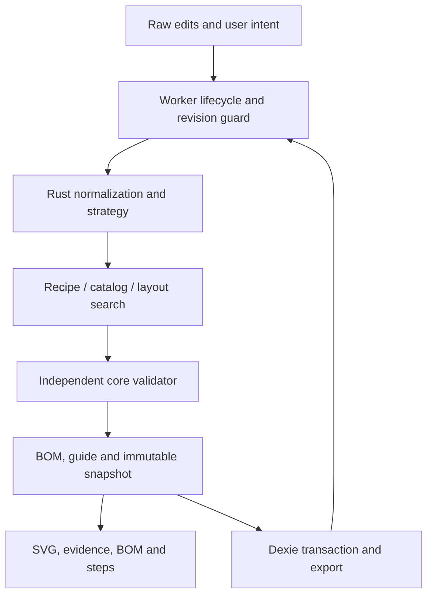
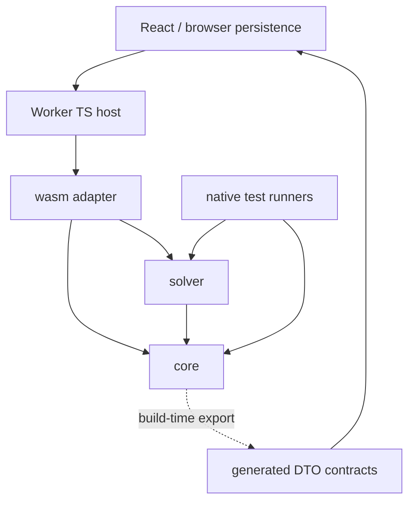

# ZARI Architecture v1

Status: proposed, documentation only. Audited base: `46082a909c9210c7dbd0ee9946386dc18246108e`. Repository reality and findings: [REPOSITORY_AUDIT.md](REPOSITORY_AUDIT.md). The architecture becomes an implementation contract after User adoption; no author self-review counts as independent acceptance.

## Contents and authority map

| Document | Owns |
|---|---|
| PRODUCT_SPEC.md | Product thesis, supported scope, first slice, release outcomes |
| ARCHITECTURE.md | Dependency direction, runtime authority, integration decisions |
| DOMAIN_MODEL.md | Serialized facts, identities, geometry frame, versions, snapshots |
| SOLVER.md | Strategy, recipes, candidate scope, search, independent checks/finalization |
| WASM_PROTOCOL.md | Wire envelopes, lifecycle, stepping, cancellation/recovery |
| FRONTEND.md / DESIGN_SYSTEM.md | UI ownership, interactions, primitives and semantic presentation |
| PERSISTENCE.md | DB schemas, revisions, migration, local data recovery |
| TEST_STRATEGY.md | Fixture oracle, parity, browser tests and gates |
| PERFORMANCE_SECURITY_FAILURES.md | Targets, measurement method, threat/failure boundaries |
| DEVIN_EXECUTION_PLAN.md / DEVIN_TASK_001.md | Task graph, evidence, review gates, first dispatch instruction |
| BLUEPRINT.md / COMPILER_WALKTHROUGH.md | Implementation reading map and fully specified numerical acceptance example; no duplicate schema authority |
| design/WORKSPACE_BLUEPRINT.md | Screen hierarchy, state/action semantics and task-linked browser acceptance |
| DEVIN_PROGRAM.md / DEVIN_PROGRAM_PROMPT.md | Whole-program delegation, task-level ownership/continuation and complete program prompt |

Preserved prompts retain product intent and Rust precedence. A contradiction with an approved requirement triggers an explicit architecture decision; adding this file does not silently repeal it. AGENTS and the dispatch runbook remain governance authority. New documents specify previously missing contracts; comments in snippets are architectural designs, not installed code.

## 1. Computational and trust flow



Rust owns dimensions, decimal normalization, deterministic organization rules, geometry, search, quantities, packs, costs, validation, normalized digests and snapshot creation. TS owns raw form strings, transient selection/ghosts, screen transforms, routing, I/O scheduling and storage transactions. It may format a Rust amount but cannot recompute BOM totals, fit or pack arithmetic. The browser is not a trusted authority for future server commerce; that future service must revalidate.

Rust/WASM is justified by a portable single computational authority and controlled integer arithmetic, not by an unmeasured speed claim. WebAssembly toolchain and JSON overhead are costs. Task 001 retires the build/browser boundary risk before the full solver. No rewrite to TS or server engine is necessary from the current evidence.

## 2. Minimum runtime composition

One static Vite/React application. One dedicated module Worker per active browser tab, one single-threaded WASM instance in it, one active project/search per Worker. Multiple tabs may exist; IndexedDB compare-and-swap protects durable revisions. No SharedArrayBuffer, Rayon, network compute, native filesystem in the core or service dependency.

JSON text is the v1 WASM and Worker payload. Explicit Serde DTOs use camelCase fields and tagged string enums. Rust DTOs generate draft-07 JSON Schema with Schemars, then TypeScript declarations and Ajv standalone validators at build time. This avoids a separately handwritten domain schema and runtime schema compilation. Every Rust input still validates through constructors/domain validation; JSON Schema cannot prove support paths or conservation. No `any`, implicit enum defaults or floating-point financial values.

These tool roles are supported by their official documentation: [Schemars](https://graham.cool/schemars/), [json-schema-to-typescript](https://github.com/bcherny/json-schema-to-typescript), [Ajv standalone](https://ajv.js.org/standalone.html). Compatibility is a Task 001 executable gate, not a claim of tested installation. Pin exact compatible versions then; no dependencies are installed in the architecture phase. Generate only reachable implemented DTOs; don't scaffold future executables.

## 3. Concrete target structure

```text
apps/web/
  src/app/                 hash routes, providers, project lifecycle
  src/features/           measurement, objects, strategies, planner, purchase, execution
  src/editor/             viewport transforms, ghost interaction, command history
  src/view-models/        read-only projections of one snapshot
  src/worker/             host state machine and Worker entry/scheduler
  src/persistence/        Dexie, transactional CAS, migrations, import/export
  src/contracts/generated/ generated DTO declarations and standalone validators
  src/ui/                 React Aria wrappers and native semantic components
  src/styles/             existing tokens and app styling
  tests/                  UI/worker tests and browser workflows
crates/core/
  src/domain/             validated values, facts, versioned DTOs
  src/normalize/          exact text-to-domain transformations
  src/strategy/           deterministic rules, zones and recipe specifications
  src/catalog/            snapshot validation and identity, no fetch
  src/geometry/           foundational coordinate/AABB transforms
  src/validation/         final checks independent of solver
  src/bom/                checked physical/pack/cost arithmetic
  src/snapshot/           finalization, canonical identity, action construction
  examples/               contract export and native fixture runner
crates/solver/
  src/                    candidate enumeration and resumable search only
  examples/               complete-plan native fixture runner
crates/wasm/
  src/                    thin bindings, opaque runtime handles
fixtures/
  bootstrap/ domain/ validator/ solver/ parity/ persistence/
docs/                     durable specifications, no live dispatch transcripts
design/                   design contracts, approved/draft baseline records
scripts/                  reproducible build/generate/check/test procedures
.github/workflows/        CI evidence; introduced by implementation tasks
.github/PULL_REQUEST_TEMPLATE/ evidence checklist, documentation only
```

Paths are responsibilities to add when first used. Task 001 creates core/wasm and the minimum app; solver crate begins in task 004. No empty future backend, data, AI or GPU crates. Root Cargo workspace and npm workspaces (apps/web only initially) gain pinned lockfiles in Task 001, not now.



MUST NOT: core→solver; core/solver→wasm/React/DOM/Dexie/network; validator→solver state, heuristic feasibility flags or pruning caches; UI→second solver; persistence→mutating snapshot contents; design animations→business completion; source compiler→DuckDB/Polars/cuDF. Validate Cargo direct/transitive features, not merely folder names. Solver can share low-level dimensions/AABB predicates; its success decisions are not validator evidence.

## 4. State and snapshot integration

Raw editing ≠ normalized input ≠ search continuation ≠ evaluated snapshot ≠ persisted project. Normalization may return field errors without replacing the last valid model. Any raw edit immediately invalidates current result presentation. Worker responses must match worker session, project activation, request, editor epoch, input revision and immutable compile context. Accepted snapshots remain available as explicitly historical while edits/search/save fail.

The finalizer independently validates a CandidateLayout against immutable input/catalog, checks quantities, creates BOM and guide and hashes canonical content. Only it constructs PlanSnapshot. Views and export consume that content; never query today's catalog to silently rewrite yesterday's quote. Progress observations/timestamps live outside content identity.

ProjectInput includes the selected catalog pin and search profile/budget/seed; engine versions remain compile context. CandidateLayout includes exact direct/contained item identities and explicit selected/unresolved offers. A direct item has one coordinate authority. Cavity clearances and external staging width/depth/headroom/support are separate facts; a bin is not confirmed accessible from depth alone. See DOMAIN_MODEL and the numerical walkthrough for the complete boundary.

## 5. Choice record and deferred tools

| Decision | Reason / review trigger |
|---|---|
| Rust/core + solver + thin wasm | Preserves approved authority with testable solver independence |
| JSON text, generated schema/TS/runtime shape validation | Transparent fixtures and exact integer transport; benchmark before changing |
| Single-thread Worker with bounded continuations | Cooperative cancellation plus hard recovery without COOP/COEP requirement |
| Deterministic recipe-driven constructive search + bounded DFS | Small finite workload, explainable limitation; no general CP engine requirement |
| React reducer/context, React Aria + native HTML | Clear state ownership and accessible composites; avoid duplicate foundations |
| SVG top/front for editing; read-only 3D cutaway via Three.js only ([D007](../design/DECISIONS.md#d007--읽기-전용-3d-절개-보기에-threejs-도입--채택), User decision 2026-09-30, supersedes "no 3D dependency") | Physical coordinates are inspectable and editable with numeric alternatives; the 3D view is lazy, local, read-only and keeps a 2D fallback |
| Dexie + explicit transactions | Local-first persistence; revisions belong to the app contract |
| CSS functional motion only | Existing 120/180/240ms tokens suffice; no Motion until a proven interaction requires it |
| Storybook deferred | Adopt after reused stateful components benefit; app browser tests start immediately |
| DuckDB/Polars/cuDF deferred | No measured ingestion bottleneck; not a placement engine |

Optional future offline cache is an app-shell service worker task after build identity/recovery is proved; cached code must not mix incompatible JS/WASM/schema generations. It does not store private photos or serve as backup.

## 6. Pre-implementation verdict

The proposed contracts are sufficiently concrete to start Task 001 after architecture adoption and normal dispatch configuration. Task 001 proves normalization, width-boundary and pack arithmetic through actual native and browser WASM with a minimal editable UI. This is the highest-information first unit: it tests exact contracts, generated DTOs, tooling, real Worker messaging and UI error handling without prematurely building solver or storage complexity.

No core technology replacement or paid/cloud decision is needed. Formal independent architecture acceptance and merge remain outstanding; author challenge is not independent audit. Later tasks stop at their gates if measured evidence contradicts assumptions. Exact package versions are reversible Task 001 choices within the specified tool roles and compatibility tests.
