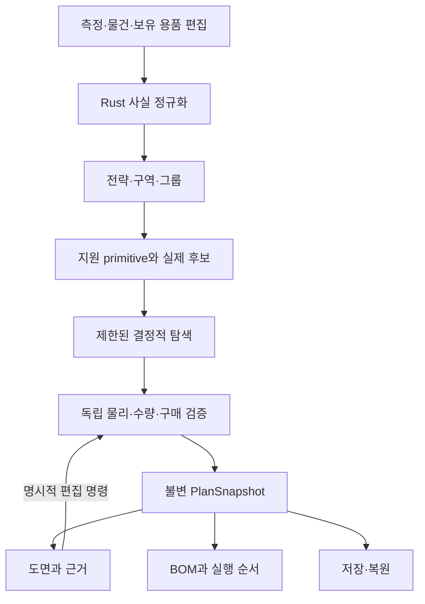
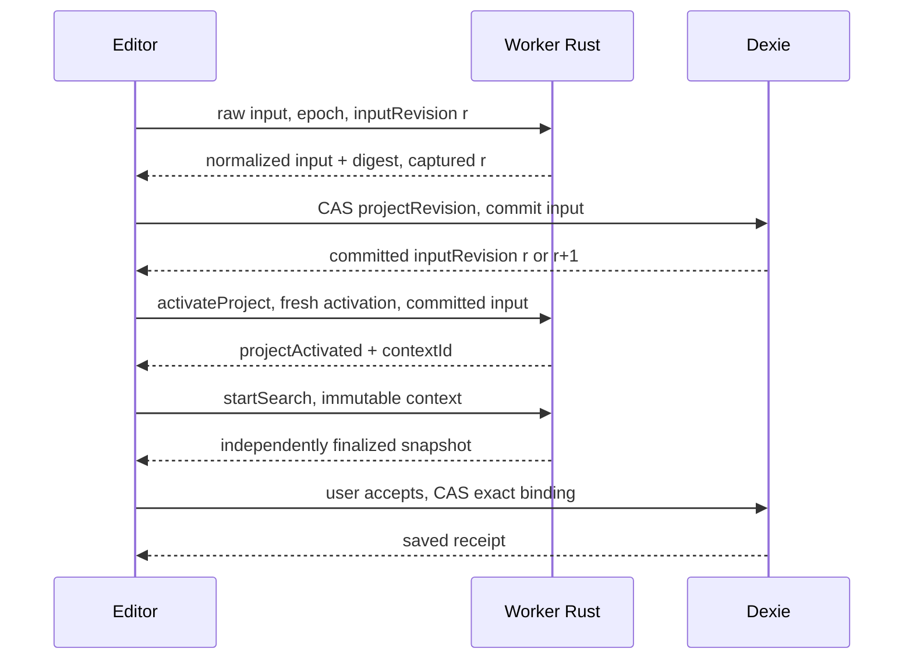

# ZARI — 구현 설계도

상태: 상세 설계 제안, 2026-09-22. 이 문서는 제품을 끝까지 구현하기 위한 전체 지도다. 정본 타입과 알고리즘을 다른 문서와 중복 정의하지 않는다. 이번 개정은 구현 전 PR #2의 문서를 보강한다. 애플리케이션 코드, 의존성, lockfile, workflow를 추가하거나 runtime을 활성화하지 않는다.

## 1. 완성해야 할 제품

사용자가 ‘이 공간에 무엇을 사야 하지?’보다 먼저 ‘이 물건들을 어떻게 정리해야 하지?’에 답할 수 있어야 한다. 측정한 공간, 실제 물건, 보유 수납, 사용 습관으로 전략을 결정하고, 그 전략을 가능한 실제 배치와 실행으로 연결한다. 구매 없이 직접 놓는 안이 가장 적합하면 그것이 첫 결과여야 한다.

한 번의 완결된 사용은 다음을 뜻한다.

1. 사용자가 공간과 물건을 입력한다. 모르는 값은 모르는 채 남는다.
2. ZARI가 그룹·구역·우선순위와 그 이유를 설명한다.
3. 실제 지원하는 수납 방식(primitive), 보유 용품, 정확한 상품 옵션(variant)을 대상으로 제한된 탐색을 한다.
4. 독립 Rust validator가 외형·내용물·삽입·접근·지지·하중·수량을 판정한다.
5. 하나의 불변 계획에서 도면·구매 묶음·재사용 목록·순서를 보여준다.
6. 사용자가 편집하면 잠정 표시 후 다시 검증한다. 오류나 unknown을 감추지 않는다.
7. 저장·재접속·충돌 처리·복구·내보내기가 동작하며, 이전 계획은 계산 당시의 근거를 유지한다.

## 2. 읽는 순서와 계약 소유자

README, AGENTS, IMPLEMENTATION_STATUS와 두 보존 프롬프트를 읽은 뒤 이 지도에서 필요한 계약으로 이동한다. 설계 문서가 서로 모순되면 구현하기 편한 해석을 선택하지 않는다. 영향을 받는 구현을 멈추고 정확한 모순을 보고한다.

| 설계 질문 | 정본 |
|---|---|
| 무엇을 만들고 어디까지 지원하는가 | [PRODUCT_SPEC.md](PRODUCT_SPEC.md) |
| 어디에서 무엇을 계산하는가 | [ARCHITECTURE.md](ARCHITECTURE.md) |
| 필드·좌표·unknown·식별자의 정확한 의미 | [DOMAIN_MODEL.md](DOMAIN_MODEL.md) |
| 전략·분할·SKU·위치·검증·순위 | [SOLVER.md](SOLVER.md) |
| 요청·취소·새 입력·Worker 실패가 겹칠 때 | [WASM_PROTOCOL.md](WASM_PROTOCOL.md) |
| 어떤 상태가 누구 소유인가 | [FRONTEND.md](FRONTEND.md) |
| 화면에서 실제 무엇을 어디서 조작하는가 | [WORKSPACE_BLUEPRINT.md](../design/WORKSPACE_BLUEPRINT.md) |
| 시각·타이포·색·형태·모션의 기준 | [DESIGN_SYSTEM.md](DESIGN_SYSTEM.md), 기존 DESIGN 계약 |
| 저장·revision·migration·복구 | [PERSISTENCE.md](PERSISTENCE.md) |
| 입력부터 최종 결과까지 수치로 검증할 예제 | [COMPILER_WALKTHROUGH.md](COMPILER_WALKTHROUGH.md) |
| 어떻게 거짓 성공을 잡는가 | [TEST_STRATEGY.md](TEST_STRATEGY.md) |
| 성능·보안·실패 경계 | [PERFORMANCE_SECURITY_FAILURES.md](PERFORMANCE_SECURITY_FAILURES.md) |
| 전체를 누구에게 어떻게 끝까지 맡기는가 | [DEVIN_PROGRAM.md](DEVIN_PROGRAM.md) |
| 작업별 범위·명령·완료 조건·검토 gate | [DEVIN_EXECUTION_PLAN.md](DEVIN_EXECUTION_PLAN.md) |

작업대 문서는 상호작용을, 계산 예제는 fixture의 정답과 판정 근거를 구체화한다. 두 문서가 Rust schema를 새로 정의하지는 않는다. 전체 위임 문서는 승인된 작업 범위를 후속 실행에서 다시 참조하는 규칙을 정의한다. AGENTS와 runbook의 역할·실행·병합 권한을 대체하지 않는다.

## 3. 제품 경로와 계산 권위

StrategyDecision은 입력 사실의 참조, rule ID, 그룹, 구역, 우선순위를 담는 중간 표현이다. CandidateLayout은 위치, 개별 물건의 정확한 배정, 미배치 범위, 판매 옵션 선택을 담는 제안이다. 최종 PlanSnapshot에는 검증 결과, BOM, 실행 단계와 canonical identity가 함께 들어간다. solver의 잠정 결과나 현재 상품 목록을 도면·BOM의 별도 정본으로 사용하지 않는다.

## 4. 구현자가 다시 선택하지 않을 결정

| ID | 결정 | 변경 시 영향 |
|---|---|---|
| C01 | Rust가 모든 권위 있는 물리·수량·BOM 계산을 소유 | 다른 runtime으로 계산 권위 분산 금지 |
| C02 | 정수 mm, 정확한 문자열 parsing, unknown·N/A·증거·오차 분리 | 생성 DTO·fixture·migration |
| C03 | 원점은 앞·왼쪽·아래, x는 오른쪽/y는 뒤/z는 위, upright 0°/90° | 모든 기하·SVG·부모 좌표 변환 |
| C04 | 단일 구획·바닥 지지·직육면체 장애물·용기 안 물건 한 단계 | 임의 3D·적층·내부 기울이기 미지원 |
| C05 | catalogPin과 search는 ProjectInput, engine version은 compile context에 포함 | inputRevision·stale 판정·재현 |
| C06 | direct placement 좌표는 한 곳에서 소유, ordinal별 정확한 분할, 명시적 offer 연결 | 수량 보존·중복 방지·구매 수량 |
| C07 | 제한된 constructive placement와 DFS, 안정된 순서, 작업량 예산 | 실행 시간이나 경합으로 결과 선택 금지 |
| C08 | validator가 전체 배치 제안을 독립적으로 재검사 | solver의 pass flag를 증거로 사용 금지 |
| C09 | JSON으로 완결된 요청 전달, Worker 하나·WASM 하나, 협력적 step 실행 | 취소·trap 복구·전송 비용 |
| C10 | raw draft·정규화 입력·검색·snapshot·저장 프로젝트 분리 | 잠정 표시·undo·충돌 처리 |
| C11 | React Aria와 native HTML, SVG, 명시적인 상태 의미 | 범용 DnD나 카드 대시보드로 도메인 동작 대체 금지 |
| C12 | local-first Dexie CAS, 불변 이력, 명시적 내보내기 | 로컬 저장을 backup으로 표시 금지 |

이는 초안 schemaVersion 1의 상세 계약 보완이다. 아직 실제 저장 프로젝트나 생성 DTO가 없으므로 migration을 수행했다고 주장하지 않는다. Task002가 전체 DTO를 구현·검증한 뒤에는 호환·비호환 변경을 version과 migration 규칙에 따라 처리해야 한다.

## 5. 작은 범위를 정확히 지원한다

| 물리 기능 | 지원 | 정직한 제한 |
|---|---|---|
| 정적 배치 | 축에 정렬된 직육면체, 명시적 여유·장애물·지지 조건 | 외형 통과는 내용물 통과가 아님 |
| 내용물 | 보수적인 내부 공간(cavity)과 별도 offset, 바닥 위 배치 | 부피 합만으로 적합 판정 금지 |
| 설치 | 정면에서 고정 방향으로 직선 삽입, 검증된 선행 순서 | 내부 회전·기울임·턱 넘기 미지원 |
| 사용 | 같은 방향으로 꺼낸 뒤 외부 staging에서 내용물을 위로 추출 | staging 폭·깊이·높이·지지·하중 정보 필요 |
| 앞 물체 제거 | blocker ID·의존 관계·개수 설명 | 임시 보관 위치와 재설치 동작은 미지원. blocker가 있으면 접근은 조건부이며, hard one-action이면 실패 |
| 구매 | 동일 variant로만 구성된 묶음, 명시적인 판매 옵션 | 혼합 묶음·할인 엔진·checkout 미지원 |
| 대안 | 실제로 다른 배치 0–3개 | 판매자만 바꿔 세 개의 배치안으로 표시 금지 |

명목 치수의 fit에만 근거한 결과는 조건부다. nominal, conservative, physicallyConfirmed, assignmentComplete, accepted, current, saved, purchaseReady의 의미를 구분해 표시한다. 사용자 수락이나 저장 완료가 unknown 검사를 Pass로 바꾸지 않는다.

## 6. 가장 위험한 통합 순서

동시에 raw 입력이 바뀌면 epoch가 먼저 변경되므로 이전 정규화·검색 응답을 현재 결과로 적용할 수 없다. CAS 실패 시 계산 결과를 새 revision에 억지로 붙이지 않는다. DB 저장 성공 후 Worker 활성화가 실패하면 ‘저장됨’과 ‘계산 재시작 필요’가 동시에 참이다. 그 경우 저장이 취소되었다고 주장하거나 revision을 다시 올리지 않는다.

배치만 움직이는 명령은 ProjectInput을 바꾸지 않는다. 같은 inputRevision 아래 새 manualEdit snapshot이 생긴다. 선택된 catalog 안에서 상품 offer만 바꾸는 것도 manualEdit다. 다른 catalog snapshot으로 바꾸면 정규화된 입력 변경이다.

## 7. 작업 분해와 실제 제품 능력

| Task | 끝난 뒤 사용자가 할 수 있는 일 | 아직 주장할 수 없는 일 |
|---|---|---|
| 001 | 입력 → 실제 Rust 폭·묶음 계산 → 브라우저 확인 | 전체 물리 검증·계획·저장 |
| 002 | 안정적인 도메인·schema를 다른 계층의 기반으로 사용 | solver 구현 완료 |
| 003 | 제안 배치를 독립 검증하고 snapshot을 생성 | 자동 최적 배치 |
| 004 | 전략·recipe·제한된 탐색을 검증 fixture에서 실행 | 완성 UI·실제 상품 안전 보장 |
| 005 | 측정 draft 저장·reload와 Worker 복구 | harness 취소가 실제 solver 취소를 입증한다는 주장 |
| 006 | 합성 공간 → 정리 계획 → 도면·BOM → 저장·reload | 실제 catalog 기반 상용 준비 완료 |
| 007 | 검증된 배치 편집·대안·undo | 임의 geometry 지원 |
| 008 | 증거 있는 catalog·보유품·구매 묶음·실행 진행 상태 | 재고 예약·checkout |
| 009 | export/import·손상 복구·offline 재방문·로컬 사진 | cloud backup·사진에서 mm 추론 |
| 010 | 지원 범위의 측정 결과와 beta 검증 자료 확인 | 사용자 승인 없는 출시·시각 baseline 승격 |

함수나 파일 하나마다 task를 만들지 않는다. 사용자 행동, Worker, Rust 통합, 저장, 브라우저 검증이 하나의 완결된 기능이면 같은 작성자가 책임진다. validator와 solver의 구현 책임은 분리하며, 구현 작성자와 독립 리뷰어도 구분한다.

## 8. 검증 추적표

| 불변조건 | 수치/실패 증거 | 최초 책임 | 추가 통합 증거 |
|---|---|---|---|
| unknown ≠ 0 | blank·zero·sub-mm, cavity·staging 정보 누락 | 001/002 | 006/008 |
| 내경과 외경 분리 | 220mm 물건과 210mm cavity | 003 | 006 |
| 삽입과 접근 분리 | 정적 배치 pass, staging headroom 474mm에서 fail | 003 | 006 |
| 구매 없는 안의 동등한 취급 | 직접 배치 485mm·0원과 용기 3개 배치 590mm·27,000원 비교 | 004 | 006 |
| 보유 수량 보존 | 보유 2개를 재사용 3개로 계산하지 않음 | 003/004 | 008 |
| 포장 수량의 독립 계산 | 필요 3개 / 2개 묶음 → 2묶음·4개 확보·1개 잉여 | 001/003 | 006/008 |
| 위치의 단일 소유 | direct assignment가 대응 placement를 참조 | 002/003 | 007 |
| 필드별 출처 | 내경·외경의 서로 다른 출처, unknown을 pass로 바꾸지 않음 | 002 | 008 |
| 결정성 | 같은 budget에서 step 크기 1/7/128/256 비교 | 004 | 006/010 |
| 실제 취소 | macrotask 사이 cancel 처리, trap 인스턴스 폐기 | 005 | 006의 실제 WASM |
| snapshot 일관성 | 같은 ID의 SVG·BOM·action·reload 결과 | 003/005 | 006/007 |
| 충돌 보호 | 두 탭의 같은 base revision CAS에서 한쪽 conflict | 005 | 009 |
| 도메인 UX | 치수 focus, keyboard 이동, stale, 동일 scale | 001/005 | WORKSPACE_BLUEPRINT의 UX ID |
| 정직한 준비 상태 | synthetic 표시, 가격 미확인, 저장 실패 | 006 | 008–010 |

상세 수치는 COMPILER_WALKTHROUGH의 TRACE 항목을, UI는 WORKSPACE_BLUEPRINT의 UX 항목을 fixture·test 이름 또는 완료 조건별 증거 목록에 연결한다. 이 문서의 표 자체가 테스트 실행 증거는 아니다.

## 9. 엄격한 사전 판정

별도의 Task000에서 scaffolding을 늘리기보다 Task001에서 실제 계산 경로를 검증하도록 설계했다. 구현 전에 typed input/context, 배치 제안과 offer의 연결, direct placement의 위치, cavity·handling·staging, 그룹 분할을 명시했다. solver·validator·UI가 서로 다른 계약을 만드는 여지를 줄이기 위한 결정이다.

남아 있는 일은 실제 toolchain 검증, 작성자와 분리된 설계 감사와 사용자 채택, 실행 시점의 canonical dispatch 설정이다. 이들이 완료되었다고 취급하지 않는다. 이번 설계 작업에서는 main 병합, 구현 프로그램 실행, runtime 활성화를 수행하지 않는다.
