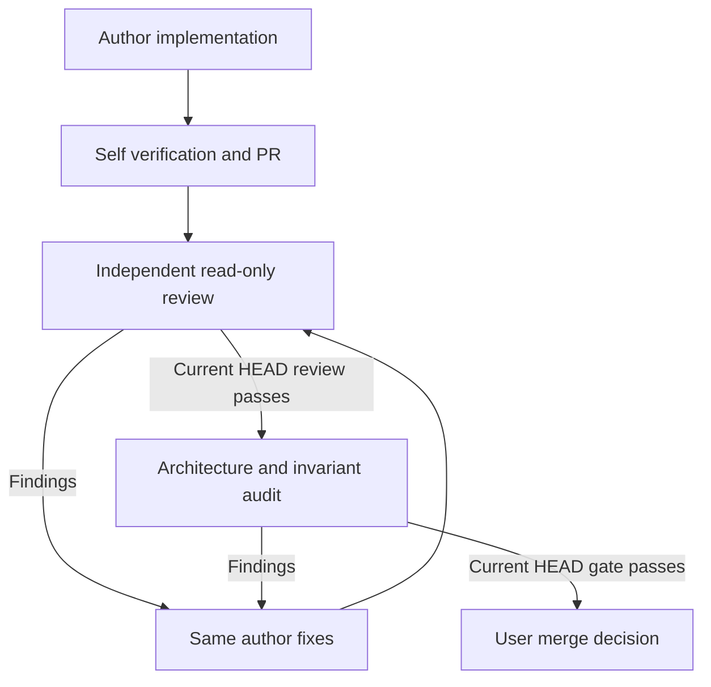
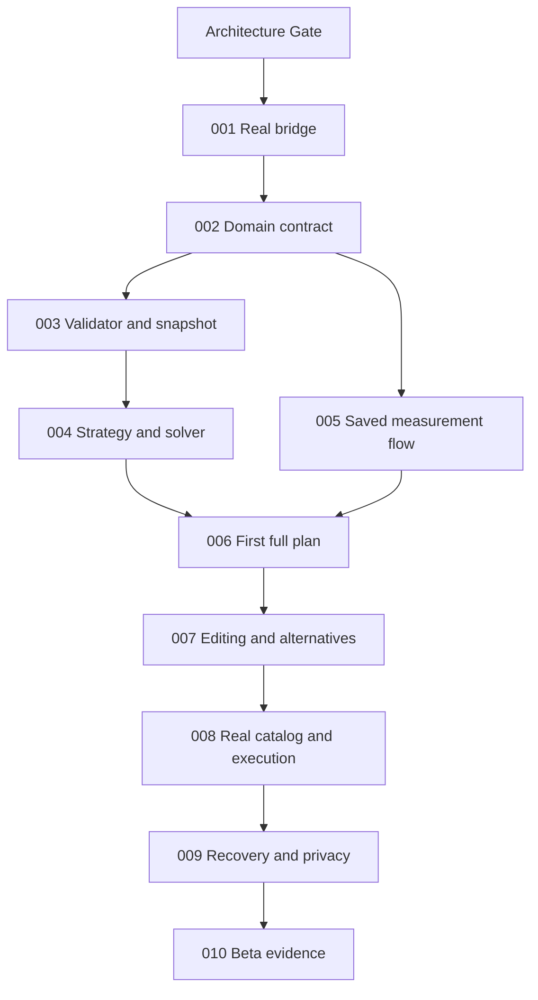

# ZARI — Devin execution contract v1

Status: architecture proposal; implementation has not begun. This document describes work to execute after the architecture gate. It does not enable automation, dispatch a session, approve a visual baseline, or authorize a merge.

## 1. Authority, readiness and ownership

Read `AGENTS.md`, `TASKS/TEMPLATE.md` and `RUNBOOKS/DISPATCH.md` with this document. Product and computational contracts live in `PRODUCT_SPEC.md`, `ARCHITECTURE.md`, `DOMAIN_MODEL.md`, `SOLVER.md`, `WASM_PROTOCOL.md`, `PERSISTENCE.md` and `TEST_STRATEGY.md`. Design contracts remain `DESIGN.md` and the files under `design/`.

The preserved prompts and `SOURCE_MANIFEST.json` are protected. These tickets implement the distilled contracts; they do not rewrite the sources. An implementation discovery may justify a proposed correction, but convenience does not authorize changing a contract.

ASTRA owns foundational contracts, task boundaries and architectural interpretation. Devin owns investigation, implementation, debugging, tests, browser verification and the PR within one ticket. A reviewer owns read-only challenge. The user controls merge and consequential decisions.

The architecture author cannot independently approve this architecture change. Its present self-review and internal challenge are not an independent PASS. Under `AGENTS.md` §8, only the user can designate the independent auditor for an ASTRA-authored change, using a durable GitHub pointer identifying the PR/task, task revision and audit scope. The normal independent review requirement is also preserved.

### Dispatch is manual until separately activated

`MANUAL_ONLY` and `REVIEWER_LANE_ID: CONFIG_REQUIRED` are the inspected defaults. Before a ticket launches, the user/intake must provide a canonical GitHub issue or task-bearing PR with the complete envelope, specification revision, authorization pointer, reviewer identity and control record. Under the runbook, the user is the sole manual launch executor and control-record writer. Reserve the claim and launch request durably before sending to Devin; record the returned session. Reuse an existing owner. An unresolved `SUBMITTING` or `UNKNOWN` launch blocks another launch.

Do not turn these engineering tickets into an implementation of the mechanical control plane. No polling, automatic task launches, scheduled sessions, automatic merge or unapproved provider integration is included. Existing local verification policy remains required even after Task 001 adds CI. The introduction of a workflow alone does not configure a new `CI_GATE_PASS` policy or branch protection.

### Dependency and scope discipline

Every task below inherits the common lifecycle, forbidden work, stop conditions, evidence and review loop in §§2–5. Its own fields add to, and do not replace, those rules. No task is dispatch-ready unless its dependencies have passed the specified gates and its pinned contracts are present. Ordinary helper names, internal module splits and debugging choices are Devin's responsibility.

Task classes:

- **A — deterministic implementation:** one implementation owner and objective tests.
- **B — vertical product slice:** one owner across UI, transport, Rust integration and persistence as needed; real browser verification required.
- **C — exploratory decision:** controlled competing experiments, common benchmark, no initial production merge.
- **D — investigation:** read-only findings, no implementation unless separately authorized.
- **E — review:** read-only independent challenge of an exact revision and HEAD.

Parallel policies are `SEQUENTIAL`, `PARALLEL_SAFE` or `EXPERIMENTAL_PARALLEL`. Parallel-safe means contracts and ownership are fixed, not merely that work is in different languages.

## 2. Common Devin lifecycle

Every coding task begins: **Before modifying anything, inspect the current repository HEAD and the relevant architecture/code paths.** Read the ticket's bounded surfaces first; inspect adjacent callers and tests when needed, without repeating an unlimited whole-repository audit.

1. Inspect the actual remote default branch, local branch, dirty state, current owner and relevant contracts. Record the observed base SHA. Preserve unrelated changes.
2. Create the assigned feature branch from the authorized base. Do not silently use an unrelated or stale branch.
3. Summarize a short local implementation plan and assumptions in the same session. Proceed without routine plan approval when within scope.
4. Implement the complete bounded outcome, following established patterns and the contracts below.
5. Write meaningful feature and failure tests. Run them; investigate and fix local failures in this session.
6. Run the application or native fixture runner when applicable. For user-facing changes, start the app and exercise the actual browser workflow, successful and important failure states, console and responsive layouts.
7. Inspect the complete diff against the task base, including generated artifacts, lockfiles and test changes. Remove unrelated edits, debug output and secrets; verify the documentation describes actual behavior.
8. Re-run affected required verification after fixes. A CI failure is diagnostic input for this owner, not a reason to start another writer or redesign the architecture.
9. Update `docs/IMPLEMENTATION_STATUS.md` with implemented capabilities, exact verification, limitations and the next task. Put mutable session/dispatch/review status and evidence links in the canonical GitHub issue/PR, not new runtime log files in Git.
10. Commit, push the feature branch and open/update the task PR. Report its exact final HEAD SHA and the exact commands/results. Leave it unmerged. If credentials block push/PR creation, preserve the commit and report the concrete access limitation; never invent a remote PR.

Same-session test fixes and review corrections remain with the same author. A fresh chat by the same author is not independent review. If a genuine architecture defect is found, stop only the affected scope, record a minimal reproducible case and propose the minimum correction.

## 3. Verification commands and evidence contract

Task 001 establishes the following public commands. Later tasks extend their coverage rather than introducing parallel command conventions. Version output and exact resolved tool versions belong in the PR evidence. Commands below are requirements for future implementation, not claims that they exist now.

| Name | Command | Purpose |
|---|---|---|
| R1 | `cargo fmt --all -- --check` | Rust formatting |
| R2 | `cargo clippy --workspace --all-targets --locked -- -D warnings` | Rust static checks |
| R3 | `cargo test --workspace --locked` | Native unit, property and integration tests |
| W1 | `npm run wasm:build` | Locked Rust WASM build and matching wasm-bindgen bindings |
| C0 | `npm run contracts:generate` | Regenerate schemas, TypeScript and runtime validators from Rust |
| C1 | `npm run contracts:check` | Generate from Rust, detect checked-in contract drift, validate fixture structure |
| J1 | `npm run typecheck` | TypeScript contract and app checking |
| J2 | `npm run lint` | Frontend/tooling lint |
| J3 | `npm test` | Vitest tests, including transport/persistence tests as introduced |
| J4 | `npm run build` | Production app build using the real WASM artifact |
| B1 | `npm run test:browser -- --project=chromium` | Actual browser end-to-end tests |
| P1 | `npm run test:parity` | Native versus actual browser Worker/WASM common fixtures |
| D1 | `node scripts/check-design-tokens.mjs --self-test` | Existing token checker; never full accessibility approval |
| S1 | `npm run dev -- --host 127.0.0.1` | Start the real app for interactive verification |

`npm ci` installs the committed root npm workspace lockfile in implementation/CI environments. Rust package names and generated paths follow `ARCHITECTURE.md`; do not create unused crates to make a command pass. `wasm:build` must use the exact wasm-bindgen CLI version matching the crate version in the lockfile. Task 001 pins compatible stable Rust, Node/npm, frontend and binding versions after official-document verification. No versions are guessed by this architecture phase.

Rust-only tasks require R1–R3 plus C1, W1 and P1 for affected authoritative outputs. Browser tasks require the relevant native checks plus W1, C1, J1–J4, B1, P1 and D1. A ticket may identify a genuinely inapplicable check with a reason; it may not call an unexecuted requirement PASS. Full cross-browser and performance matrices belong to Task 010, while every task runs enough verification to resolve its concrete risk.

Each PR supplies an acceptance-criterion-to-evidence index with exact commands, exit status, useful assertion/test counts, fixture IDs, CI run links when available, browser/OS/version, viewport sizes, failure output and disposition. Screenshots/videos show behavior; they do not replace invariant tests. Native-only WASM emulation and mocked Rust outputs do not satisfy browser parity.

### Proposed implementation PR evidence template

```text
Task ID / canonical task / task revision:
Task specification revision:
Architecture documents and exact sections consulted:
Observed base SHA:
Final HEAD SHA:

Problem and outcome:
What changed / why:
Complete changed paths:
Acceptance criterion -> exact test or evidence pointer:

Commands / exact results / environment:
CI run links and required checks, or CI not configured:
Browser verification: routes, actions, success/failure states, viewport,
console errors, screenshots/video, unverified browsers:
Native/WASM parity: fixture set and result, or justified N/A:

Known limitations:
Out-of-scope follow-ups:
Architecture deviations: none / explicit proposed change:
TOUCHED_AREAS:
CONTRACT_CHANGE_REQUIRED: NO / YES (advisory, not final audit classification)
Risk areas for reviewer:
Self-review performed against base SHA:
No merge performed:
```

After a successful procedure has been repeated, the user may authorize a reusable instruction referencing these documents. Do not create a collection of unproven Playbooks/Skills now.

## 4. Common forbidden work and stop conditions

**Forbidden for all coding tickets:** merge; change protected source prompts/manifest; silently change architecture/schema/authority; implement a second TypeScript/Python solver; default unknown to zero/pass/free/available; weaken or delete required tests; fake products or approval evidence; add DuckDB/Polars/cuDF/OR-Tools/cloud/auth/AI/payment infrastructure; activate automation; upload private photos or secrets; approve or replace visual baselines; broaden into another ticket without explicit scope revision.

Reviewers must remain read-only. Devin Review source editing and Auto-Fix must not create a second writer. Route findings to the existing implementation owner; do not enable repository-wide automation as a convenience.

**Stop the affected scope and report** if a required contract is missing or contradictory; a frozen invariant cannot be satisfied; completing the ticket requires an unapproved consequential decision or protected-contract edit; a required package demands unexpected paid infrastructure or unacceptable licensing; a destructive migration is necessary; secrets/production credentials are required; a real browser verification requirement is impossible in the environment; or dispatch/ownership evidence is absent or ambiguous. Include exact pointers, reproduction and smallest proposed correction. Continue unrelated already authorized work when safe. Do not stop for ordinary helper choices, test failures or debugging.

## 5. Review loop and gates

Every substantive task follows:



Findings: `BLOCKER` prevents safe execution/acceptance; `MUST FIX` violates a task acceptance or correctness requirement; `NOTE` is nonblocking; `ARCHITECTURE DECISION REQUIRED` identifies a contract choice needing the prescribed decision path. Audit outcomes remain exactly those in `AGENTS.md`; do not invent a second outcome vocabulary.

Any relevant HEAD change invalidates current review/audit facts. CI green alone is never a substitute for the exact-HEAD review, audit, or user merge decision.

| Gate | Required evidence and invariants | Green CI does not prove | Stop progression when |
|---|---|---|---|
| Architecture Gate, before 001 | Complete contracts; user authorization; independent review; designated independent A3 auditor for author conflict; exact revision/HEAD evidence | Architecture approved, scope accepted, independence or actor configuration | Foundational contradiction, unresolved scope choice, missing reviewer/designation/dispatch record |
| Bridge Gate, after 001 | Real browser Worker/WASM fixture execution; normalization and pack correctness; no TS authoritative computation; generated contract drift check; width-only claims | Full geometry, PlanSnapshot, persistence, solver or approved design | WASM mocked; domain in TS; unknown coerced; full-plan claim from probe |
| Rust Domain Gate, after 002 | Validated constructors/deserialization; every field's unknown/NA/provenance meaning; canonical digest vectors and round trips | Real-world field truth or complete validator | Schema ambiguity, lossy integers, noncanonical identity or cycles accepted |
| Solver/Validator Gate, after 003 and 004 | Independently constructed malicious proposals; invariant properties; resumable deterministic solver; no solver success flag trusted | Global optimality, arbitrary 3D, product safety or catalogue completeness | Shared solver state is evidence of validity; conservation fails; nondeterministic selection; unsupported geometry accepted |
| Persistence/Worker Gate, after 005 | CAS conflict, reload, failed-save preservation, corruption/export recovery, project switch, crash and cancel-host harness cases; real search cancellation gate is after006 | Browser storage is a backup; all devices have identical quotas | Data silently overwritten/lost, stale result installs, cancellation only sent but never serviced |
| Vertical Slice Gate, after 006 | One compartment through strategy/SKU/solver/validator to one snapshot, SVG/BOM/guide and saved reload; parity; real browser | Practical real-product readiness, user visual approval, complete v1 | Mixed snapshots, synthetic sold as real, valid outer box treated as content fit |
| UX Interaction Gate, after 007 | Numeric and keyboard moves, provisional/rejected/verified states, undo, equal-scale alternatives, responsive evidence | Physical correctness solely from pictures; approved baseline | Invalid preview becomes authoritative, input changes leave plan current, mobile workflow unusable |
| Catalog/Privacy Gate, after 008 and 009 | Real field provenance; malicious import corpus; unknown offer semantics; no unexpected network/photo upload; round-trip export and recovery | Price/inventory freshness forever, lawful commercial feed access | Fake availability, harmful URL execution, lost unknowns, external privacy change |
| Beta Readiness Gate, after 010 | Supported-browser matrix; accessibility; bounded fixture performance measurements; all earlier gates; user visual and release decisions | Universal support, guaranteed fit, deployment or permission to merge/release | Missing critical browser flow, privacy regression, fabricated performance or unresolved required finding |

A3 is the minimum proposed audit depth for Tasks 001–006 and 008–009 because these establish authority, schema, protocol, persistence and validation boundaries. Tasks 007 and 010 have A2 minimum, promoted to A3 if their actual changes affect contracts. The actual auditor verifies depth from the diff rather than accepting the author's label.

## 6. Milestones and task graph

**M0 — approved executable architecture:** architecture documents and initial dispatch prerequisites complete; no application claim.

**M1 — cross-runtime proof (001):** a genuine physical-boundary and package calculation traverses Rust, WASM, Worker and browser. No solver or saved-plan claim.

**M2 — computational and state contracts (002–005):** stable domain, independently checked plans, resumable solver and safe local editing/persistence.

**M3 — first useful synthetic vertical slice (006):** the complete requested chain is real, including save/reload. Label synthetic data and unsupported capabilities.

**M4 — practical local planning (007–009):** safe editing, real catalog ingestion, owned storage, purchase/action flows and recovery/privacy.

**M5 — bounded beta readiness (010):** measured supported workload, browser/accessibility evidence and user-approved visuals; release remains a user decision.



003 and 005 may run together only after 002 is accepted, with explicit nonoverlapping ownership. 003 owns core validation/finalization modules and its fixtures; 005 owns app persistence/Worker/editor modules and integration tests. 005 may integrate frozen APIs but must not implement the final validator. Changes to shared roots, generated contracts, Cargo/npm lockfiles and `IMPLEMENTATION_STATUS.md` must be handed off and integrated sequentially by one owner; if either task needs such changes concurrently, serialize the tasks. 004 follows 003 and is not parallel-safe with 005 by default because it introduces the solver/WASM export integration and shared lifecycle contracts.

The graph does not launch all queued tickets. The user sends only the next eligible canonical task. Reserve competing sessions for evidence between approaches; speed alone is not a reason for multiple owners of one contract.

## 7. Ticket 001 — executable architecture proof

**ID:** ZARI-001.

**Task Class:** B.

**Execution Mode:** single Devin; same-session fixes; **SEQUENTIAL**.

**Objective:** prove the selected Rust/WASM/Worker/browser and generated-contract path using real normalization, a width-boundary calculation and package arithmetic.

**User-visible or architectural outcome:** changing width/unit updates a Rust-produced schematic and an explicitly limited width-check result. Required quantity 5 with pack quantity 2 returns 3 packs, 6 supplied and 1 surplus from Rust. Native and actual browser outputs agree.

**Why this is one coherent Devin ownership unit:** the integration risks occur across toolchain, Rust DTO, WASM, Worker and UI. One owner can investigate/build/debug the whole causal path without pretending it is a complete planner.

**Required context files:** repository reading order; architecture/domain/protocol/test docs; DESIGN and component/measurement contracts; `DEVIN_TASK_001.md` contains the complete launch prompt.

**Contracts already frozen:** authority in Rust; integer-mm and exact decimal input; unknown semantics; JSON text boundary; shared envelope/revision guards; root npm workspaces; Rust-generated schema/TypeScript/validators; width probe is not PlanSnapshot.

**Allowed implementation judgment:** compatible stable patch versions, small helper/module names, bundler wiring and test organization inside the pinned contracts.

**Files/modules likely involved:** root Cargo/npm/toolchain configuration and lockfiles; `crates/core`; `crates/wasm`; actual implemented `apps/web` shell/measurement/Worker code; generated contracts; fixtures; scripts; narrowly scoped CI; README/status. No empty solver crate.

**Required implementation:** normalized mm/cm inputs; positive dimensions, checked arithmetic and explicit unknown; physical width probe and pack arithmetic; Schemars draft-07 → JSON Schema → json-schema-to-typescript plus Ajv standalone validators; real module Worker/WASM path; minimal restrained UI with existing tokens; shared native/browser fixtures; commands in §3. Implement only protocol capabilities `initialize`, `activateProject`, `normalizeInput`, `evaluateProbe`, `disposeProject`; advertise search/cancellation capabilities as unavailable.

**Acceptance criteria:** required numerical fixtures and invalid/unknown cases in the full prompt pass; unmeasured is not 0; outer width never claims installation/content validity; stale replies cannot replace a newer probe; a worker failure has explicit retry and preserves editing; browser uses actual `.wasm`; complete diff remains bounded.

**Exact verification expectations:** R1–R3, W1, C1, J1–J4, B1, P1 and D1; fresh locked install/build; dependency feature inspection; real interactive browser path. Report versions and CI results separately from local results.

**Browser verification:** mm/cm equivalence, invalid zero/sub-mm/negative input, blank unknown, 590mm pass versus 605mm fail in a 600mm space, 5/2 package result, rapid edits, worker recovery, keyboard traversal, 390px and 1440px layouts and console.

**Evidence required:** common PR index, fixture parity artifact, actual WASM network/load evidence, desktop/mobile captures and observed final HEAD.

**Forbidden work:** common prohibitions; no PlanSnapshot, full solver, whole product UI, real catalog, persistence, auth or deployment; no fabricated completion of M3.

**Stop conditions:** common conditions; missing pinned architecture or canonical ownership; material repository changes invalidate this bounded bootstrap.

**Dependencies:** Architecture Gate and manual dispatch prerequisites.

**Can run in parallel with:** none.

**Must not run in parallel with:** any implementation writer modifying repository/toolchain/contracts.

**Expected review mode:** independent Class E review then A3 Bridge Gate audit.

**Merge authority:** USER ONLY.

## 8. Ticket 002 — validated domain and stable interchange

**ID:** ZARI-002.

**Task Class:** A.

**Execution Mode:** single Devin; **SEQUENTIAL**.

**Objective:** implement the complete frozen domain/DTO/version/provenance contracts and canonical fixture interchange before solver and persistence owners depend on them.

**User-visible or architectural outcome:** every supported input/catalog/placement/plan payload has one Rust-owned validated meaning, stable generated types and reproducible canonical digests; malformed persisted/imported payloads cannot bypass validation.

**Why this is one coherent Devin ownership unit:** scalars, identity, provenance, version fields, graph integrity and DTO generation form one contract; splitting by individual types creates inconsistent semantics.

**Required context files:** `DOMAIN_MODEL.md`, `ARCHITECTURE.md`, `PERSISTENCE.md`, `WASM_PROTOCOL.md`, `TEST_STRATEGY.md`; Task 001 generated-contract/build patterns and accepted findings.

**Contracts already frozen:** all named entities, measurement intervals, value status versus evidence status, parent coordinates, IDs, version fields, canonicalization exclusions, search profile/budget and PlanSnapshot content.

**Allowed implementation judgment:** private validation helpers, module grouping, error collection organization and fixture authoring, without changing public DTO shape/meaning.

**Files/modules likely involved:** core domain/DTO/canonical modules; generated contract outputs; schema/export tools; shared domain fixtures; documentation/status.

**Required implementation:** complete validated scalar/entity graph; known zero where allowed, unknown and N/A; field evidence; exact integers; explicit supported enum rejection; canonical order/hash; independent schema and envelope version checks; PlanSnapshot data structure without inventing a solver. Extend the native fixture runner and generated contract checks.

**Acceptance criteria:** malformed JSON cannot produce valid-domain instances; nonfinite/sub-mm/out-of-range inputs fail structurally; IDs/references/cycles/duplicates are checked; canonical-equivalent permutations hash equally where ordering is nonsemantic; semantically different inputs do not collapse; large money/counters round-trip without precision loss; preserved probes still pass.

**Exact verification expectations:** R1–R3, C1, W1, P1, J1; property tests for normalization/canonicalization and regression fixtures for every rejected boundary; regenerate twice and show no drift.

**Browser verification:** run actual WASM parity fixtures including large numeric strings and malformed boundary payloads. No new product UI is required.

**Evidence required:** field-to-contract coverage index, canonical digest vectors, rejected-payload matrix, generated-file diff, dependency graph and common evidence.

**Forbidden work:** common rules; no geometry algorithm, strategy/solver, storage migration or visual redesign; no manually maintained duplicate TS domain schemas.

**Stop conditions:** common rules; missing field semantics or canonicalization would make persistence/worker owners invent incompatible contracts.

**Dependencies:** accepted 001/Bridge Gate.

**Can run in parallel with:** none during contract establishment.

**Must not run in parallel with:** 003–005 or any shared-contract writer.

**Expected review mode:** independent Class E review then A3 Rust Domain Gate.

**Merge authority:** USER ONLY.

## 9. Ticket 003 — independent validation and plan finalization

**ID:** ZARI-003.

**Task Class:** A.

**Execution Mode:** single Devin; **PARALLEL_SAFE** only with 005 under §6 ownership conditions.

**Objective:** establish the Rust trust boundary that accepts a proposal only after independent validation and constructs its immutable BOM/action/diagram-consistent snapshot.

**User-visible or architectural outcome:** an arbitrary or malicious proposed arrangement receives separate geometry, capacity, insertion, access, load, orientation and commercial checks; no solver assertion can certify itself.

**Why this is one coherent Devin ownership unit:** independent revalidation, quantity reconciliation, package calculation and snapshot assembly together determine what may become an authoritative plan. Search remains separate.

**Required context files:** domain, solver, architecture and test docs; accepted domain fixtures; source prompt T02–T15 and uncertainty rules.

**Contracts already frozen:** coordinate/clearance/support model, finite supported insertion/access model, item occurrence accounting, check severity/status, BOM arithmetic, snapshot identity and action references.

**Allowed implementation judgment:** simple independent algorithms and internal decomposition; deliberately prefer transparent reference checks over reuse of solver acceleration state.

**Files/modules likely involved:** `crates/core` validation, geometry, BOM and snapshot modules; independent native/property/adversarial fixtures; status. Do not add solver code or app persistence.

**Required implementation:** complete supported rectangular checks with conservative uncertainty; sibling overlaps versus parent containment; permitted rotations; support and load aggregation; aperture/insertion/access evidence; quantity conservation and owned limits; known/unknown price/inventory/shipping; pack surplus; deterministic finalization and linked action steps. A checked snapshot may be conditional: checks having run does not mean all conditions passed.

**Acceptance criteria:** reject forged solver pass flags, unsupported geometry, cycles, orphan/duplicate assignments, overuse of owned containers, negative/out-of-range coordinates and overflow; distinguish nominal versus robust evidence; no hard failure is recommended; unknown remains conditional/blocked per contract; all snapshot projections refer to the same content and IDs; test with proposals not generated by the solver.

**Exact verification expectations:** R1–R3, C1, W1 and P1 for validator/BOM fixture output; property tests with an independent small geometric/conservation oracle, not only calls to the production predicate.

**Browser verification:** actual browser-WASM adversarial fixture parity; no new UI.

**Evidence required:** check-to-fixture matrix; independent-oracle design; malicious proposal results; dependency proof core does not depend on solver; common PR evidence.

**Forbidden work:** common rules; no solver, search pruning or UI; do not share solver caches/success state; no claim of arbitrary 3D, safety certification or unsupported stacking.

**Stop conditions:** common rules; any plan cannot be finalized without missing physical/commercial semantics must be rejected or explicitly conditional per contract, not defaulted.

**Dependencies:** accepted 002/Rust Domain Gate.

**Can run in parallel with:** 005 only after explicit path ownership and sequential shared-file integration.

**Must not run in parallel with:** 002, 004 or any core/schema writer.

**Expected review mode:** independent Class E review and A3 validator audit; combined Solver/Validator Gate follows 004.

**Merge authority:** USER ONLY.

## 10. Ticket 004 — inspectable strategy and resumable solver

**ID:** ZARI-004.

**Task Class:** A.

**Execution Mode:** single Devin; **SEQUENTIAL**.

**Objective:** implement the rule→strategy→recipe→actual variant→bounded placement search defined in `SOLVER.md`, invoking the accepted finalizer for candidate outputs.

**User-visible or architectural outcome:** a recorded strategy explains why an item group gets a zone/primitive; valid no-purchase and owned-storage plans compete fairly with purchase candidates; repeated reference runs produce the same answer and explicit search termination.

**Why this is one coherent Devin ownership unit:** strategy and candidate ordering define the finite search space. One owner can test the whole semantic pipeline while the previously accepted validator remains an external trust boundary.

**Required context files:** solver, domain, product, protocol and test contracts; accepted validator API and fixtures.

**Contracts already frozen:** v1 primitive capability table, rule reasoning, pinned user strategy, candidate pruning, scoring/tie-breaks, node budget semantics, search stepping, finalizer input/output and no-solution distinctions.

**Allowed implementation judgment:** private search state/data structures, memoization and transparent heuristics within the specified reference order and budgets. Optimization cannot change reference semantics silently.

**Files/modules likely involved:** `crates/solver` when it first has real code; solver fixtures/tests; thin existing WASM binding integration for approved methods; status. Core final validator is read-only except an independently justified bugfix ticket.

**Required implementation:** actual candidate dimensions, direct placement and owned options; deterministic rule traces/recipes; finite candidate bounds, constructive placement plus bounded backtracking; resumable state machine, deterministic work counts and disposal; stable ranking/deduplication; final validation for emitted plans; explicit unassigned items and termination reason.

**Acceptance criteria:** catalog input order permutations do not choose different equivalent results; one uninterrupted run and arbitrary legal step partitions exhaust the same budget/result; cancellation can dispose without emitting a current final result; all accepted candidates pass independent validation; exhaustion differs from no candidate/no supported layout; missing data does not improve a candidate's price/safety score; no duplicate alternatives to fill card count.

**Exact verification expectations:** R1–R3, C1, W1, P1; deterministic/property tests under multiple chunk sizes; direct validator comparison; instrument work counters; no wall-clock assertions used as reference selection proof.

**Browser verification:** browser-WASM stepping/parity fixtures. Interactive cancellation is also tested during 005/006 integration; this task must not claim it merely because a cancel DTO exists.

**Evidence required:** reference search trace, ranking vectors, consumed budget and termination fixtures, catalog/recipe coverage, final validation evidence and common PR index.

**Forbidden work:** common rules; no replacement validator, OR-Tools/GPU or unbounded general 3D search; no product UI; no hidden strategy change or dropping unassigned quantity.

**Stop conditions:** common rules; a required valid path depends on unimplemented geometry or a frozen search rule is contradictory.

**Dependencies:** accepted 003 validator/finalizer and 002 contracts.

**Can run in parallel with:** none by default; read-only reviews can inspect already frozen unrelated work.

**Must not run in parallel with:** 003/005 shared binding/lifecycle/schema changes or a competing production solver writer.

**Expected review mode:** independent Class E review plus A3 Solver/Validator Gate.

**Merge authority:** USER ONLY.

## 11. Ticket 005 — saved measurement and Worker lifecycle vertical

**ID:** ZARI-005.

**Task Class:** B.

**Execution Mode:** single Devin; **PARALLEL_SAFE** only with 003 under §6 conditions.

**Objective:** make real project editing normalize through Rust, survive reload and recover safely from stale work, multiple-tab conflicts and Worker failures.

**User-visible or architectural outcome:** the user can create a project, enter valid/invalid/unknown measurements, switch units/projects, see corresponding dimension emphasis, save a draft and restore it. Failed/stale work never overwrites the last accepted durable state.

**Why this is one coherent Devin ownership unit:** raw form state, revisions, Worker responses and IndexedDB commits form one observable save/edit behavior. Separate frontend/storage/transport tickets would leave responsibility gaps.

**Required context files:** persistence, protocol, frontend/design and domain contracts; accepted bridge; generated DTOs.

**Contracts already frozen:** project versus input revision, draft/normalized/snapshot separation, protocol identity tuple, CAS transactions, migration and corruption policy, no persisted component state.

**Allowed implementation judgment:** React reducer organization, Dexie adapters and test harness internals that implement the frozen state transitions.

**Files/modules likely involved:** app routes/project/editor/forms; Worker host/runtime; persistence schema/repository/recovery; browser/transport/storage tests; status. No final validator or solver implementation.

**Required implementation:** meaningful measurement flow and project switch; generated validation; revision increments; guarded Worker lifecycle, cancel/dispose/restart and crash handling; Dexie stores/migrations/transactions; explicit save states; stale-response rejection; reload and multi-tab conflict recovery. Pending search lifecycle is tested with controllable protocol fixtures until 004 is integrated, explicitly distinguishing those tests from real search cancellation.

**Acceptance criteria:** invalid raw text survives draft reload without being silently normalized; units change exact values through Rust; success appears only after DB commit; two tabs cannot silently last-write-win; project switching fences previous Worker generations; trap/restart preserves committed state; corrupted/imported unsupported versions are not overwritten; unknown remains visible.

**Exact verification expectations:** R1–R3 if authoritative core changes are needed, W1, C1, J1–J4, B1, P1, D1; transaction abort/quota/future-version fixtures; stale/request-order/crash tests; reload and two-page Playwright tests.

**Browser verification:** create/edit/save/reload; keyboard focus→dimension highlight; unit switch; invalid/blank; A→B project switch during delayed response; second-tab conflict; injected save failure; Worker crash/retry; 390px/1440px and console.

**Evidence required:** state-transition test matrix, actual IndexedDB reload evidence, browser captures, explicit distinction between protocol harness and real solver tests, common PR evidence.

**Forbidden work:** common rules; no independently designed domain/schema or solver; no snapshot acceptance before finalizer integration; no server sync; no calling browser storage backup.

**Stop conditions:** common rules; concurrent owner needs the same contract/generated/root files, or migration would destructively alter unexported data.

**Dependencies:** accepted 002; 001 bridge. 004 is not required for this measurement-only path.

**Can run in parallel with:** 003 with frozen contracts/disjoint files and serialized shared changes.

**Must not run in parallel with:** 002/004/006 shared protocol, generated-contract or app integration work.

**Expected review mode:** independent Class E review plus A3 Persistence/Worker Gate.

**Merge authority:** USER ONLY.

## 12. Ticket 006 — first complete verified-plan vertical slice

**ID:** ZARI-006.

**Task Class:** B.

**Execution Mode:** single Devin; **SEQUENTIAL**.

**Objective:** connect one compartment, user items, minimum strategy and synthetic catalog to a validated immutable plan, same-snapshot SVG/BOM/guide and accepted-plan reload.

**User-visible or architectural outcome:** the entire first vertical slice is genuinely usable in demo-catalog mode, with no purchase/reuse alternatives valid outcomes and explicit remaining unknowns.

**Why this is one coherent Devin ownership unit:** the meaning of completion is the uninterrupted user flow across accepted lower-level contracts; one owner is accountable for matching outputs and persistence, not isolated mocks.

**Required context files:** all architecture docs; screen/component/design-state contracts; accepted 003–005 APIs and fixture definitions.

**Contracts already frozen:** strategy first; actual candidate dimensions; immutable checked snapshot and source identity; conditional/failed distinction; persisted acceptance and stale presentation.

**Allowed implementation judgment:** UI composition and integration glue consistent with design states; no new computational logic in React.

**Files/modules likely involved:** app strategy/compile/workspace/inspector/BOM/guide routes; Worker approved command integration; snapshot persistence; synthetic fixtures and end-to-end/parity tests; status.

**Required implementation:** one honest inspectable strategy at minimum; real synthetic variants with no fake merchant links; real incremental solver in Worker; independent finalization; front/top SVG scale; selections linked to checks and BOM; accepted snapshot save/reload; unassigned items; stale input handling; actual long-search cancellation followed by successful new search.

**Acceptance criteria:** the same snapshot ID/content drives diagram, placements, checks, BOM and guide; changing input never mutates past snapshots; reload restores source versions, assignments and quantities; new catalog does not silently update old prices; hard-invalid plans never become accepted recommendations; supported conditional cases display their exact limitations; no-purchase plan is normal; cancelling real search is serviced between WASM calls.

**Exact verification expectations:** all §3 commands; end-to-end fixture chain from normalized input to restored plan; native/browser parity including complete authoritative plan; stale/cancel/worker-generation and real DOM tests; no all-mocked compile route.

**Browser verification:** sample→measure→items→strategy→calculate→inspect placement/check→BOM→guide→accept/save→reload; alter width to stale; cancel long search then new successful search; demonstrate no-purchase, failure and unknown cases on mobile/desktop.

**Evidence required:** one primary browser video or ordered captures, complete snapshot/parity artifact, per-output same-snapshot assertions and common PR evidence.

**Forbidden work:** common rules; no real-commerce/readiness claim, full editing/drag tooling, arbitrary storage primitives, AI imagery or faked future strategy cards.

**Stop conditions:** common rules; integration reveals incompatible snapshot/Worker/persistence contracts; record minimal reproducer and stop affected boundary.

**Dependencies:** accepted 003/004/005 and their gates.

**Can run in parallel with:** none.

**Must not run in parallel with:** any writer touching compiled-plan UI/protocol/snapshot/persistence contracts.

**Expected review mode:** independent Class E review then A3 Vertical Slice Gate.

**Merge authority:** USER ONLY.

## 13. Ticket 007 — trustworthy editing and comparable alternatives

**ID:** ZARI-007.

**Task Class:** B.

**Execution Mode:** single Devin; **SEQUENTIAL**.

**Objective:** let users deliberately modify physical plans, compare distinct alternatives and undo edits without conflating temporary previews with validated snapshots.

**User-visible or architectural outcome:** selection, numeric/keyboard/allowed-drag movement and allowed rotation operate on real placements; invalid moves remain provisional or are rejected; alternatives use the same scale and quantity evidence.

**Why this is one coherent Devin ownership unit:** the editor command history, Worker validation, view models and regenerated snapshots are one interaction model, best verified by one end-to-end owner.

**Required context files:** frontend/design, protocol, domain, solver, persistence and test docs; accepted 006 flow.

**Contracts already frozen:** draft command history, monotonic revisions across undo, physical coordinate conversion, immutable snapshot acceptance, equal-scale alternatives and unsupported-transform rules.

**Allowed implementation judgment:** hit-testing and SVG interaction internals, state reducer organization and keyboard affordances within the interaction contract; no generic DnD library substitute for physical validation.

**Files/modules likely involved:** editor/workspace/inspector/alternative comparison; Worker command integration; draft history and snapshot selection persistence; UI/browser tests.

**Required implementation:** pointer and keyboard/numeric editing parity; provisional styling and verification states; whole-layout Rust revalidation; frozen SKU size; allowed rotations; grouped semantic undo/redo; selection→contents/evidence links; alternative dedupe and equal-scale views.

**Acceptance criteria:** no provisional geometry/quantity leaks into verified BOM; late edit replies cannot overwrite newer commands; undo follows DOMAIN_MODEL revision scope (layout-only: new epoch/projectRevision, same inputRevision; input edits: new inputRevision only if digest changes), never reviving an old request token; parent moves update child transforms without quantity changes; unsupported move/rotation explains rejection; narrow screens retain usable inspector/workspace workflow.

**Exact verification expectations:** W1/C1/J1–J4/B1/P1/D1 and relevant Rust tests; browser move/invalid move/undo/redo/stale/BOM consistency assertions; keyboard-only equivalent path; user-visible screenshots are draft, not automatically approved baselines.

**Browser verification:** select, inspect contents/checks, valid numeric move, invalid move, permitted rotation, undo/redo, switch alternatives, change input while verification pending, mobile inspector and console.

**Evidence required:** command-state transition index, same-snapshot consistency proof after edits, keyboard/mobile captures and common PR evidence.

**Forbidden work:** common rules; no arbitrary product resizing, unsupported stacking/3D, auto-accept preview, design identity replacement or unapproved baseline update.

**Stop conditions:** common rules; an interaction cannot be represented without changing the frozen command/history/snapshot contract.

**Dependencies:** accepted 006/Vertical Slice Gate.

**Can run in parallel with:** none by default.

**Must not run in parallel with:** 008/009 app-state and persistence writers.

**Expected review mode:** independent Class E review, A2 UX Interaction Gate, A3 if contract touched.

**Merge authority:** USER ONLY.

## 14. Ticket 008 — real catalog, owned storage and execution flow

**ID:** ZARI-008.

**Task Class:** B.

**Execution Mode:** single Devin; **SEQUENTIAL**.

**Objective:** turn the accepted demo path into a truthful local plan using manually verified real product options, owned containers and actionable purchase/execution records.

**User-visible or architectural outcome:** users can register/import a variant and its separate offer, reuse owned quantities, inspect evidence/unknowns, generate correct pack purchase lists and follow linked action steps.

**Why this is one coherent Devin ownership unit:** ingestion facts only become useful when the candidate, placement, BOM and execution UI preserve their identity and uncertainty; the owner follows that path end to end.

**Required context files:** domain/catalog/product/solver/persistence/security and test contracts; accepted plan/editor path; source provenance requirements.

**Contracts already frozen:** Product/Variant/Offer/Owned separation, field evidence and observation time, outer/inner/handles/mounting distinctions, price/stock/shipping statuses, exact package quantity and action prerequisites.

**Allowed implementation judgment:** local form composition, bounded CSV/JSON parsing adapter and import review workflow consistent with Rust validation; no crawler, retailer API or merchant business-model choice.

**Files/modules likely involved:** catalog/owned import UI and Worker adapter; Rust ingestion validation under existing core contracts; local catalog snapshots; BOM/purchase/guide/progress UI; fixtures/browser tests.

**Required implementation:** staged manual/CSV/JSON import with Rust validation before activation; no partial snapshot publish; existing containers inventory; safe reference links; offer-bound quantities/known subtotal; shipping policy as supported; real variant/offer selection; action progress tied to immutable snapshot and prerequisites; explicit demo/real modes.

**Acceptance criteria:** malformed imports leave previous catalog intact; missing inner dimensions never imply contents fit; same-name different variants remain distinct; owned shortage is explicit; required 5/pack2 yields 3/6/1; free differs from unknown; shipping/stock unknown prevents falsely confirmed totals/availability; no required item disappears; action for an undelivered purchase cannot silently complete its placement prerequisite. A practical-product completion claim requires a small auditable real catalog; no real data means this claim remains unverified.

**Exact verification expectations:** required full-stack commands; import malicious/unknown/provenance fixtures; native/browser BOM parity; catalog-change stale tests; real-product reproducibility with source observation dates.

**Browser verification:** manual variant+offer registration, safe failed import, owned reuse, real option selection, unknown-price/shipping display, purchase surplus, action progress/reload and current-versus-historical catalog behavior.

**Evidence required:** real-data evidence index with field-level gaps, import transaction/failure logs, safe-link cases, browser captures and common PR evidence.

**Forbidden work:** common rules; no scraper, automatic purchase, commercial feed agreement, inferred undisclosed price/stock, auto-upload or cloud catalog.

**Stop conditions:** common rules; commercial access/license requires a new decision, factual data cannot be verified, or proposed import loses provenance. Unknown real fields may remain unknown; do not invent them to unblock.

**Dependencies:** accepted 007 and existing computational/persistence gates.

**Can run in parallel with:** none by default.

**Must not run in parallel with:** 009 shared catalog/persistence/security code.

**Expected review mode:** independent Class E review and A3 catalog/commerce truthfulness audit.

**Merge authority:** USER ONLY.

## 15. Ticket 009 — recovery, privacy and portable local projects

**ID:** ZARI-009.

**Task Class:** B.

**Execution Mode:** single Devin; **SEQUENTIAL**.

**Objective:** make local work portable and recoverable and implement only the already approved local photo attachment boundary with explicit privacy guarantees.

**User-visible or architectural outcome:** users can export/import/duplicate projects safely, recover damaged or incompatible records, delete projects/photos and understand save failures without hidden external transmission.

**Why this is one coherent Devin ownership unit:** persistence, imported untrusted content, optional attachments and recovery/export UX jointly define what happens to the user's local home data.

**Required context files:** persistence/security/domain/product/test contracts; accepted app storage patterns and source photo scope.

**Contracts already frozen:** bounded export archive/JSON schema, staging versus activation, no destructive overwrite, ID remapping, attachment metadata, revision checks, data retention/deletion and no automatic network/telemetry.

**Allowed implementation judgment:** local storage helpers, MIME/size sniffing and browser download flow within the contract; no external image processor or remote backup service.

**Files/modules likely involved:** storage export/import/recovery/migration; optional local photo attachment UI; app errors/settings; malicious import/IDB/browser tests; documentation.

**Required implementation:** transactional export/import and duplicate; explicit future-schema errors; quarantine/recovery/download raw damaged data; migration rollback/failure handling; formula-safe CSV output where offered; URL/string hardening; local-only optional photo bounds/metadata handling and deletion; no photos sent to analytics/AI. Local photos are attachments, never authoritative mm measurements. Implement versioned same-origin offline app-shell caching as specified in PERFORMANCE_SECURITY_FAILURES.md: stage a complete build manifest, prevent JS/WASM/schema mixing, avoid caching private data, coordinate update activation with in-flight work, retain last complete build and honor DB downgrade protection.

**Acceptance criteria:** browser storage is never described as backup; export round-trip preserves unknowns, provenance, versions and snapshot identity; importing cannot execute HTML/formulas/URLs; unsupported files cannot destroy old projects; quota/save failures retain recoverable state; delete removes actual linked records; photo attachment/removal emits no external request; unexpected future versions remain retrievable; after one successful load, an offline reload runs the same complete supported build, while incomplete updates retain the prior build.

**Exact verification expectations:** full-stack commands; staged import/rollback and corruption fixtures; two-tab revision and deletion tests; network assertions; browser export-download/import/reload tests; native/browser verification of imported authoritative payloads.

**Browser verification:** export/reimport/duplicate, invalid and future-version imports, corruption recovery, quota failure, add/delete local photo, project deletion, offline revisit/reload, interrupted asset update, old-tab/new-build schema safety, and network/console inspection.

**Evidence required:** network allowlist observation, malicious corpus outcomes, migration recovery matrix, exported round-trip parity, browser evidence and common PR index.

**Forbidden work:** common rules; no auth, cloud sync, external photo analysis, secret collection, background telemetry or irreversible migration.

**Stop conditions:** common rules; recovery demands destructive data loss, privacy model changes or unexpected external processing.

**Dependencies:** accepted 008, 005 persistence foundation and full approved local privacy scope.

**Can run in parallel with:** none by default.

**Must not run in parallel with:** any persistence/catalog/editor-data writer.

**Expected review mode:** independent Class E review plus A3 Catalog/Privacy and Persistence recovery audit.

**Merge authority:** USER ONLY.

## 16. Ticket 010 — measured beta readiness

**ID:** ZARI-010.

**Task Class:** B.

**Execution Mode:** single Devin; **SEQUENTIAL**.

**Objective:** demonstrate bounded product readiness on declared browsers/devices and fix local performance/accessibility failures without changing architecture by stealth.

**User-visible or architectural outcome:** the supported workflow is usable with keyboard, narrow/touch layouts and reduced motion; errors have concrete recovery; measured representative workloads stay within documented targets or honestly show the shortfall.

**Why this is one coherent Devin ownership unit:** readiness is an end-to-end quality outcome across loading, search, rendering, persistence and interaction. One owner gathers reproducible evidence and fixes bounded defects, rather than creating disconnected cosmetic tasks.

**Required context files:** performance/test/security/failure/design contracts and all previous gate findings; approved visual baseline manifest if any.

**Contracts already frozen:** supported workload and limits, metrics methodology, accessibility/state semantics, no unmeasured performance claims and baseline approval process.

**Allowed implementation judgment:** local measured optimizations and accessible DOM/layout corrections preserving reference solver output and public contracts. Uncertain algorithms route to INV-01/EXP-01.

**Files/modules likely involved:** benchmark harness, Playwright projects, accessibility/UI fixes, CI artifacts, test documentation and status; affected core only for separately reviewable bounded fixes.

**Required implementation:** warm/cold measurement by phase; normal/stress fixture matrix; supported Chromium/Firefox/WebKit checks and explicit real-device gaps; keyboard/zoom/reduced-motion and 360–390/768/1280–1440 layouts; error recovery coverage; complete PR evidence. Visual snapshots are drafts until approved; add regression comparisons only for approved references.

**Acceptance criteria:** disclose hardware/browser/sample size/p50/p95/peak memory where measurable; no combined timing hides serialization/Worker costs; search budget unchanged for reference comparisons; long-task cancellation observed; all hard invariants preserved; accessibility failures in critical flows fixed; unverified physical devices remain marked; release scope and residual limitations explicit.

**Exact verification expectations:** all §3 commands; `npm run test:browser` across configured supported projects; a documented `npm run bench:browser` introduced here for reproducible phase timings; accessibility checks plus manual keyboard/screen-reader evidence as applicable; before/after results for any optimization.

**Browser verification:** complete primary flows and critical failures across responsive matrix, keyboard only, zoom, reduced motion, browser crashes/restart and reload; record supported versus untested environments.

**Evidence required:** reproducible benchmark report/fixture digests, accessibility matrix, exact-browser artifacts, unresolved limitation list and common PR evidence.

**Forbidden work:** common rules; no silently weakened budgets/tests, automatic baseline replacement, global optimality claim, architecture rewrite, deployment or beta release without user authorization.

**Stop conditions:** common rules; target cannot be met without new architecture, proposed optimization changes determinism/validation, or visual approval is absent for a baseline claimed approved.

**Dependencies:** accepted 007–009 and all earlier gates.

**Can run in parallel with:** explicitly commissioned read-only INV-01; no concurrent performance code writer.

**Must not run in parallel with:** EXP-01 production integration or other app/core changes invalidating the measurement baseline.

**Expected review mode:** independent Class E review then A2 Beta Readiness Gate, A3 for contract-affecting fixes. User separately approves visuals/release.

**Merge authority:** USER ONLY.

## 17. Conditional investigation and experiment tickets

These are not pre-scheduled work and do not delay the default path. They become dispatch-ready only with an observed question and an authorized canonical task specifying its exact base/fixtures.

### INV-01 — investigate an observed bottleneck or cross-layer regression

**ID:** ZARI-INV-01. **Task Class:** D. **Execution Mode:** Ask Devin investigation/read-only session; **PARALLEL_SAFE** with read-only inspection of a pinned baseline.

**Objective:** explain an observed regression/bottleneck using a call map, measurements and a minimal reproduction. **User-visible or architectural outcome:** the next implementation/experiment has an evidence-backed boundary. **Why this is one coherent Devin ownership unit:** cross-layer reconnaissance has independent value once real code exists; it should not be repeatedly rediscovered.

**Required context files:** affected architecture/test/performance sections, reported failing flow, exact source and evidence SHA. **Contracts already frozen:** current baseline and invariant set. **Allowed implementation judgment:** read-only tracing, local noncommitted probes and profile analysis; do not change production code. **Files/modules likely involved:** exact affected caller/callee paths, selected by the observed failure.

**Required implementation:** none; produce a durable findings report with call graph, reproduction, measured phases and minimum proposed next scope. **Acceptance criteria:** distinguish observation from inference, identify what evidence would falsify the hypothesis, do not call an unmeasured guess the cause. **Exact verification expectations:** rerun the reported command/fixture on the pinned base and provide exact output/profiler method. **Browser verification:** required when the reported issue is user-facing or browser-specific. **Evidence required:** canonical task report and links to relevant source, trace and fixture digests.

**Forbidden work:** code changes, fixes, merge, production credentials or automatic conversion to implementation. **Stop conditions:** missing reproducible input, inaccessible required environment or consequential data access. **Dependencies:** concrete observed question; no fresh-repository investigation by default. **Can run in parallel with:** read-only review or unrelated work against an explicitly pinned base. **Must not run in parallel with:** mutation of the measured baseline. **Expected review mode:** independent check of findings; ASTRA determines any architecture decision. **Merge authority:** USER ONLY; normally no code PR to merge.

### EXP-01 — compare justified alternatives under one benchmark

**ID:** ZARI-EXP-01, with child alternatives A/B only when explicitly authorized. **Task Class:** C. **Execution Mode:** parallel experiment; **EXPERIMENTAL_PARALLEL**.

**Objective:** choose between two credible approaches to a measured bottleneck, such as search candidate ordering or JSON transport cost. **User-visible or architectural outcome:** a documented adoption/rejection decision with accuracy, latency, memory, complexity and rollback evidence. **Why this is one coherent Devin ownership unit:** competition yields information, whereas several agents implementing the same frozen scalar contract would only create integration overhead.

**Required context files:** INV-01 or equivalent observations, current solver/protocol/performance contracts and common benchmark specification. **Contracts already frozen:** same fixture/catalog digests, seeds/profile/budget, validity checks, machine/browser class and evaluation metrics. **Allowed implementation judgment:** internal experiment approach inside isolated branches; no production contract changes. **Files/modules likely involved:** isolated prototype/benchmark modules on separate experiment branches; production modules remain the comparison baseline.

**Required implementation:** baseline plus narrowly scoped alternative, reproducible runner and comparison report; reject invalid outputs before comparing speed. **Acceptance criteria:** matched work/quality conditions, repeated samples, independently validated outputs, determinism status disclosed, serialization/transfer costs included where relevant. **Exact verification expectations:** accepted core test suite and the common pinned benchmark command; same measured environment or explicitly normalized separate-machine reporting. **Browser verification:** mandatory for WASM/renderer/transport experiments. **Evidence required:** baseline/alternative HEADs, fixture digests, all measurements including losses, maintainability/cost/rollback assessment.

**Forbidden work:** merge prototype to production, weaken hard constraints, compare unequal search budgets without disclosure, new paid infrastructure or choose the winner solely by wall-clock speed. **Stop conditions:** missing measurement baseline, unmatched environments or need for consequential architecture/privacy changes. **Dependencies:** observed bottleneck and ASTRA-approved experiment question; user approval for any consequential alternative. **Can run in parallel with:** the other isolated experiment only. **Must not run in parallel with:** production integration into the same modules. **Expected review mode:** independent Class E comparison; ASTRA selects within authority, user decides consequential adoption. Integration requires its own bounded task revision. **Merge authority:** USER ONLY.

### REV-task — required independent review unit

**ID:** `ZARI-REV-<task-id>-<task-revision>-<head>`, represented in the existing canonical control record rather than a new competing engineering task. **Task Class:** E. **Execution Mode:** independent read-only review; **PARALLEL_SAFE** with other independent read-only reviews, never a source writer.

**Objective:** challenge the actual diff, evidence and acceptance criteria at the exact HEAD. **User-visible or architectural outcome:** concrete findings and a trustworthy review fact, not author self-certification. **Why this is one coherent Devin ownership unit:** the entire bounded PR and affected callers must be understood together.

**Required context files:** pinned task, authoritative architecture sections, full base-to-HEAD diff, actual fixtures/tests and evidence index. **Contracts already frozen:** task revision, base/current HEAD, scope and reviewer identity. **Allowed implementation judgment:** investigate affected paths, run verification in an isolated checkout and construct local read-only probes; no commits. **Files/modules likely involved:** complete changed paths and affected dependencies, not only files highlighted by the author.

**Required implementation:** none. **Acceptance criteria:** identify correctness/contract/test/UX/security findings with source and reproduction; independently verify the relevant invariants; classify findings; no PASS with unresolved required failure. **Exact verification expectations:** rerun risk-relevant required commands, verify claimed artifacts correspond to this HEAD and report all unexecuted checks. **Browser verification:** required to assess interactive acceptance when changed. **Evidence required:** reviewer identity/session, task revision, exact HEAD, scope, findings and result in the canonical PR/task record.

**Forbidden work:** source changes, Auto-Fix writes, merge, lowering gates, copying the author assessment as proof. **Stop conditions:** reviewer participated in authoring, HEAD changes, missing contract/evidence or inability to verify an essential acceptance item. **Dependencies:** author verification complete, configured reviewer lane and current-head review request. **Can run in parallel with:** unrelated read-only reviews. **Must not run in parallel with:** author mutation of the audited HEAD if claiming a current result; a change requires a new exact-HEAD assessment. **Expected review mode:** configured independent review, then separate required architectural audit; ASTRA authorship requires user-designated auditor under `AGENTS.md`. **Merge authority:** USER ONLY.

## 18. DEVIN UTILIZATION ANALYSIS

This is an execution design based on the repository's needs, not a claim that a vendor feature guarantees successful delivery. Cognition's guidance supports bounded goals, named context, clear success criteria and testing in the desktop/browser. ZARI applies those capabilities while retaining stricter repository ownership and approval rules. [Official instruction guidance](https://docs.devin.ai/essential-guidelines/instructing-devin-effectively)

| Phase | Why Devin is appropriate / autonomy | ASTRA must decide beforehand | Required evidence / browser | Parallel value / independent review | Future durable procedure |
|---|---|---|---|---|---|
| 001 bridge | One owner can debug Rust build, generated schema, bundling, Worker and actual UI as one outcome; safe local implementation choices remain free | Numeric/unknown semantics, DTO generation and transport, limited probe scope | Native/browser fixture parity, toolchain versions, actual UI; browser required | Multiple production writers add little; independent review and A3 required | After repeated use: verify-rust-wasm-bridge |
| 002 domain | Coherent implementation of related types, validation and round trips | Full field/identity/version/canonical contracts | Constructor/deserialization/property/digest fixtures; browser parity required | No parallel contract invention; independent review/A3 required | Verify-generated-contracts |
| 003 validator | Autonomous adversarial testing and simple independent algorithms | Geometry/access/support/conditional acceptance and quantity semantics | Independent oracle, forged proposals and snapshot consistency; browser parity required | Can overlap isolated 005; separate from solver author ownership; independent review/A3 required | Review-plan-snapshot |
| 004 strategy/solver | A meaningful algorithmic unit with investigation/debug/test loop | Rules, scope, ranking, budget accounting and termination | Chunk-invariance/determinism and independent validity; browser-WASM execution required | Experiments only after a measured question; independent review/A3 required | Verify-reference-solver |
| 005–007 vertical flows | Devin owns behavior crossing UI, Worker, Rust integration and local persistence | State/revision/undo/snapshot and interaction semantics | Real keyboard/touch/failure/save/reload flows, console and screenshots; browser required | Only 003/005 after contracts, no arbitrary language splits; independent review required | Verify-ui-flow and verify-persistence-recovery |
| 008–009 real data/privacy | One owner can trace imported facts to actual plans and recover bad inputs | Provenance, trust boundaries, data lifecycle and no external transmission | Malicious corpus, real sources, network assertions, export/reload; browser required | Generally sequential shared persistence; independent review/A3 required | Audit-catalog-import |
| 010 readiness | Devin can repeatedly launch, measure, reproduce and fix bounded defects | Workload, targets, supported scope and baseline approval | Measured phase budgets, accessibility/browser matrix; browser required | Read-only investigation can help; independent review required | Release-readiness checklist after successful manual run |
| INV/EXP | Code search and competing prototypes can resolve real uncertainty | Exact question, common benchmark and consequential decision boundary | Reproducible findings and comparison, browser where relevant | Epistemic value is the purpose; independent comparison required | Preserve findings, not generic speculative automation |

Ask Devin provides codebase exploration and planning with context carried into an execution session. Use it for an unfamiliar regression, migration or measured bottleneck, not a mandatory extra paid reconnaissance session before every small task in this presently sparse repository. [Official Ask Devin guide](https://docs.devin.ai/work-with-devin/ask-devin)

For UI tickets explicitly request the app launch, primary flow, important failure state, console inspection and responsive check. Devin's recording workflow can capture a short demonstration; keep automated tests for broader assertions and do not treat a video as physical correctness evidence. [Official testing and recording guide](https://docs.devin.ai/work-with-devin/testing-and-recordings)

Devin Review can organize and discuss diffs, and also offers code editing and Auto-Fix capabilities. ZARI uses a read-only reviewer lane: those write capabilities must not become a second author. The same implementation owner handles findings, and a new HEAD requires refreshed evidence. Merger convenience features do not transfer the user's authority. [Official Devin Review guide](https://docs.devin.ai/work-with-devin/devin-review)

Playbooks suit repeatable procedures after experience exposes reliable steps. First execute the bridge, parity, browser and import procedures manually; then encode successful repeated procedures with links to current repository contracts. Knowledge/Playbook recall cannot outrank GitHub contracts, invent an approval, or activate a routine. [Official Playbook creation guide](https://docs.devin.ai/product-guides/creating-playbooks)

Cost discipline: prefer one bounded author session, retain it for fixes, reuse durable findings, and record completed-task cost/user interventions when available. Do not claim savings without observations. Do not buy parallelism for deterministic type implementation; use independent alternatives only when evidence between approaches has decision value.

## 19. Starting verdict

The first correct implementation unit is **ZARI-001**, after the Architecture Gate and canonical manual-dispatch prerequisites. It retires the highest early integration risks with two real computations and browser parity while avoiding the much larger solver/persistence/product surface. It is intentionally not the first complete plan milestone; **ZARI-006** proves that milestone after independently checked computational and state contracts exist.

Missing reviewer configuration or author-conflict designation is an operational gate, not a reason to rewrite these technical contracts or launch a second writer. The user makes the consequential approval and merge decisions on concrete reviewable artifacts.
