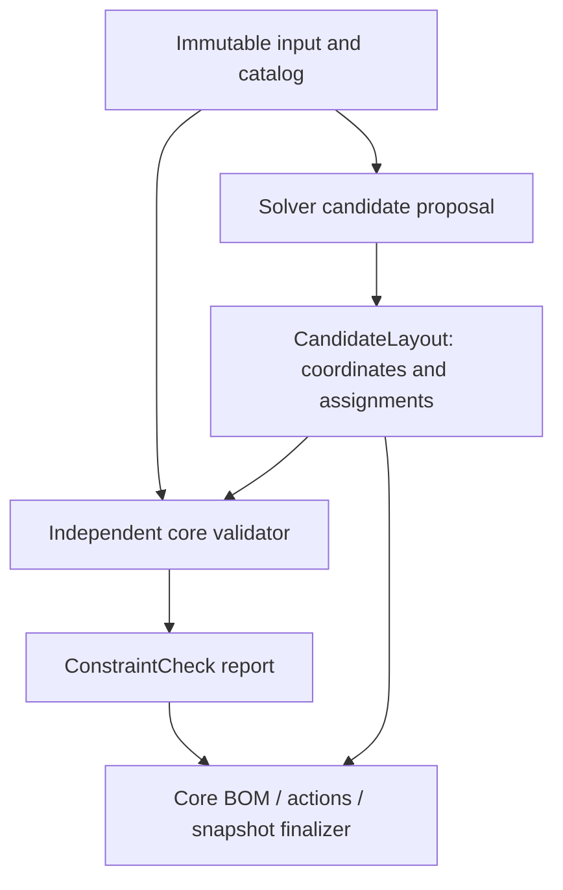

# ZARI Strategy, Search and Independent Validation v1

Status: proposed contract. Domain types and numeric bounds are in DOMAIN_MODEL.md; task ownership is in DEVIN_EXECUTION_PLAN.md. No solver or performance result exists at the reviewed main.

## Contents

1. Organization IR and inspectable rules
2. Primitives, recipes and catalog resolution
3. Reference search and deterministic work
4. Geometry, insertion and access
5. Independent validator and finalizer
6. BOM/guide and acceptance examples

## 1. Strategy is a computational layer

Input facts → applicable rules → user-selected Strategy → StrategyDecision with groups/zones/priorities/reasons → Recipe candidates. An LLM does not choose final truth. Each rule emits rule ID/version, exact input field references, conclusion, tradeoff and unresolved assumptions. Unknown frequency cannot silently become “daily”; an incomplete group is explainable and remains visible.

| Family / rule prefix | Deterministic proposal | User choice / constraints |
|---|---|---|
| `min-purchase/*` | Generate direct and owned options before buying; count required new physical units | User may forbid all purchases; no implied sacrifice of access or quantity |
| `frequency/*` | Daily group prefers front depth zone, reserve/rare group rear | Unknown frequency asks for input; front zone is soft unless explicitly locked |
| `activity/*` | Group declared same-activity IDs; deterministic chosen partition | User resolves overlapping activities; no duplicated item instances |
| `active-reserve/*` | Separate known active and reserve stock roles | Role comes from input; cannot infer from packaging/brand |
| `one-action/*` | Favor zero other-container moves before retrieval | If selected as hard, every required path must be proved; unknown cannot pass |
| `visual/*` | Rank known color/material consistency after hard constraints | A preference only; never changes dimensions or discards objects |

Default front/rear split is y∈[0,floor(D/2)) / [floor(D/2),D), recorded as rule-derived soft zones. A group straddling a soft zone gets an explanation/penalty, not a false geometry failure. A user locked zone is a hard spatial constraint. Item categories never imply hazardous compatibility; explicit hazardous/high-load/child-safety requests that cannot be evaluated produce a scope restriction/condition and no safety certification.

Rules form a small versioned Rust registry with deterministic ordering. StrategyDecision is structured IR, not marketing text. UI translates reasons such as `frequency.front_preference` with `{groupId, frequency, zoneId}`. A plan that needs a different strategy remains a separate proposed user choice; solver cannot silently switch it.

## 2. Primitives, recipes and candidates

| Primitive | Required proof | v1 retrieval |
|---|---|---|
| directPlacement | Item rigid envelope, authorized orientation, support, quantity | Fixed-orientation front extraction |
| openBin | Outer envelope, independent conservative inner cuboid/offset, mass/support facts | Pull container out, then retrieve contents in staging area |
| tray | Same rectangular-envelope checks; retained contents under declared handling mode | Pull tray out, then retrieve |
| verticalFile | Upright contents and verified conservative cavity; side/taper approximations explicitly evidenced | Pull unit out then retrieve upright item |

A tapered product is supported only as an evidenced inscribed inner cuboid plus enclosing outer envelope; it is not arbitrary shape collision support. Unmodeled lids, sliding mechanisms, mounting or stacking exclude candidates. Unknown relevant fields yield explicit conditional candidates only when sufficient nominal geometry exists. Unknown outer dimensions exclude placement generation and produce `catalog_data_unknown` with missing fields; do not silently label it “no matching products.”

Recipe binds strategy ID, item group, target zone, primitive, catalog predicates, orientation, clearance, compatibility and retrieval constraints. It contains no ideal invented SKU dimension. Catalog candidates are actual variants or explicit user-owned physical models. Search branches over candidate choice and placement together; a candidate's actual cavity can force a different assignment and another SKU choice.

Candidate process:

1. Validate catalog and field provenance without upgrading it.
2. Retain no-container direct placement and every available owned model matching recipe.
3. Filter known hard incompatibility, unsupported primitive/orientation/mounting, known outer oversize and known impossible interior fit.
4. Keep unknown conditions separately from known fails. A conditional candidate cannot satisfy a hard confirmed-only request.
5. Canonically sort eligible variants; the profile can select at most 100 per group. If more exist, report total, included IDs and deterministic restriction, offer narrower user filters. Never claim full-catalog search.
6. Resolve offers after a physical option is considered. v1 supports a single homogeneous pack offer per candidate purchase line; compare supported offers deterministically. Inventory unknown/out-of-stock and price/shipping unknown are distinct. An unavailable offer doesn't erase the physical option, but it is not purchase-ready.

Owned units are consumed from known available quantity; reuse is not a global reservation across different projects. If available quantity is unknown, do not allocate confirmed owned units. User can confirm or keep a conditional/unassigned alternative. Same name/different physical model remains separate.

## 3. Reference algorithm and explicit search scope

Choose deterministic constructive placement followed by bounded depth-first backtracking. This is custom finite search over recipe, variant, orientation, anchors and item assignments. No random seed in reference-v1. Do not add branch-and-bound, exact-cover/OR-Tools/general CP until a measured problem requires them; current task is small rigid placement with bespoke access/unknown semantics. A generic solver would not remove the need for these contracts or independent validation.

v1 has no stacking; top-level objects rest on the established floor. Nested items rest on the cavity floor. Candidate anchors are the cross product of sorted x/y sets from usable near walls, fixed obstacle near/far faces, and placed object near/far faces adjusted by declared gaps. Include far-wall fit anchors. Clamp nothing: reject out-of-range anchors. z is the support elevation. Recompute deterministic anchors on each branch; cap via work/node budget, not a silent random subset. This finite anchor family is a heuristic scope, not completeness over all integer coordinates.

For each group: iterate stable group priority, recipe IDs, eligible direct/owned/new subject IDs, orientation Upright0 then Upright90, anchors by `(y,x,z)` and item instance IDs. Keep largest maximum footprint first within equal strategy priority to reduce early fragmentation; tie by ID. All sort fields are specified integers/IDs. Existing source order, HashMap iteration, thread timing and wall-clock duration never select a winner.

Group assignment is itself deterministic rigid box placement within the selected cavity using the same supported floor-anchor family. Do not use volume sum as proof. For grouping requirements that cannot hold, backtrack or preserve unassigned objects with reasons. Unknown quantity cannot be expanded; its group remains incomplete. The 200-instance cap is explicit. No object is silently disposed of.

Container multiplicity is an explicit search dimension: process stable item instances; try an existing compatible target before opening a new target, in direct→owned→new subject order. AllowMultipleTargets groups may mix those targets; OneTarget groups must choose one container or the same direct-placement zone. Item-level mustStayTogether further restricts its instances. A failed inner placement can open the next container or backtrack, rather than treating one group as one bin. No empty container is added; every new target consumes at least one known instance (or a separately labeled provisional association), known owned ordinals are used once, and total placed containers≤20. Groups with wholly unknown quantity create no phantom container. Stop at the same deterministic work/node budget, retaining exact unassigned ordinals/ranges. Strategy decisions never relax a hard together rule.

CandidateLayout is the concrete DTO in DOMAIN_MODEL, including PurchaseSelection and single-authority direct ItemLocation references. After physical new-container quantities are known, enumerate supported offer selections by variant ID then offer ID, one offer for all new instances of that variant; selected offers must resolve within the pinned catalog. Each offer-choice tuple/checked pack-cost operation consumes a bounded work unit and is resumable. Missing offers create Unresolved, not a fake offer. Evaluate supported seller shipping once per seller. For a duplicate physical layout retain the best completed purchase selection under the documented ranking tuple; do not create three apparent layout alternatives from three sellers. No unmeasured unit-price shortcut overrides pack quantity, shipping or unknown facts.

Construct an initial solution greedily, then explore alternatives through DFS until the finite frontier is exhausted or budget reached. Solver pruning may use simple geometry checks and caches. Final candidates always cross the independent validator boundary. Cache keys include complete immutable input/catalog/rule/search context; cache invalidation is not delegated to UI revisions alone.

### Ranking and deduplication

Reject known hard failures before scoring. Among candidates in the same declared scope, compare lexicographically:

1. Fewer known unassigned instances, then fewer unknown-quantity groups.
2. Fewer unresolved required physical checks (never numeric substitution for unknown measurements).
3. Strategy objective: minimum-purchase→fewer new physical units then fewer purchase lines; one-action/frequency→fewer required blocker moves for priority groups then fewer zone preference violations; activity→fewer split declared activity groups; active/reserve→fewer role separation violations.
4. Known cost completeness class, then known comparable delivered cost; unknown price is not zero and is not compared as cheaper. The class order is complete-known then partial/unknown only after higher objectives. Display both classes explicitly.
5. Visual preference mismatches on known facts, then unknown preference facts.
6. Canonical layout signature as final stable tie-breaker.

No unsupported percentage accessibility or volume-utilization quality score. Equal geometry/assignment/strategy outcomes are deduplicated regardless of prose. Return 0..3 alternatives, not exactly three. Reference ranking is a deterministic policy, not a claim of universally optimal organization; a future changed policy increments solverVersion/ruleVersion as relevant.

### Budget and stepping contract

Default reference-v1: `maxWorkUnits="250000"`, `maxNodes=20000`, `maxCandidatesPerGroup=100`, `maxAlternatives=3`; seed=null. All limits are persisted. Custom budget cannot exceed `maxWorkUnits="2000000"`/nodes100000 without another profile and measured UI/memory gate. A bounded small problem may complete sooner.

A node is one new partial placement/assignment choice; count it before expansion. A work unit is exactly one of: filter one variant against one fixed predicate; generate one recipe/subject/orientation/anchor tuple; check one containment/orientation/support fact; check one entity pair AABB/gap/sweep; assign one item attempt; process one insertion precedence edge; compare one ranking tuple/dedup signature; execute one independent final check primitive. Every unit is bounded by the frozen entity/string/input caps. Candidate initialization, contents assignment and validation are continuation states too; don't hide an unbounded nested loop inside one “node.” Stop before executing a unit that would exceed limits. Initial bounded JSON decoding/normalization/canonical serialization are separately measured operations, not falsely included in search-work counts.

Rust `step_search(handle, allowance)` consumes at most allowance work units, retaining cursors even inside validation — with one liveness exception: a single indivisible continuation op (e.g. a full-candidate `RunEval` priced 64+p²+4a) always executes even when its cost exceeds the remaining allowance, so an allowance below one op's price can never stall the search into non-advancing progress. The over-allowance excess is bounded by that one op; the global work/node budget still applies before execution. Default Worker allowance256, max1024. Step sizes 1,7,128,256 must yield equal final content for the same total budget; chunk size is scheduling, not searchProfile. End-of-budget result keeps best fully validated alternatives only. A validator-in-progress is not published. Request progress every chunk with counters; main UI may throttle display without influencing search.

Termination distinguishes scope_complete, budget_exhausted, cancelled and interrupted (watchdog/crash). `no_layout_found_within_search_scope` means no valid candidate in this recipe/catalog/anchor/geometry domain; it is not physical impossibility. If budget exhausted with a candidate, label “탐색 한도 내에서 찾은 안”; without one, suggest narrowing or increasing explicit budget. Don't report both scope_complete and budget_exhausted.

## 4. Independent geometry checks

### Containment, support and uncertainty

Use DOMAIN_MODEL's axis convention and integer intervals. Check x/y/z independently with checked min+extent. For conservative containment, compare minimum available extents against maximum object envelope plus required clearance. Exact boundary contact is legal only if the corresponding declared clearance is zero. Unknown error produces nominal conditional result; a conservative fail isn't erased by nominal pass. Unknown handles mean unknown effective envelope, never assumed absent.

Top-level support requires the full footprint on the established floor at declared elevation (normally verified zero); no arbitrary floating z, bridge across gaps, stacking or placing objects on obstacles. Inner items rest on the cavity floor. SupportGeometry pass does not prove SupportLoad: include all container/contents mass and compare to floor/cavity capacity where required. Unknown masses/limits stay Unknown. Insufficient known capacity is a hard failure. No presumed furniture safety rating.

### Front opening and fixed-orientation insertion

Only front straight translation is supported; no rotation, tilt, disassembly, lifting around lips or bending. At the chosen x,z and fixed orientation, the product cross-section including declared handling margins must fit the opening and remain within internal bounds. Front opening offsets and extents are separate facts; don't assume a full-width opening from internal dimensions.

External staging is the separately measured front cuboid in DOMAIN_MODEL. It must hold the full oriented depth plus pullExtraDepth outside y=0 at the unchanged x/z and orientation, with required lateral/top handling margins; its supported base is level with the compartment floor. Swept occupied envelope from fully outside to final position is checked against fixed obstacles/access exclusion zones. Expand the moving envelope by its effective left/right/top margins against stationary physical envelopes; do not inflate both objects and double the same gap. No bottom expansion below the support plane. An opening sill or staging height difference requiring unsupported vertical motion fails the supported path, even if a final static box fits. Missing staging/opening data is Unknown.

Plan installation assumes the compartment can be emptied except fixed obstacles; show a clear-space action and require user confirmation. Derive precedence B→A if A's final volume obstructs B's insertion sweep. Topologically sort with ID tie-breaks; cycle means no supported insertion order. Independently replay the proposed sequence, checking each swept envelope against fixed obstacles and already installed objects. This permits back-before-front installation while detecting contradictory paths. Finalizer records this sequence for the guide; solver cannot simply supply an unverified order.

### Operational access

Check against the complete installed plan. Direct items extract straight through the opening. A container's supported operation is fixed-orientation pull-out into known staging space, then contents retrieval with documented clearance. Required other-unit removals are recorded as blocker IDs and a stable dependency order; reverse installation alone does not prove ergonomics, parking or contents handling. Report the distinct blocker count within this straight-path model; it is not a complete number of human actions including parking and replacement. A cyclic/unsupported fixed path or hard one-action restriction fails. Unknown handling/lift clearance remains conditional. One-action-access is zero other-unit moves; it doesn't imply unmeasured hand comfort or safety.

For PullContainerThenRetrieve, vertical contents extraction is checked only after the container is fully outside. Conservative free staging height must cover `outerHeight + itemHeight + liftAboveRim + effectiveTopHandling`; liftAboveRim is the gap between the item's bottom and the container rim, while effectiveTopHandling is the free space above the moving item, so each is applied once. Each child's x/y sweep must fit the conservative cavity and free staging footprint with applicable margins. Use the item's supported orientation throughout; no in-compartment lift/tilt or side threading. Check container+contents load against the compartment, cavity loads separately, and the moving unit's total load against staging support. Missing staging headroom/support cannot produce confirmed access/load. Off-path temporary parking and replacement of blockers are not modeled in v1. Nonzero removable blockers therefore leave operational_access Unknown with reason temporary_parking_unsupported unless a hard zero-blocker requirement makes it Fail; an acyclic graph or user acknowledgement cannot promote it to Pass. Confirmed access fixtures require zero blockers. These checks establish the supported rectangular motion only, not hand biomechanics.

Installation success can coexist with operational-access failure. Outer success can coexist with interior failure. Exterior staging may support a box but not safe handling of a heavy box; retain separate load/handling conditions.

## 5. Validator independence and snapshot publication

Production boundary:

Validator lives in `crates/core/src/validation`, depends on core domain/fundamental geometry only. It receives normalized input/catalog and CandidateLayout, not search nodes/caches/pass flags. It independently checks IDs/references, cycles, orientations, physical containment and overlaps, inner assignments, support/load, insertion order, operational access, hard constraints, quantities and owned availability. Solver's preliminary tests may be different implementations; finalizer never trusts their status.

Sharing scalar and transform primitives is reasonable but a common bug remains possible. Tests require independently calculated small geometry/pack oracles, corrupted candidates submitted directly to validator, brute-force enumeration on tiny bounded layouts and metamorphic invariants. A separate implementation ticket/owner for final validation is deliberate. Do not “fix” a failing solver case by weakening final checks.

Report reduction: Rejected if any required known hard failure; Conditional if any required physical Unknown or unproved conservative fit; ConfirmedWithinScope only all applicable physical checks pass conservatively, with reasons for N/A. Assignment completeness and commerce readiness are independent dimensions. Partial/conditional snapshots may be user-pinned, but execution steps dependent on unresolved facts remain blocked. Safety-critical unresolved constraints never receive an unconditional recommendation. Persist rejected proposals only as optional diagnostic evidence outside PlanSnapshot, not accepted plans.

Finalizer inputs must be immutable for its entire stepped execution. It performs final independent checks, quantity audit, BOM/guide generation and canonical hash atomically in logical terms; no partial view publication. Candidate token or private validated-layout type is scoped to that immutable input/catalog hash; it cannot be reused after editing. The UI publishes one snapshot reference in a single action.

## 6. BOM and action arithmetic

Physical instance references produce needed units; owned placements allocate each owned unit once. New-unit need = physical need minus allocated owned units, with checked nonnegative subtraction. Never subtract total owned quantity again from already-owned placement lines. Group purchase lines by exact variant and selected offer; separate vendors/pack offers remain separate lines. Known needed5 / pack2→packs3, supplied6, surplus1. Unused supplied units are procurement surplus, never phantom drawn placements.

Direct placement is not a purchase line. Reused containers appear in reuse list with evidence and placements; no price does not mean an unknown-cost purchase. Explicit free new product is Known("0") and different from unknown price. If pack quantity is unknown, order packs/supplied/surplus remain unknown; don't assume 1. Aggregate product subtotal sums only known amounts and exposes missing line IDs; grand total exists only when all applicable product and seller shipping amounts are known. Shipping charged once per seller under a supported observed policy. No-purchase plan shipping is N/A and new purchase cost is known zero.

Hard budget: known lower-bound subtotal>cap→fail; subtotal≤cap with unknown prices/shipping→unknown; all costs known≤cap→pass. Unknown delivered total is not a cheap ranking value. Inventory reports observed availability, not a reservation/checkout guarantee. Reference URLs must match the selected physical option/pack; uncertain correspondence blocks purchase-ready status.

Action IDs derive from step kind and semantic subject IDs; prerequisites form an acyclic graph, sorted deterministically for display. New products require acquisition/arrival confirmation before installation. Installation sequence is the validator's proved sequence. Content transfer steps reference item assignments; unresolved capacity, staging, load or measurement creates confirmation steps and blocks affected execution steps. A plan without purchases still has a useful arrangement guide.

For openBin/tray/verticalFile, action order is explicit: acquire/confirm arrival if needed → clear the compartment and prepare measured staging → load assigned items into that unit in staging → insert the loaded unit in the validated order. Loading reverses the proved upright contents-extraction envelope; never silently instruct an unsupported in-compartment vertical transfer. Direct items are inserted individually. Moving a loaded unit uses the supported fixed-orientation, quasi-static rigid-motion assumption; the model does not simulate acceleration, spills, grip or deformable contents. A known requirement outside that model produces unsupported/conditional handling and blocked dependent steps, not a claimed retention/dynamics proof. The guide explains this scope. Model-validity and completed user confirmations remain distinct.

Mandatory counterexamples: 590 mm width pass vs605 fail; inner230/item240 fail; opening narrower than final box; front obstacle; yaw90 asymmetric cavity transform; unsupported rotation; floating support; empty-vs-unknown quantity; owned2/reused3 failure; installable rear-first but inaccessible without front removal; support geometry pass/load unknown; nominal pass/conservative fail; identical results under altered chunk sizes; no fabricated third alternative.

## 7. SP-012 guide order and evaluation accounting

Adopted by [D012](../design/DECISIONS.md) and [docs/adr/SP-012-action-evaluation.md](adr/SP-012-action-evaluation.md). BOM arithmetic in §6 is unchanged. The load-then-insert sentence in §6 is the adopted guide meaning. SP-004 forbids regenerating that graph inside the old task. SP-013 ([D013](../design/DECISIONS.md), [docs/adr/SP-013-execution-guide.md](adr/SP-013-execution-guide.md)) changes the producer under `ruleVersion` `zari-domain-v2`. A transfer no longer depends on the container install. `reasonIds` name the related unknown or blocking checks. `requiredConfirmations` stay empty. `RunEval` and `zari-solver-v1` are unchanged. Historical `zari-domain-v1` snapshots keep the old edge and stay valid records.

Adopted order, using existing kinds only: clear-space user assertion, then acquire and arrival only for a new variant, then one `transferContents` per contained `(item, ordinal)` in external staging, then `install` of the loaded unit after those transfers and after the validator insertion predecessors. Direct items install without transfer or purchase steps. An empty catalog has no acquire, arrival, or loading steps; shipping is not applicable and new purchase cost is known zero. Owned ordinals are consumed once. Unassigned ranges remain.

Display order is Kahn, taking the byte-smallest ready step id. Do not attach every check to every step. A blocker matches the step's instance or placement. Price, shipping, inventory, and `bg:soft` do not block an unrelated direct install. A blocking known failure still publishes no snapshot. Checkbox completion does not change check status.

Profile `default` version 1 keeps `RunEval` priced `64+p²+4a` around one `evaluate_candidate` call. That price is not a time bound. A later profile that splits evaluation uses only these quanta, in order: structural reference (1), one check basis or one pair comparison (1), one quantity row (1), one BOM line (4), one action step or prerequisite edge (1), one 4096-byte canonical chunk with a minimum of 1, one revalidation walk of a check id or action id (1). The lump price is not a quantum of that profile. An allowance below one quantum's cost still runs that quantum. Publish one complete result only after revalidation. `budgetExhausted`, `cancelled`, and `interrupted` stay distinct. Partial BOM, actions, or hashes are not published. Hand-checked oracles, not `build_actions` output, are the expected graphs.
