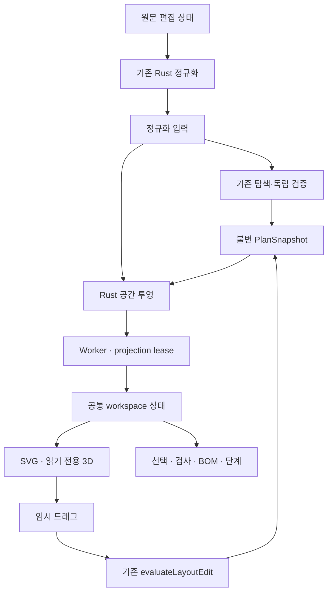

# ZARI 공간 작업대 확장 — 설계·개발 계획

상태: **설계 후보 / 구현 없음 / AIOPS 미발송**. 작성일: 2026-09-30 KST. 사용자는 아래 다섯 기능의 상세 설계와 게시를 요청했고 실제 개발은 AIOPS에 맡긴다. 이 문서는 작성자의 설계 제안이며 현재 규약상 설계 권한자 Claude Fable의 감사·채택 기록을 대신하지 않는다. 화면 승인·병합·출시·런타임 활성화를 주장하지 않는다.

## 1. 범위와 읽는 순서

| 사용자 요청 | 최종 개발 결과 | 작업 |
|---|---|---|
| 측정·선택·검사 레이어 | 입력과 치수선 연결, 선택 대상의 외경·내경·설치·접근 근거 표시 | SP-001, SP-002 |
| 직접 끌어 배치 | 평면 SVG에서 임시 드래그 → 기존 Rust 전체 검증 → 새 작업 스냅샷; 숫자·키보드 경로 유지 | SP-003 |
| 벽을 걷어내는 공간 뷰 | 한 구획의 앞·윗 경계를 숨기는 읽기 전용 3D; WebGL 실패 시 2D 유지 | SP-005 |
| 2D·3D 선택 연동 | 같은 스냅샷·typed target·placement ID로 도면, 내용물, BOM, 검사, 가이드 연결 | SP-001, SP-002, SP-005 |
| 실행 순서 시각화 | 실제 ActionStep DAG의 현재 단계 대상 강조; 채택된 현재 계획에만 완료 저장 | SP-004 |

먼저 본 문서를 읽고, 계산/DTO는 [SPATIAL_VIEW_CONTRACT](SPATIAL_VIEW_CONTRACT.md), 화면과 조작은 [SPATIAL_WORKSPACE](../design/SPATIAL_WORKSPACE.md), 검증은 [SPATIAL_VERIFICATION](SPATIAL_VERIFICATION.md), 실행은 [AIOPS_SPATIAL_EXECUTION_PLAN](AIOPS_SPATIAL_EXECUTION_PLAN.md)을 따른다. AIOPS 전달문은 [AIOPS_SPATIAL_HANDOFF](AIOPS_SPATIAL_HANDOFF.md), 비활성 프로그램 후보는 [ZARI_SPATIAL_PROGRAM_DRAFT.json](aiops/ZARI_SPATIAL_PROGRAM_DRAFT.json)이다.

현재 제품의 사실은 README/IMPLEMENTATION_STATUS가 소유한다. 이 보충 설계의 신규 범위와 계약은 **채택 후 관련 작업부터** 적용한다. 기존 DOMAIN_MODEL의 mm·좌표·unknown·PlanSnapshot, WASM_PROTOCOL의 transport/stale fencing, PERSISTENCE의 CAS, DESIGN의 시각·접근성 계약을 대체하지 않는다. 보존 MASTER_PROMPT_KO/RUST_ADDENDUM_KO/SOURCE_MANIFEST는 변경하지 않는다. 충돌은 Fable에게 근거와 함께 전달하고 관련 작업만 중단한다.

## 2. 실제 기준점

| 항목 | 확인한 사실 |
|---|---|
| ZARI main | `7269c142d2e2c3becc43088d64e516389228527e` (2026-09-30 조회) |
| main tree | `6fa1061ecfb633fdde1fd9062f45e72219087f6d` |
| 이전 검토 main | `026342a478eb72c891c01c15b36ef2b433815df8`; PR #34 규약 변경으로 이동 |
| 기존 구현 | Task 001–010 병합; core/solver/wasm, React/Aria, SVG top/front, Dexie/CAS, 수치 편집/회전/undo, action progress, 수동 catalog, export/import/offline |
| 신규 기능 | 드래그·3D·공통 공간 투영 DTO·검사 부피 레이어·단계 focus는 아직 없음 |
| 품질 기록 | Task 010/PR #30은 당시 사용자 지시로 CI·독립 감사 없이 병합; PR #34 기록에도 browser timeout이 있음. 기록된 로컬 통과를 이번 실행 결과로 전용하지 않음 |
| 화면 | approved baseline 0; 이 패키지는 화면 캡처나 승인 아님 |
| AIOPS 참고 main | `f079b7e7ec71a8e47c03fca8d7ead2ef9a2fc960` |
| 운영 확인 범위 | 중앙 source를 읽었음. host 설치/qualified lanes/현재 활성 runtime SHA 일치를 시험하지 않음. client의 구형 candidate pin과 중앙 최신 source는 동일하지 않음 |
| 앱 실행 | 이번 설계 작성에서는 앱·테스트·설치를 실행하지 않음 |

모든 빌더는 시작 시 실제 main/task plan pin/계약/adjacent code를 다시 확인한다. SHA가 달라도 정상적인 구현 진전은 해당 태스크 범위에 적응한다. 좌표·도메인·운영 권한이 바뀌면 조용히 재해석하지 않는다.

## 3. 선행 결함과 위험

| ID | source 근거 / 영향 | 처리 |
|---|---|---|
| R1 | `features/plan/view.ts:136–151`는 contained item을 parent+local로 표시. `core/geometry.rs:253–282`는 inner offset과 parent yaw90을 적용 | SP-001 공통 Rust 투영 + 회전/offset fixture. 수치 예: parent=(100,200,0), outer depth=400, offset=(10,20,5), child local=(30,40,0), extent=(50,60,70), yaw90 → min=(380,240,5), extent=(60,50,70). 기존 단순 합과 다름. 정적 발견이며 앱 재현 결과는 아님 |
| R2 | 현재 SVG는 y/z를 화면 아래로 직접 그리며 DESIGN의 뒤쪽/위쪽 축 계약과 다를 수 있음 | SP-001/002에 축·앞면·pointer inverse 공동 fixture; top는 뒤쪽이 위, front는 높이가 위 |
| R3 | PlanScreen guide는 progress=null을 `{}`로 바꿔 일부 완료 입력이 가능. session toggle은 await 뒤 채택 binding 변경을 별도 검사하지 않음 | SP-004 unknown progress 제어, accepted/current binding과 늦은 응답 fence, repository current-input 검사 |
| R4 | 여러 뷰가 각자 형상을 만들면 같은 snapshot에서도 표시가 달라짐 | 모든 물리 투영은 Rust read model 하나, TS는 화면 축/카메라/색/미리보기만 |
| R5 | 3D는 GPU/추가 자산/컨텍스트 실패를 만들 수 있음 | lazy load, demand render, dispose, 2D fallback, 독립 perf 측정 |
| R6 | 참조 프로젝트의 unsafe JSON→innerHTML 및 license 부재 | 코드/asset/JSON 직접 복사·의존 금지. 개념만 참고하고 ZARI 계약으로 별도 구현 |

R1–R3의 수정은 요청 기능을 신뢰할 수 있게 만드는 관련 범위다. 저장 데이터 파괴·전체 solver 재설계·관련 없는 버그 정리는 이 계획의 범위가 아니다.

## 4. 제품 경계

한 axis-aligned 직사각형 구획, 현재 upright0/upright90, 기존 v1 primitive와 한 단계 nesting만 지원한다. 3D는 기존 계획을 보는 후속 보조 기능이다. 방 전체, arbitrary rotation, stacking, drawers/lids, wall mounting, freeform meshes, furniture resizing, first-person walk, physics simulation, photogrammetry, AI, cloud, scraper, cart/checkout은 포함하지 않는다.

3D 그림에 보인다는 사실은 설치·접근·하중 검증을 확장하지 않는다. 내경 위치/불확실성/사진 추론을 만들어내지 않는다. 무구매·owned/reuse도 동일하게 렌더링한다. 같은 material/color를 쓰더라도 선택·pass·unknown·stale은 별도 의미다.

## 5. 책임과 의존성

`core/geometry`의 순수 좌표/부피 함수는 validator와 projector가 공유할 수 있다. validator는 projector·UI·Three.js에 의존하지 않는다. projector는 solver를 실행하거나 검사값을 다시 판단하지 않는다. core→solver 의존을 만들지 않는다. projection은 snapshot 밖의 재생성 가능한 read model이며 schema/hash/BOM/guide를 수정하지 않는다. 렌더링은 main thread, 기존 계산 WASM은 Worker에 둔다. OffscreenCanvas/renderer Worker는 도입하지 않는다.

## 6. 완료와 배포의 구분

일곱 작업이 완료되면 다섯 기능, 회귀·parity·브라우저·오프라인·성능 증거, draft capture package가 존재해야 한다. 테스트 통과와 Fable 감사는 실제 화면의 사용자 승인을 대신하지 않는다. approved manifest 변경은 사용자가 정확한 capture set을 승인한 별도 작업만 수행한다. 베타·배포·production 공개는 별도 결정이다.

개발 시작 전 Gate G0는 이 문서 패키지의 exact-HEAD Fable 설계 감사/채택을 기록한다. author self-check는 독립 감사가 아니다. 이후 AIOPS는 현재 중앙 규약의 lane 선택·TASK ENVELOPE v4·서명·computed merge gate를 사용한다. 이번 작성자가 빌더/리뷰 레인을 지정하거나 launch/merge/activation을 수행하지 않는다.

## 7. 외부 자료와 채택 판단

- 아이디어 출처: [floorplan-3d pinned source](https://github.com/wy51ai/floorplan-3d/tree/a03136c86842968a3de5da4c33549d3df3313c51). 배치와 뷰 연동/절개 개념만 참고. 소스·assets·스타일을 복제하지 않는다.
- 렌더러 후보: 직접 Three.js + 하나의 React lifecycle adapter, `OrbitControls`만 필요한 범위 사용. React Three Fiber/Drei/Motion/generic DnD foundation은 추가하지 않는다.
- 공식 upstream 검토 기준: [three.js `9b4a2ac`](https://github.com/mrdoob/three.js/tree/9b4a2ac29c63ccb43fd51c5661f2f873ac2c39b8), package `0.186.1`, MIT license. 이 값은 Git source 확인값이며 npm publish/registry integrity/타입 package/브라우저 호환성까지 검증했다는 뜻이 아니다. SP-005 시작 때 이 version의 registry availability와 matching 타입을 확인해 exact pin/lock/evidence를 기록한다. unavailable이면 임의 fork/CDN/다른 엔진으로 대체하지 않고 최소 dependency exception을 제출한다.
- [공식 demand rendering](https://github.com/mrdoob/three.js/blob/9b4a2ac29c63ccb43fd51c5661f2f873ac2c39b8/manual/pages/rendering-on-demand.html), [cleanup](https://github.com/mrdoob/three.js/blob/9b4a2ac29c63ccb43fd51c5661f2f873ac2c39b8/manual/pages/cleanup.html)을 따른다. 새 버전을 이유로 현재 핵심 toolchain을 일괄 업데이트하지 않는다.

## 8. 현재 설계 판정

이 후보는 구현 단위와 공통 DTO·좌표·상태·gesture·3D·progress 계약을 구체화했다. 첫 실행 단위는 SP-001이다. 표시 좌표와 unknown 의미를 고정해야 이후 UI가 같은 오류를 여러 renderer로 복제하지 않기 때문이다. 남는 외부 전제는 exact-HEAD Fable 채택, 유효한 운영 pin/host 자격, SP-005 dependency qualification, 실제 기기 측정, 사용자의 capture 승인이다. 이 전제들은 문서 존재만으로 충족되지 않는다.
