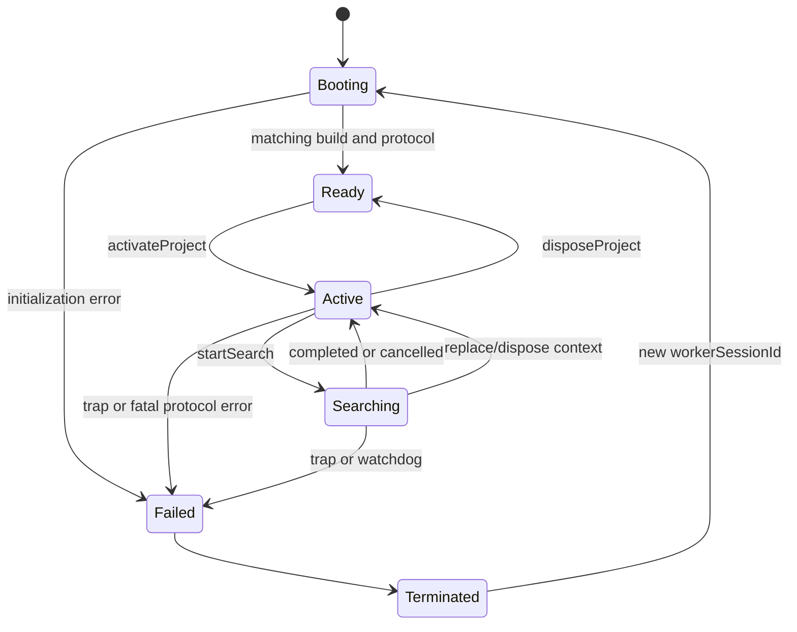

# ZARI Rust / WASM / Worker Protocol v1

Status: proposed contract. JSON Schema/TypeScript are generated during implementation, not in this documentation phase. This file defines observable behavior; helper names inside Rust are implementation judgment.

## Contents

1. Transport and canonical request identities
2. Operations and capability staging
3. Search continuation and cancellation
4. Stale prevention, activation and recovery
5. Bootstrap fixture contract and verification

## 1. Coarse transport

One module Worker, one wasm-bindgen Runtime object, one active project context and search. Worker JS owns message scheduling/lifecycle; Rust owns normalized models/search/finalization. The main thread retains raw input and last accepted snapshot. No business state exists exclusively in an uncheckpointed Worker.

Main↔Worker: JSON string in postMessage. Worker↔WASM: JSON string request/response through a thin `handle_json` method; Rust Runtime maintains opaque context/search handles internally. JSON strings are copied/encoded, not zero-copy. Cache catalog by digest and input by context; do not resend either on pointer movement, pairwise geometry calls or every search step. Operations consume complete forms/commands and produce complete field diagnostics or complete evaluated snapshots.

Use wasm-bindgen's generated module loader with bundler-resolved Worker URL and WASM asset; JS glue and `.wasm` must come from the same pinned build. CLI version exactly matches wasm-bindgen crate. Native/wasm builds share core code, not TS approximations. Official [wasm-bindgen string support](https://wasm-bindgen.github.io/wasm-bindgen/reference/types/string.html) and [Worker messaging](https://developer.mozilla.org/en-US/docs/Web/API/Web_Workers_API/Using_web_workers) support this transport; actual performance/compatibility remains measured work.

Limits: message UTF-8 ≤5 MiB; import file ≤10 MiB handled in the import boundary, split only into explicitly validated per-record operations if necessary, never bypass message limits. JSON nesting≤32, numeric strings≤64 bytes, labels≤256 Unicode scalars, descriptions/evidence notes≤4096, URLs≤2048. Reject duplicate object keys in Rust JSON input handling before domain conversion (or a decoder that explicitly rejects them); UI JSON.parse alone cannot enforce this. No dynamic schema or remote reference loading from imported content.

### Envelope (camelCase on wire)

```ts
type RequestMeta = {
  protocolVersion: 1;
  schemaVersion: 1;
  workerSessionId: string;
  projectActivationId: string;
  requestId: string;
  projectId: string;
  editorEpoch: string;    // canonical u64 decimal
  inputRevision: string;  // canonical u64 decimal
  contextId: string | null;
};
type Request = {meta: RequestMeta; command: Command};
type Response = {
  meta: RequestMeta; // exact captured identity, never replaced by latest state
  sequence: number; // u32, monotonic within request, starts at 0
  event: Event;
};
```

This illustrative TS is generated from Rust DTOs when implemented. IDs are opaque bounded strings; session/activation/request IDs may be created with browser random UUIDs because they are observation/transport identity, excluded from deterministic content. ContextId is Rust-generated SHA-256 of inputDigest + catalogDigest + rule/solver/schema/canonical versions + profile/budget/seed. Project/revision binding remains in meta. Pre-normalization/bootstrap has null contextId. A request never gains currentness because a caller overwrote its original metadata.

Response events are tagged `ready`, `projectActivated`, `normalized`, `probeEvaluated`, `recordVerified`, `catalogFieldsNormalized`, `catalogValidated`, `strategiesProposed`, `searchStarted`, `searchProgress`, `searchCompleted`, `searchCancelled`, `editEvaluated`, `spatialViewProjected`, `nextFactsQueried`, `actionEligibilityQueried`, `projectDisposed`, `operationFailed`. Failures use code, affected fields/IDs, retryability and reason parameters, not raw private input dumps. Invalid protocol/schema returns a structured rejection if enough identity can be safely decoded, otherwise a fatal protocol error to the host.

## 2. Operation table

Every command has `kind` and the fields below. Unknown commands and unavailable capabilities return operation_not_supported, not success/no-op.

| kind | Payload / precondition | Outcome |
|---|---|---|
| initialize | build ID, expected protocol/schema; projectId=`system`, projectActivationId=`system`, revision/epoch=`0`, null context | Load wasm once, return build/rule/solver/schema versions + explicit capability set |
| activateProject | project draft/normalized context kind, catalog snapshot or known cached digest; fresh activation | Dispose old search/context, validate input/catalog as needed, acknowledge activation; no implicit search |
| normalizeInput | `{input: NormalizeInputDto, priorInputDigest: Digest|null, formatRequests: FieldFormatRequest[], groupFormatRequests?: MeasurementGroupFormatRequest[]}` raw bootstrap or project form; current activation | Rust field normalization/diagnostics, normalized DTO + digest, equivalence to prior digest, formattedFields for requested units, and formattedGroups for requested nominal+bounds groups; never allocate durable projectRevision |
| evaluateProbe | `{probe: BootstrapProbeDto}`; bootstrap capability | Rust width check and pack result only; no PlanSnapshot or physical-fit claim |
| verifyRecord | `{record: VerifiableRecordDto}`; initialized system or current project identity | Rust schema/domain-structure and canonical digest verification; `recordVerified` gives record kind, computed digest and diagnostics; no physical revalidation or currentness claim |
| normalizeCatalogFields | `{fields: RawCatalogFieldDto[]}`; initialized system or current project identity, maximum1024 fields per batch | Stateless Rust scalar conversion; `catalogFieldsNormalized` gives per-path typed values or diagnostics, no project digest/revision |
| validateCatalog | `{catalog: CatalogImportDto}`; initialized system or current project identity | Rust validates complete bounded catalog and computes its digest; `catalogValidated` gives immutable CatalogSnapshot or field diagnostics; no save, active-pin change or trust upgrade |
| proposeStrategies | normalized input/context | Applicable structured StrategyDecisions; no AI request |
| startSearch | normalized ProjectInput or cached contextId, matching CatalogSnapshot or cached digest, `mode: continuous|manual` | Derive strategy/catalog/profile/budget from ProjectInput, validate complete context, allocate searchId, return searchStarted then progress/completion; one active search |
| stepSearch | searchId, allowance1..1024; manual mode only | Consume bounded work and return progress/completion; continuous mode host owns stepping |
| cancelSearch | exact searchId and start request identity | Idempotent cancellation of that search only; dispose handle, acknowledge |
| validateEdit | current base snapshot binding/content ID, LayoutEditCommand + immutable input/catalog context (DOMAIN_MODEL manual-edit rule) | Rust full independent revalidation, either a new immutable candidate snapshot or diagnostics; no mutation of original |
| projectSpatialView | `{source: SpatialViewSource}` where source is `{kind:"normalizedInput", input, inputDigest}` or `{kind:"plan", snapshot}`; initialized system identity, also legal on an active project. Stateless: does not mutate context, search, budget, or the supplied source | `spatialViewProjected` carries one `SpatialProjection` (projectionVersion 1) or `operationFailed`. Drawable rectangles stay in the domain plane; the page inverts an axis only while painting |
| queryNextFacts | `{input: ProjectInput, inputDigest, snapshot: PlanSnapshot or null}`; initialized system identity, also legal on an active project. Stateless: does not search, reprice, re-finalize, mutate activation, counters, or the supplied input | `nextFactsQueried` carries one `NextFactsReply`, or `operationFailed` (`digest_mismatch`, `completion_limit_exceeded`). No partial list. Not stored in IndexedDB, export, BOM, or a snapshot hash |
| queryActionEligibility | `{snapshot, progress: rows or null, stamp}`; initialized system identity, also legal on an active project. Stateless: does not search, persist, or change the snapshot | `actionEligibilityQueried` carries one `ActionEligibilityReply`. `progress: null` is not eligible. More than 4096 rows is `action_progress_limit`. A duplicate step id is `invalid_input`. Not stored |
| disposeProject | current activation | Dispose handles/input references; return projectDisposed; cached catalog may remain within bounded cache |

Current engine `BUILD_ID` is `zari-domain-7`. The ready capability list, in order, is `initialize`, `activateProject`, `normalizeInput(bootstrap)`, `normalizeInput(project)`, `evaluateProbe`, `verifyRecord`, `normalizeCatalogFields`, `validateCatalog`, `validateCandidate`, `evaluateLayoutEdit`, `projectSpatialView`, `queryNextFacts`, `queryActionEligibility`, `disposeProject`, and, when the search engine is installed, `proposeStrategies`, `startSearch`, `stepSearch`, `cancelSearch`. The page checks this list by exact order and length, so a swap is a mismatch and the Worker and the client update together. `protocolVersion`, persisted `schemaVersion`, and PlanSnapshot bytes stay at 1. `projectSpatialView` and `queryNextFacts` are ephemeral read models and are not stored in IndexedDB, export, BOM, or a snapshot hash. A system reply can outlive an editor-epoch bump; the session applies it only when the captured project, source key, worker, and mount still match.

`NormalizeInputDto` is tagged `kind: bootstrap | project`; bootstrap has `{kind:"bootstrap", probe:BootstrapProbeDto}`, project has `{kind:"project", project:RawProjectInputDto}` and carries the RawProjectInput DTO mirroring ProjectInput with raw numeric fields. Task 001 implements bootstrap only. InputRevision is not incremented in hidden Worker state: before persistence, the controller allocates next checked session revision after Rust reports changed normalized digest; after Task005 the durable repository transaction allocates it, then the controller installs the acknowledged context. A response computed under a prior normalized revision cannot be silently rebound to the new revision. See normalization commit in PERSISTENCE.

ProjectInput owns catalogPin and search(profile/budget/seed). RawProjectInput carries their selection explicitly; normalized inputDigest includes them. A duplicate transport selection that differs is rejected, never last-field-wins. Activation/search require supplied or cached catalog bytes to validate to the pinned version/digest. Normalization may accept an unavailable but structurally valid pin for a recoverable draft, but cannot create a searchable context without those bytes. Engine rule/solver/schema/canonical versions come from initialized Rust, not caller preferences. An engine update invalidates context without manufacturing an input edit.

Normalization/commit handshake is explicit: request under durable inputRevision=r → normalized reply still bound to r → short CAS save allocates r or r+1 → activateProject with the saved normalized input and that committed revision, using a fresh projectActivationId → projectActivated returns the Rust contextId → subsequent search/edit uses that identity. Invalid input remains a saved raw draft only. A failed CAS discards the prospective install; a failed activation after save leaves a durable input ready for retry and no current evaluated plan. No `installContext` message outside this protocol or rebinding a response is permitted. Before persistence exists, the session controller follows the same sequence with checked session-only revision allocation. Bootstrap evaluateProbe retains its documented probe-only path.

FieldFormatRequest is `{fieldPath:string, unit:"mm"|"cm"}` with paths restricted to known numeric measurement fields. `normalized` includes `formattedFields:[{fieldPath,unit,text}]`, `formattedGroups`, `normalizedInput`, `inputDigest`, `equivalentToPrior` and `diagnostics`. Rust formats exact mm as canonical decimal cm/mm; it emits no replacement text for invalid fields, and emits empty text for explicitly unknown fields. UI commits a unit switch only with the matching formatted result. No extra formatting protocol or JS conversion is permitted.

`groupFormatRequests` is optional on `normalizeInput` and defaults to an empty list, so older requests still decode. Each request is `{fieldPath, unit}`. The path must be the finite measurement grammar in [DOMAIN_MODEL.md](DOMAIN_MODEL.md) and [docs/adr/SP-008-measurement-completion.md](adr/SP-008-measurement-completion.md): `space.*` omits the space id, and `items.{id}.*`, `space.obstacles.{id}.*`, and `ownedContainers.{id}.quantityOwned|quantityAvailable` accept any validated id. Catalogue paths (`variants.*`, `offers.*`) and owned-container physical paths are read-only and fail the command with `catalog_field_read_only`. An unknown path fails with `invalid_format_field`. More than 16 requests fails with `invalid_input`. Bootstrap input rejects a non-empty group list. A field diagnostic, an unknown fact, or an unsupported unit leaves that group `converted: false` with `nominalText: null` and does not invent a bound of zero. A known nominal with unknown uncertainty converts and reports uncertainty `unknown`. Signed-offset groups accept integer mm only. Clearance, including zero, formats in mm or cm. The response field `formattedGroups` is always present.

A startSearch request may resupply full input/catalog bytes only if they match the already acknowledged active committed context exactly, for bounded cache recovery; it cannot establish or replace the active context. Context replacement occurs only through activateProject and its matching acknowledgement after the normalization/commit handshake. Mismatched input/catalog/context is rejected before work. Subsequent steps carry contextId/searchId only. Catalog cache holds at most two validated immutable snapshots and discards unreferenced ones on replacement; eviction never mutates accepted data. Project activation clears search, request registry and old input state.

Capability staging: Task001 advertises initialize/activateProject/normalizeInput(bootstrap)/evaluateProbe/disposeProject. It proves stale/terminate-restart handling but advertises no search cancellation, solver or persistence. Task002 adds the full project DTO roots. Task004 adds resumable Rust search; Task005 implements the host scheduling/cancel/recovery contract and may use an explicit protocol harness if Task004 is not yet integrated; Task006 must prove actual stepped WASM search cancellation/recovery. The005 gate may not call harness-only cancellation proof of real search. No compatibility shortcut creates a second bootstrap protocol.

### Durable-data verification and catalog ingestion

These three stateless operations are callable in Ready before any project activation: use initialized workerSessionId, projectId/projectActivationId=`system`, epoch/revision=`0`, null contextId and a fresh requestId. They leave the Worker Ready and do not fabricate an active project. System results are fenced by Worker session, current import/recovery request ID and increasing sequence in a separate host registry; they can update only that import/recovery preview, never a project plan. Changing/discarding that workflow invalidates its publication token. Operations initiated for an active project instead capture its full activation tuple and use normal stale fencing. This permits first-open import and integrity recovery when the saved catalog is corrupt and project activation is impossible. No verification receipt survives Worker replacement.

Task002 freezes these DTOs; Task005 implements `verifyRecord` for persistence, Task008 implements `validateCatalog` for ingestion. `VerifiableRecordDto` is tagged `kind: input | catalog | snapshot`, with respectively `{input:ProjectInput, inputDigest}`, `{catalog:CatalogSnapshot}`, or `{snapshot:PlanSnapshot}`. Rust checks supported schema/canonical versions, validated scalar constructors, bounded collections, local identity/reference consistency and the claimed content digest. It never executes a search, activates a project, replaces an embedded historical check or writes storage. Unsupported historical versions are explicitly unverified and remain available for raw export; they do not acquire a current-version hash. A matching hash proves consistency of supplied bytes, not their source or physical validity. Even a correctly rehashed malicious snapshot is historical/untrusted until current input/catalog are independently evaluated through the normal compiler. Currentness and the project/input binding are checked separately by the host and CAS repository.

`CatalogImportDto` has the same versioned fields as CatalogSnapshot except `catalogDigest`, which only Rust produces. Import adapters may decode bounded CSV rows into this DTO, preserve source text/evidence and select explicit units; authoritative numeric conversion uses `normalizeCatalogFields`, never JavaScript arithmetic. Task008 implements this stateless operation alongside validateCatalog. RawCatalogFieldDto has a unique `fieldPath` restricted to generated catalog numeric paths and a tagged `value`: `measurement{raw:RawMeasurementDto}`, `quantity{text}`, `packQuantity{text}`, `moneyKrw{text}`, `massGrams{text}`, `clearanceMm{text}` or `positionMm{text}`. Measurement follows the domain unit/uncertainty grammar; other fields trim ASCII decimal text and use the exact corresponding scalar constructor, with signed position grammar only where DOMAIN_MODEL permits it. Empty text yields explicit Unknown, invalid text yields diagnostics and no typed value. Money is whole KRW, not floating decimal currency; provenance remains separately supplied and is never upgraded by conversion. No user-controlled path writes directly into an object/prototype. Complete-catalog validation independently checks each scalar's field type and evidence.

The complete catalog is then validated once; invalid required data rejects publication, explicit unknown facts remain unknown. JSON catalog imports already using normalized scalar encodings go directly to validateCatalog. An existing CatalogSnapshot imported with a claimed digest first passes verifyRecord; ingestion never silently recomputes over a mismatched claim. These operations neither fabricate a project nor advance an inputRevision. Only explicit catalog selection followed by the normal input commit changes the active pin.

No aggregate import session lives in WASM. The host stages individually verified records, checks cross-record references and commits the complete project atomically as PERSISTENCE specifies. Each record must fit the5 MiB message cap; a10 MiB archive containing an oversized indivisible record is rejected, not secretly chunked into an unbounded decoder. Worker restart discards staging request receipts; reverify before commit. Identity fencing follows the explicit system/project cases above.

### Measurement completion: normalization and the completion query

SP-008 is adopted ([D008](../design/DECISIONS.md)). It implements signed-offset normalization and nominal+bounds group formatting on the existing `normalizeInput` command, and it bumps `BUILD_ID` to `zari-domain-5` with the same capability list. At that delivery, `queryNextFacts` was frozen and was not a command, a capability, or a generated runtime schema. SP-009 consumes only that normalization contract and does not change the capability list.

SP-010 is adopted ([D010](../design/DECISIONS.md)). It is the first executable `queryNextFacts`. The command, capability, generated schema, Worker entry, and client ship together, and `BUILD_ID` is `zari-domain-6`. The capability is inserted immediately before `disposeProject`. Unknown operations stay `operation_not_supported`. A bare `queryNextFacts` payload is `invalid_input`. An old page and a new Worker, or the reverse, fail the exact build-id and capability handshake instead of assuming compatibility.

## 3. Search lifecycle and scheduling



Search start creates a continuation handle; it does not run the full algorithm synchronously. A step consumes at most allowance work units from SOLVER's fixed work definitions, including inner assignment and final check cursors. Terminal snapshot serialization is bounded by input/output caps and measured separately. Step allowance is scheduling only; it cannot change candidate ordering/ranking or budget outcomes.

Continuous mode schedules one step, posts progress, then returns to a macrotask via setTimeout(0) or equivalent task-queue mechanism. `await Promise.resolve()` alone is forbidden as a yielding loop because it can starve incoming message tasks. Manual mode performs no next step until requested, enabling deterministic debug and incremental search tests. Handle stores immutable context IDs, DFS/validation cursors, sorted frontier and counters; never persist the handle.

No claim of cooperative interruption during one synchronous WASM call. The main thread marks cancel requested and invalidates the search's display token immediately; actual cooperative acknowledgement occurs only after the current step returns and queued cancel is processed. Queued scheduled ticks re-check the searchId/generation and do nothing for disposed searches. Cancel for an old ID never cancels a new search. After cancellation, late progress/completion is ignored even if all other fields match.

If cancellation has not acknowledged within 250 ms in a foreground test, host may terminate the Worker, mark interruptedBy=hardCancel, recreate a new session and restore immutable input. Normal foreground cancel acknowledgement target is≤100 ms desktop /≤200 ms mobile; these are design targets, not deterministic results or browser hard guarantees. Background throttling is recorded. A 5-second no-progress watchdog in foreground requests recovery; elapsed-time interruption is not budget_exhausted. Do not automatically restart/recompute indefinitely after a repeated crash; offer retry and keep input/export available.

Native fixture driver calls the same step API until scope/budget completion. It doesn't sleep or use wall time to decide a reference result. Step allowance1/7/128/256 must yield identical canonical alternatives and consumed counters at equal budget. Interrupted partial results are labeled with consumed work; never compared as completed reference output.

## 4. Stale results, ordering and recovery

Host acceptance predicate is the conjunction of matching workerSessionId, projectActivationId, projectId, current operation requestId, captured editorEpoch, current inputRevision and exact contextId (when applicable), plus a noncancelled searchId and strictly increasing sequence. Shape-valid responses can still be stale. Per-operation request registry allows a save result and a search result to coexist; a superseding normalization invalidates prior normalization/search/edit publications, not unrelated confirmed DB receipts.

On every domain-affecting raw edit, increment editorEpoch before starting any asynchronous work, mark the existing plan stale and invalidate prior result publication tokens. Even blank/invalid text does this. A display-unit change requires Rust equivalence/formatting; don't accept an old response solely because it happens to contain the same numeric value. A→B→A project navigation creates new activation IDs each time. Worker replacement creates a new session even with identical project/revision. These prevent ABA-style stale acceptance.

Requests are processed serially within one Worker. New startSearch cancels/disposes the old search before acknowledging the new one; if an operation cannot meet this contract, return busy rather than execute concurrent mutable continuations. Repeated requestId with identical payload in the same activation reuses a bounded terminal acknowledgement (last32); same ID with different payload is protocol error. Side-effecting physical mutation does not occur in the Worker, but duplicate computation must not double-publish snapshots or revisions.

Rust invalid input returns Result-based diagnostics. An uncaught wasm trap, panic, Worker error/messageerror or malformed response retires the entire instance. Do not call dispose/free into a potentially corrupt trapped runtime and then continue. Terminate the Worker, clear pending promises with worker_crashed, preserve input/last accepted snapshot, and create a fresh session on retry. Normal cancellation/project switch explicitly frees handles; hard terminate discards the whole isolated memory and does not promise destructors ran. Official [Rust target notes](https://doc.rust-lang.org/rustc/platform-support/wasm32-unknown-unknown.html) and [Worker terminate](https://developer.mozilla.org/en-US/docs/Web/API/Worker/terminate) support treating these as distinct paths.

Restore path: read durable project and raw draft → validate/migrate outside Worker if structural → initialize matching build → activate new project generation → Rust validates normalized context → show restored historical snapshot after digest/shape validation → recompile only on user action or an explicit current-input calculation trigger. No “successful recovery” until a real subsequent request succeeds.

## 5. Task001 bootstrap proof contract

Task001 is not a solver. Its input/output roots are small but final-contract-compatible:

```text
BootstrapProbeDto:
  compartmentWidth: RawMeasurementDto
  unitWidth: RawMeasurementDto
  unitCount: RawCountDto {text: string} // Rust Quantity parser, probe row cap20
  leftGapMm, rightGapMm, betweenGapMm: Fact<ClearanceMm>
  neededNewUnits: RawCountDto
  packQuantity: RawCountDto // Rust PackQuantity parser

BootstrapProbeResult:
  normalizedCompartmentWidth: Measurement
  normalizedUnitWidth: Measurement
  requiredWidthMm: Fact<decimal-string u64>
  rowObjects: Fact<Array<{ordinal: u32, xMm: decimal-string u64, widthMm: u32}>>
  widthCheck: ConstraintCheck (outer_geometry, nominal, x-axis scope only)
  order: {packsToOrder: Fact<Quantity>, suppliedUnits: Fact<UnitCount>, surplusUnits: Fact<UnitCount>}
  diagnostics: structured field errors
```

For unitCount0 requiredWidth=0 (no wall/gap contribution). Otherwise width=`unitWidth*unitCount + leftGap+rightGap + betweenGap*(unitCount−1)` using checked wide intermediate; requiredWidth beyond a single length scalar limit is returned as the declared decimal string, not silently clipped. Dimensions themselves remain bounded integer numbers. Full constraints/geometry are not inferred from this x-axis probe.

RawCountDto trims whitespace, accepts digits only, empty means Unknown, validates through Quantity/PackQuantity constructors; invalid required count produces field errors. Row unitCount is limited to20 for this bootstrap visualization. Rust returns every row x coordinate as a decimal string because an out-of-bounds diagnostic row can exceed the supported PositionMm range; these are probe evidence, never domain Placement coordinates. Unknown width/count/gaps makes rowObjects/requiredWidth Unknown, except explicitly known count0 has an empty row and required width0. Unknown demand/pack keeps order fields unknown (known zero demand establishes zero packs without needing an offer, but a provided invalid pack0 still yields a field error). All relevant evidence comes from Rust; TS only scales the returned coordinates to pixels.

Expected fixtures: 60cm=600mm; 60.1cm=601mm; nonintegral-mm/zero-size/negative/oversized input errors; empty width unknown. With 600 width,3 units at190 and gaps5/5/5, required590 and width pass;195 gives605/fail. Need5 pack2 yields3/6/1. Known need0 produces0/0/0; pack0 invalid. Unknown width yields width Unknown while independent valid pack calculation still works; zero is never substituted. UI calls Rust and displays matching outputs, a scaled width illustration and “폭 조건 검사 · 전체 배치 검증 전”. Test same fixtures in native and actual browser Worker/WASM, reject delayed responses after raw edit, terminate/restart and verify next probe succeeds.

All results must clearly distinguish probe output from PlanSnapshot. No invented strategy, catalog, full physical validity, accepted-plan storage or business completion is shown by Task001. Required command/evidence contract is in DEVIN_TASK_001.md and TEST_STRATEGY.md.

## 6. SP-012 eligibility handshake, not a command

Adopted by [D012](../design/DECISIONS.md). In that delivery `BUILD_ID` stayed `zari-domain-6` and the capability list stayed as it was then. `protocolVersion` and persisted `schemaVersion` stay 1. The current list and build id are in §2.

In the SP-012 tree, `queryActionEligibility` was a reserved read name. It was not a `Command` variant, not a capability, and not a generated schema. A request with that kind was `operation_not_supported`. The following paragraphs are the SP-013 command.

The read exists because `ActionStep.subjectIds` cannot carry a unit ordinal and blockers must come from structured checks. SP-013 ships the command, capability, generated schema, Worker entry, client, and fixture in one tree. The ADR registers `BUILD_ID` `zari-domain-7`. The page and Worker require that list's exact order and length.

SP-013 ([D013](../design/DECISIONS.md), [docs/adr/SP-013-execution-guide.md](adr/SP-013-execution-guide.md)) opens that read. `BUILD_ID` is `zari-domain-7`. The capability sits immediately before `disposeProject`. A bare `queryActionEligibility` payload is `invalid_input`. Unknown kinds stay `operation_not_supported`. The reply is not a pass when `eligible` is false. `executable` is false for acquire, transfer, and install while a related unknown or blocking failure remains. Clear, arrival, resolve, and unassigned review stay user assertions. The page does not treat a missing reply as an empty eligible list.

The read takes one immutable snapshot and at most 4096 progress rows. It does not search, persist, promote facts, or interpret arbitrary strings. The reply stamp is project, input digest, snapshot id, catalog digest and version, rule, solver, schema, canonical, build, search profile, accepted input revision, observed project revision, editor epoch, and progress-row identity. A missing target or a mismatched stamp is not eligible. Publication of search results is unchanged: one complete candidate or a rejection, never a validator-in-progress snapshot.

SP-014 ([D014](../design/DECISIONS.md)) does not add a command or a capability. `stepSearch` stays the host step. The evaluation continuation is private to the solver. `ready.solverVersion` is `zari-solver-v2`, the current engine. A snapshot still stamps `solver_version_for` of its own profile, so profile `default` version 1 remains `zari-solver-v1`. A digest mismatch discards the in-progress candidate and does not apply a late reply.

